# Lab 100: Prepare Your Cloud Environments

## Preparing Autonomous Transaction Processing Database, Java Cloud Service and Developer Cloud Service

During this part of the lab, you will take on the **DevOps Engineer Persona**. You will provision the required cloud services for Developer Cloud Service to build and deploy to a WebLogic Server cluster in Java Cloud Service and work with Oracle Cloud Platform tools. You must have access to a:

- Oracle Public Cloud Service Account
- Java Cloud Service (JCS)
- Database Cloud Service (DBCS) or Autonomous Transaction Processing (ATP)
- Developer Cloud Service (DevcS)
- Compute Classic Cloud Service
- Storage Classic Cloud Service

An Oracle Database Cloud Service or ATP is required by Java Cloud Service for storing its configurations and to host the Oracle Fusion Middleware component schemas used by Oracle Java Required Files (JRF).

Customer data can be stored in the same DBCS or ATP instance. However, for this lab, the customer data is already populated in a separate ATP instance. This is to keep the lab duration short and to avoid the laborious effort in uploading the data to a database. This customer database will be shared by all attendees.

## About This Exercise

In this exercise, we will:
- Create and configure a DBCS or ATP instance to hold the JCS (WebLogic) configuration (Optional)
- Create and configure a JCS (WebLogic) instance to host the JET UI frontend
- Create and configure a Developer Cloud Service (DevCS) Build VM to build yo application

## Provision an Autonomous Transaction Processing Database (ATP)

**This step is Optional**

**You will be advised by you instructor**

Due to the resource constrain, the instructor may have already created one for you. It also make sense that a single ATP instance should be shared by all lab participants, hence there is no need to create separate instances. The following steps are for your reference and you may dive into an existing instance to explore its configuration and administration tools.

### **STEP 1**: Sign Into Your OCI Console

- Please refer to the Cloud Account that has been provided by your administrator.

- Open your browser (Safari, Firefox or Chrome) and go to your Oracle Cloud Infrastructure Console URL. The OCI Console URL is:

  https://console.us-ashburn-1.oraclecloud.com/#/a/

This URL may be different to the one you are provided with. Use the provided URL if it is different to the above.

You can also access the OCI Console URL from your Cloud Dashboard.

- Click on **Change tenant** button if you are not presented with the Cloud Tenant input form.

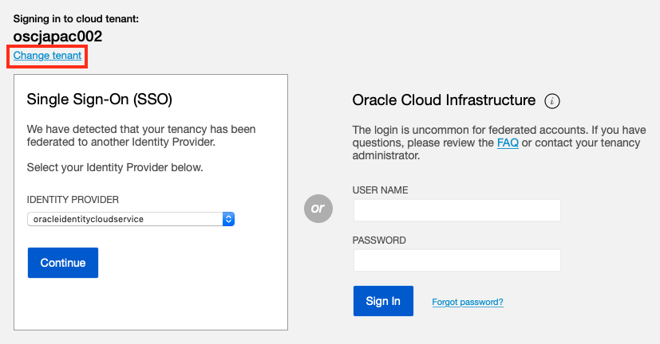

- Enter your Cloud Tenant Name in the input field and click the Continue button. This will return you to the Cloud Dashboard.

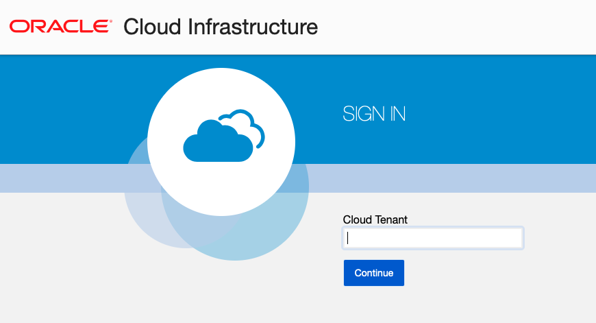

- Enter your OCI user name and password

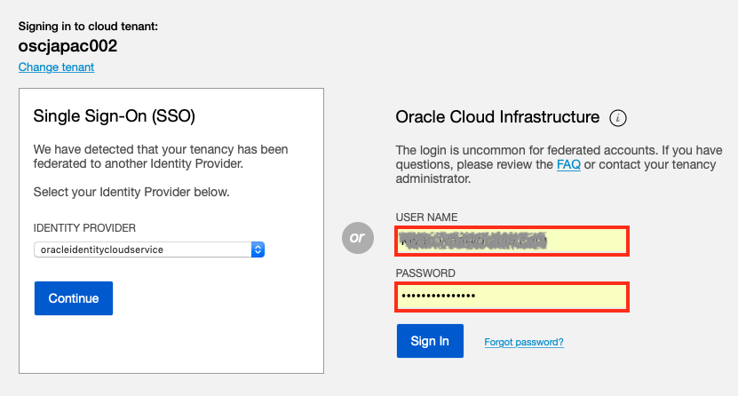

- Make sure you're in your region, otherwise select your region from the dropdown menu.

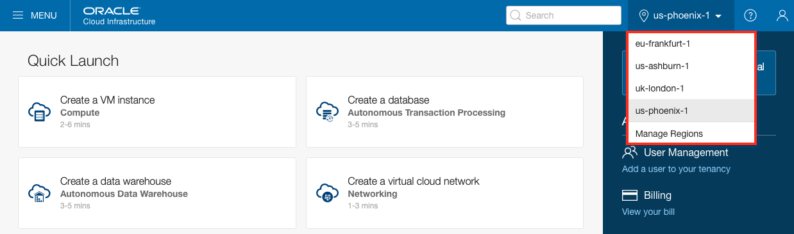

### **STEP 2**: Create an ATP Instance

Before creating an instance, we need to create a dedicated Compartment for the instance to be hosted in.

- Click on the **Menu** button at the top left corner of your console and select **Identity -> Compartments**

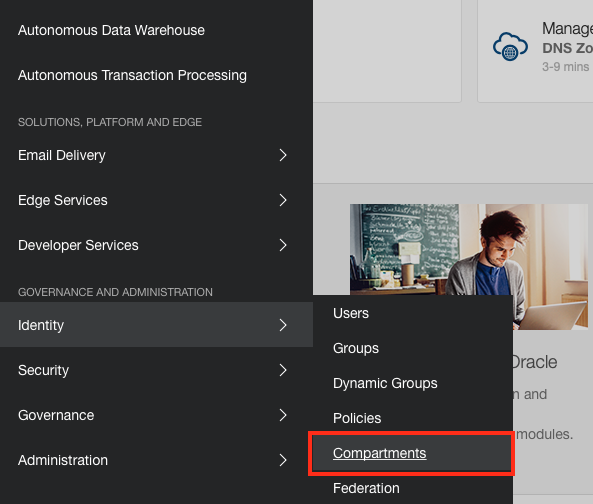

- Click on the **Create Compartment** button and enter the following parameters:

  - **NAME**: `ATP_Demo`
  - **DESCRIPTION**: `Compartment for ATP CTD`
  - **PARENT COMPARTMENT**: `(root)`
  - Leave the rest to default

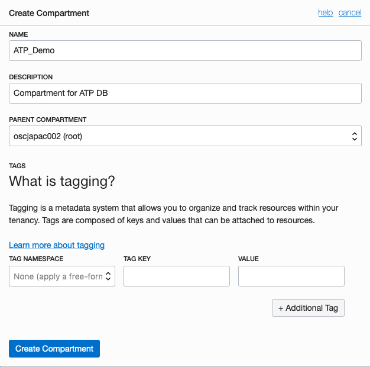

- Click **Create Compartment**

- Click on the **Menu** button at the top left corner of your console and select **Autonomous Transaction Processing**

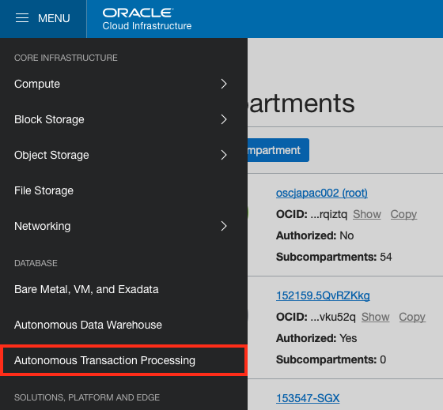

- Once in the ATP Console page, select the **CTD** compartment your just created from the dropdown menu. And click **Create Autonomous Transaction Processing Database**

  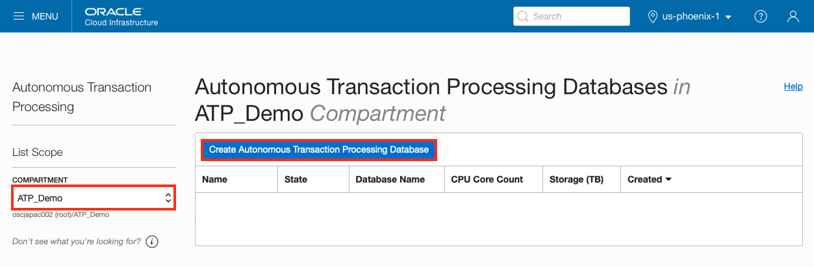

- Click on **Create Autonomous Transaction Processing Database** and enter the following parameters:

  - **COMPARTMENT**: `ATP_Demo`
  - **DISPLAY NAME**: `ATP Demo DB`
  - **DATABASE NAME**: `ATPDemoDB`
  - **CPU CORE COUNT**: `1`
  - **STORAGE(TB)**: `1`
  - **PASSWORD**: DB's administration password. Please take note of the password.
  - Leave the rest to default

  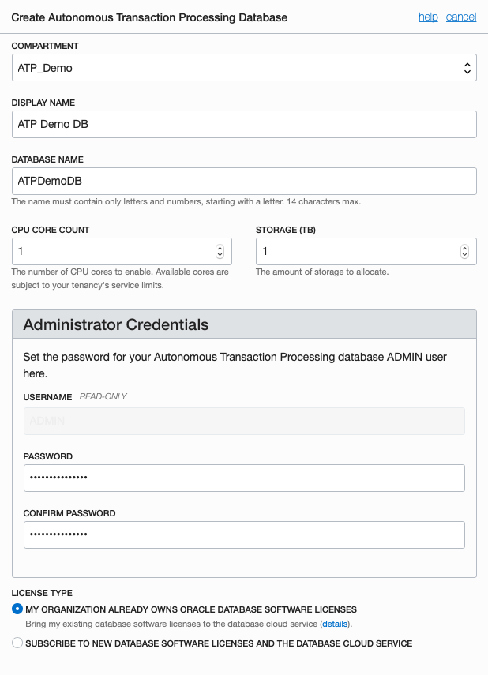

- Click on **Create Autonomous Transaction Processing Database**

**NOTE**:  Your ATP instance will take about 4 minutes to complete.
Once finished, it will be in the **Available** state as shown below:

  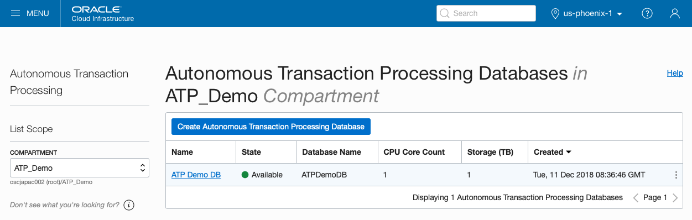

*Congratulation! You have provisioned an ATP database. You must wait for this to finish before proceeding to the next part of the lab. Alternately, your instructor may have already created an instance for you. Please consult your instructor for connection details.*

## Provision a Java Cloud Service (JCS) Instance

For this part of the lab, you would need a DBCS/ATP instance to complete the JCS configuration.

- Please verify the provisioning of a DBCS instance in **Step 2** has completed and is up and running

- If this is running, then proceed to the following steps, otherwise, please wait until it is ready.

**NOTE**: If a DBCS/ATP instance is provisioned by your instructor, he will provide you with the access detail.

### **STEP 3**: Create a JCS Instance

- On the dashboard click the hamburger icon on the **Java** tile. Select **Open Service Console**.

  

- Once in the Java Cloud Service Console page, create a new instance by clicking **Create Service** button.

#### **STEP 3.1**: Basic Instance Configuration

- Complete the new Create New Instance Page as illustrated below:

  

- Enter the following parameters:

  - **Instance Name**: `demoJCS`
  - **Region**: `us-ashburn-1` or `us-phoenix-1` for your tenancy
  - **Availability Domain**: `AD1` default
  - **Subnet**: `ManagedCompartmentForPaaS` select from the dropdown list
  - **License Type**: `Subscribe to a new Oracle Java Cloud Service software license`
  - **Service Level**: `Oracle Java Cloud Service`
  - **Software Release**: `12c Software Release (12.2.1.2)`
  - **Software Edition**: `Enterprise Edition`
  - Leave the rest to default

- Click **Next**

#### **STEP 3.2**: Detailed Instance Configuration

- On the Service Details page, click **Advanced** to show additional configuration options

  

The following parameters have to be provided:

  - **Shape**: `VM.Standard2.1 - 1.0 OCPU, 15.0GB RAM` this is the smallest one (default)
  - **Server Count**: `1` which means one managed server
  - **Domain Partitions**: `zero` for no partitions (default)
  - **Enable access to Administration Console**: `Checked` to get access to the Admin console
  - **Deploy Sample Application**: `Unchecked`
  - **SSH Public Key**: Provide a public key which will be uploaded to the VM during the creation. It allows you to connect to the VM through ssh connection using the private key.
    - Click on **Edit** button
    - If you don't have or want to create a new key pair then select **Create a New Key** option and select **Enter** to download the newly generated keypair for later usage
  - **Username**: `weblogic` username of WebLogic administrator
  - **Password**: WebLogic administrator's password. Don't forget to note the provided password.
  - **Database Instance Name**: `demoDB` Database Cloud Service name to store WebLogic repository data. Your provisioned DBCS instance will appear in the dropdown list.
  - **PDB Name**: `<use default>` If you have choosen default (PDB1) during Database Cloud Service creation then leave the default here too
  - **Administrator User Name**: Enter: **sys**. DBA admin to create repository schema for Java Cloud Service instance.
  - **Password**: DBA admin password you provided during Database Cloud Service creation
  + **Add Application Schema**: `No Application Schema added`
  + **Provision Load Balancer**: `No` to save resources, we will not create a Load Balancer instance
  + **Backup Destination**: `None`

- Click **Next**

The final page is the summary page about the configuration before submitting the instance creation request.

- Click **Create** to start the provisioning of the new service instance.

When the request has been accepted, the Java Cloud Service Console page appears and shows the new instance. The instance now is in Maintenance (Progress) mode. Click **In Progress** link to get more information about the status.

**NOTE**: Your JCS instance will be ready in about 30 minutes. Whilst we are waiting for the JCS instance to be provisioned, we can work on other components such as Developer Cloud Service.

*You have now completed the provisioning of a JCS instance for hosting the JET UI frontend.*

## Provision a Developer Cloud Service (DevCS)

Like other Oracle Cloud services, you must create an instance of Developer Cloud Service (DevCS) before you can start using it. You can create only one instance in an identity domain.

There are two types of Developer Cloud Services on offer depending whether you are an Oracle Cloud Infrastructure (OCI) user or an Oracle Cloud Infrastructure Classic (OCI Classic) user. The two types of Developer Cloud Services are:

  - Traditional Developer Cloud Service (OCI Classic)
  - Autonomous Developer Cloud Service (OCI)

For new Oracle Cloud accounts, user will be of type OCI and should use the Autonomous Developer Cloud Service. For this lab we will assume the participants is an OCI user and the instruction that follows is for the Autonomous Developer Cloud Service.

The Autonomous Developer Cloud Service offers a dedicated Build VM running on OCI for your build jobs. This has significant performance improvement over the Traditional Developer Cloud Service and would result in much faster build time. Oracle Developer Cloud Build VMs runs on Oracle Linux 6 or Oracle Linux 7, and supports a variety of software such as Node.js, Docker, and Oracle SOA Suite. The platform and the software stack in Build VMs are defined by the Build VM templates.

Since the Build VM is Compute instance, this can be shared among developers. This mean we do not require a dedicated Build VM for each developer or attendee as it can be shared among the team. For this workshop we would only require a few Build VMs to be shared across the participants. The Build VMs has been created for you and the instruction that follows is for your reference, unless told otherwise by your instructor.

### **STEP 4**: Create a   Developer Cloud Instance

- Go back to your Dashboard page.

- If the Developer tile isn’t available on the Dashboard, expand the Dashboard menu on the left and select **Developer**

  

- In the Instances tab, click **Create Instance**.

  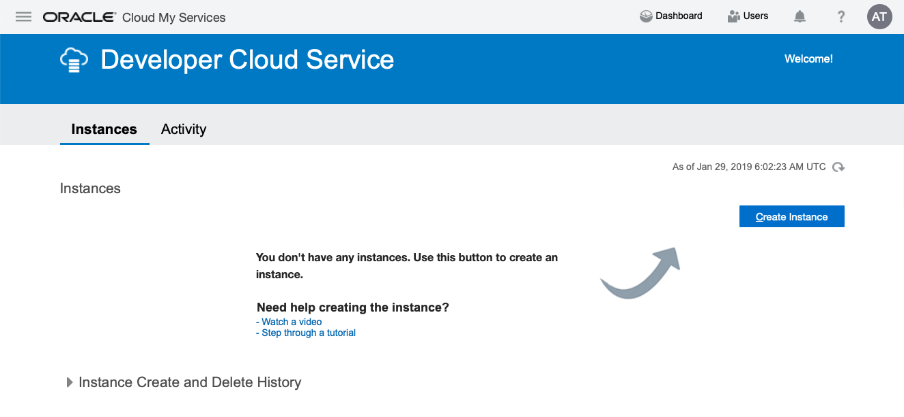

- On the **Create New Instance** page, enter the following details:

  - **Instance Name**: `A unique name` to identify the service instance in the tenant domain.
  - **Description**: `Enter a description`
  - **Region**: `Select your region` from the dropdown list. Choose from us-ashburn-1, us-phoenix-1, us-frankfurt-1.

  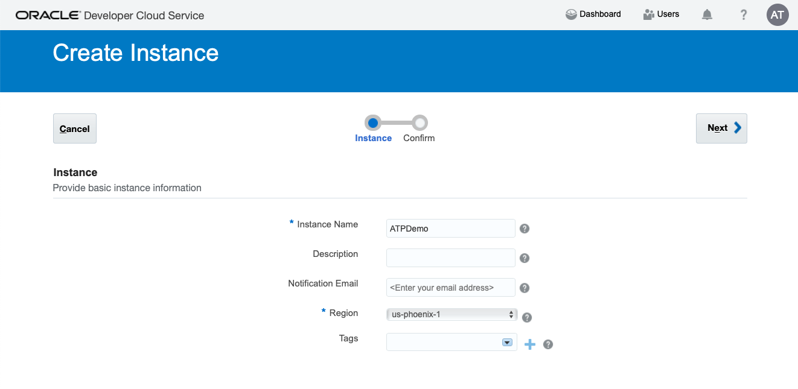

- Click **Next**

- On the Service Details page, click **Next**

  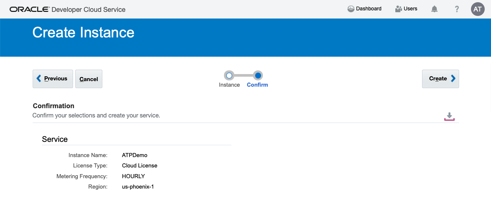

- On the Confirmation page, click **Create**

- The DevCS **Organization** page opens showing your DevCS instance

**NOTE**: You have just created a DevCS instance.

#### **STEP 4.1**: Setup The OCI Connection

You need to connect to the Oracle Cloud Infrastructure Compute (OCI Compute) because they provide the virtual machines (VMs) on which DevCS runs its builds. You need to connect to Oracle Cloud Infrastructure Object Storage (OCI Object Storage) because they are used to store build and Maven artifacts for DevCS projects. It is assumed you are an OCI user and have the access rights to set up connections to OCI Compute and OCI Object Storage.

- Once the service instance is created, you can open the service console by clicking the **Action menu icon**, and then selecting **Access Service Instance**.

  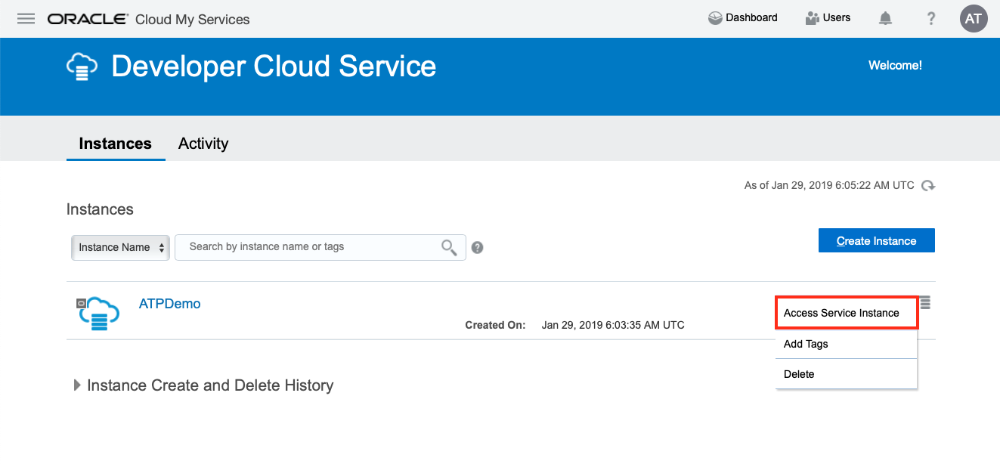

- The DevCS **Organization** page opens. Click the **OCI Credentials** to configure OCI connections before you create a project. You must be the Organization Administrator to create the connection.

  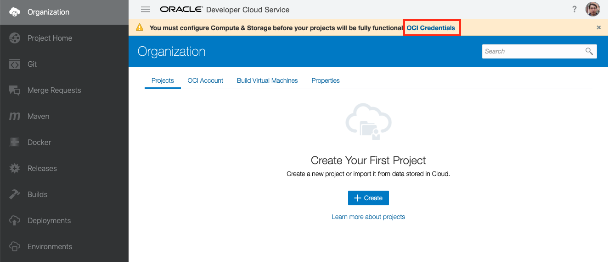

- Get the OCI input values from the your OCI Console and enter them in the following fields:

  - **Tennacy OCID**: enter the tenancy's OCID copied from the Tenancy Details page
  - **User OCID**: enter the user's OCID who can access the DevCS compartment
  - **Home Region**: select the home region of the OCI account
  - **Private Key**: enter the private key of the user who can access the DevCS compartment
  - **Passphrase**: enter the passphrase used to encrypt the private key. If no passphrase was used, leave the field empty.
  - **Fingerprint**: enter the fingerprint value of the private-public key pair
  - **Compartment OCID**: enter the compartment's OCID copied from the Compartments page
  - **Storage Namespace**: enter the storage namespace copied from the Tenancy Details page
  - **Developer Cloud Service ...**: select the checkbox to agree to terms and conditions

  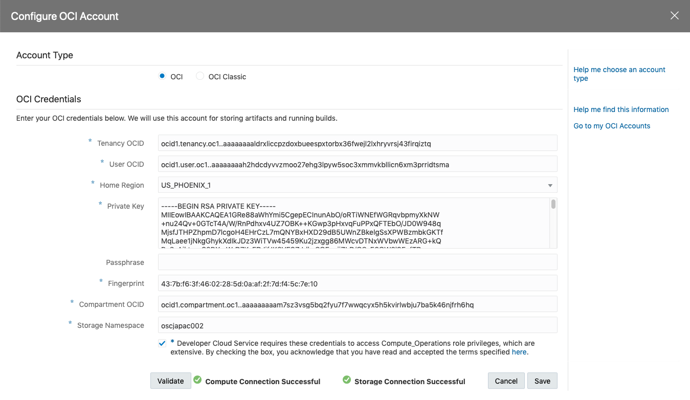

- Click **Validate**

- After validating the connection details, click **Save**

#### **STEP 4.2**: Create a VM Template

A Build Virtual Machine (VM) is an OCI Compute VM that runs builds of jobs defined in the DevCS projects. A Build VM Template defines the operating system and the software installed on Build VMs.

When you configure a job to use a software, such as Node.js or Docker, you must create a Build VM template with the software and associate the job with that template. When a job’s build runs, it doesn’t run in DevCS, but on a VM of OCI Compute, as configured in the previous step.

To get started, you first create Build VM templates with different software that your team members regularly use. After creating the templates, you allocate some Build VMs to each Build VM template. When your team members create jobs, they associate the job with a Build VM template.

When a job’s build runs, a Build VM allocated for the job’s Build VM template starts. It first installs the software defined in the Build VM template. After installing the software, it clones the job’s Git repository (if configured) to the VM, and creates artifacts (again, if configured). After the build is complete, the artifacts are copied to the OCI Object Storage. The Build VM waits for some time for any queued builds. If no builds run in the wait time period, the Build VM stops. Each time the Build VM starts, the software are installed again and the first build of the VM would take more time to run.

In this section, you learn how to create a basic Build VM template that includes the minimum required software.

- Select the **Virtual Machines Templates** tab from the **Organization** page

  

- Click **Create**

- On the pop up **New VM Template** dialog box enter the following:

  - **Name**: `CafeSupremo`
  - **Description**: `A Build VM template with minimum required software`
  - **Platform**: `Oracle Linux 7`

  

- Click **Create**

**NOTE**: You have created a Build VM Template with the minimal build components.

#### **STEP 4.3**: Configure the Software of a Build VM Template

The VM template contains the minimum software required to run basic builds. We need to add additional software to the template in order to build our JET UI frontend. The additional components are Grandle and Node.js.

  - Select the `CafeSupremo` template you just created under the **Virtual Machines Templates** tab

  - Click **Configue Software**

  

  - Select **Gradle 4** and **Node.js 6** from the list of software by clicking the **Add +** icon on that tile.

  

  - Click on **Done** to save the selections

    

**NOTE**: You have just created a Build VM Template.

#### **STEP 4.4**: Create a Virtual Machine for Build and Develop

**This step is Optional**

**You will be advised by you instructor**

When you add a Build VM, you allocate a VM on the linked Oracle Cloud Infrastructure Compute service to be used to run builds of jobs. Each build runs in one build VM. You can build up to 99 builds in parallel using the same Build VM template.

If you have multiple jobs across projects using a common Build VM template, you can assign multiple Build VMs of that template. When builds of those jobs run, DevCS picks a VM that’s available without waiting for a busy VM to get free.

- Select the **Build Virtual Machines** tab

  

- Click **Create**

- On the pop up **Add Build VM** dialog box enter the following:

  - **Quantity**: `1`
  - **VM Template**: select `CafeSupremo` from dropdown list

  

- Click **Add**

- The newly created Build VM should be in the stopped state.

  

  To minimise build execution delays, set the number of VMs of a specific Build VM template to the number of jobs that you expect to run in parallel using that template. If the VM quota is available, that number of Build VMs will be added to the Build Virtual Machines tab.

  You can always return to the Build Virtual Machines tab to add or remove VMs, based on your actual usage. Note that the more VMs you have running at a specific time, the higher the cost. To minimise the higher cost, use the **Sleep Timeout** setting on the **Build Virtual Machines** page to automatically shut down inactive VMs.

- Click **Sleep Timeout**

  

- Increase the **Sleep Timeout** value to `1500` minutes

- Click **Save**

**NOTE**: You have now created a Build VM for for your build jobs.

### You have finished this lab section.

[Proceed to Lab 200: Import Your Code](200-IMPORTlab.md)

or

[Return to Cloud Native Development Home](README.md)
