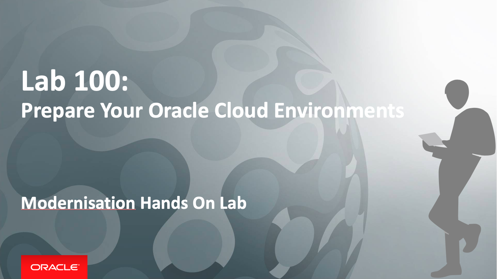
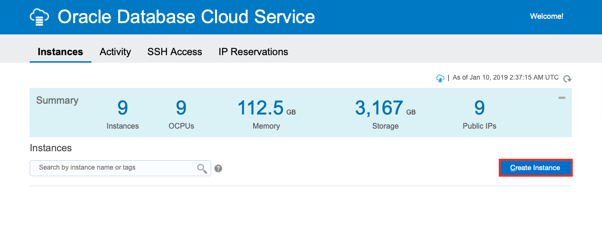
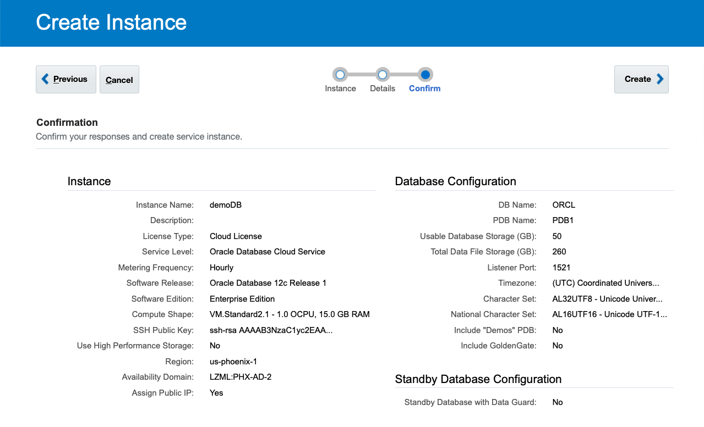
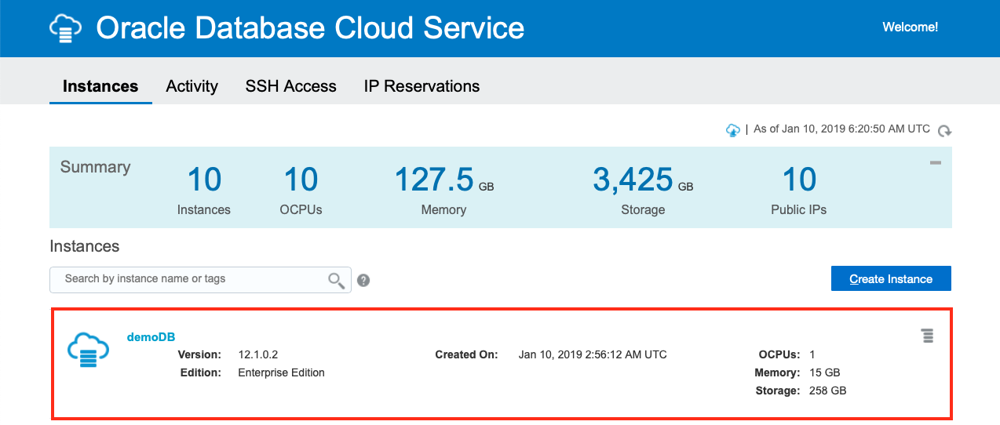
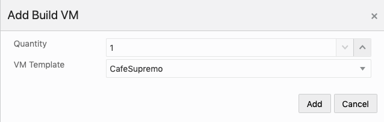
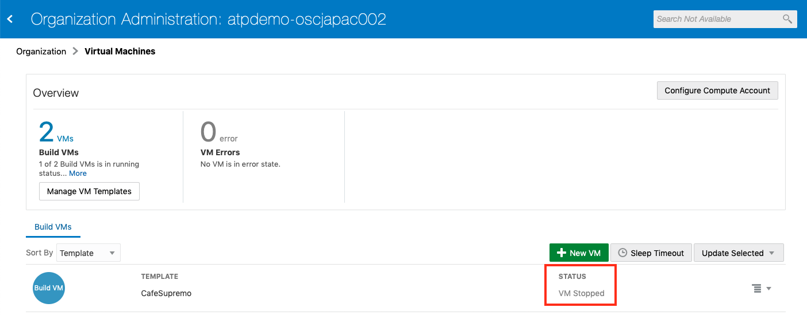

# Lab 100: Prepare Your Cloud Environments

## Preparing Database Cloud Service, Java Cloud Service and Developer Cloud Service

During this part of the lab, you will take on the **DevOps Engineer Persona**. You will provision the required cloud services for Developer Cloud Service to build and deploy to a WebLogic Server cluster in Java Cloud Service and work with Oracle Cloud Platform tools. You must have access to a:

- Oracle Public Cloud Service Account
- Java Cloud Service (JCS)
- Database Cloud Service (DBCS) or Autonomous Transaction Processing (ATP)
- Developer Cloud Service (DevcS)
- Compute Classic Cloud Service
- Storage Classic Cloud Service

An Oracle Database Cloud Service or ATP is required by Java Cloud Service for storing its configurations and to host the Oracle Fusion Middleware component schemas used by Oracle Java Required Files (JRF).

Customer data can be stored in the same DBCS or ATP instance. However, for this lab, the customer data is already populated in a separate ATP instance. This is to keep the lab duration short and to avoid the laborious effort in uploading the data to a database. This customer database will be shared by all attendees.

## About This Exercise

In this exercise, we will:
- Create and configure a DBCS or ATP instance to hold the JCS (WebLogic) configuration (Optional)
- Create and configure a JCS (WebLogic) instance to host the JET UI frontend
- Create and configure a Developer Cloud Service (DevCS) Build VM to build yo application

## Provision a Database Cloud Service (DBCS) or Autonomous Transaction Processing Instance (ATP)

**This step is Optional**

**You will be advised by you instructor**

Due to the time it takes to provision an instance, the instructor may have already created one for you. It also make sense that a single DBCS/ATP instance should be shared by all lab participants, hence there is no need to create separate instances. The following steps are for your reference and you may dive into an existing instance to explore its configuration and administration tools.

### **STEP 1**: Sign Into The Oracle Cloud Service Account

- Sign into your Oracle Cloud Service account

### **STEP 2**: Create a DBCS Instance

- On the dashboard click the hamburger icon on the **Database Classic** tile and select **Open Service Console**

  

- Once in the Database Cloud Service Console page, create a new instance by clicking **Create Service** button

  

#### **STEP 2.1**: Basic Instance Configuration

- Complete the Create Instance Page as illustrated below:

  

- Enter the following parameters:

  - **Instance Name**: `demoDB`
  - **Region**: `us-ashburn-1` or `us-phoenix-1` for your tenancy
  - **Software Release**: `12c Release 1 Software`
  - **Software Edition**: `Enterprise Edition software edition`
  - **Database Type**: `Single Instance`
  - **License Type**: `Subscribe to a new Oracle Database software license`
  - Leave the rest to default

- Click **Next**

#### **STEP 2.2**: Detailed Instance Configuration

The last input page is the Service Details page.

   

The following parameters have to be provided:

  - **Administration Password**: DB's password. Please take note of the password.
  - **Compute Shape**: `VM.Standard1.1 - 1.0 OCPU, 7GB RAM` or `VM.Standard2.1 - 1.0 OCPU, 15GB RAM`
  - **SSH Public Key**: Provide a public key which will be uploaded to the VM during the creation. It allows you to connect to the VM through ssh connection using the private key.
    - If you don't have or want to create a new key pair then select **Create a New Key** option and download the newly generated keypair for later usage
  - **Storage Username**: Your Oracle Cloud username e.g. `cloud.admin`
  - **Storage Password**: Cloud Account password
  - **Backup Destination**: Change to `None` In production you will want to enable backup and specify the storage location
  - **Create Instance from Existing Backup**: Leave to default of `No`

- Click **Next**

- Confirms the details on the next page and then click **Create**

   

**NOTE**:  Your DBCS instance will take about 30 minutes to complete. Please wait until the DBCS instance has been completed before creating a JCS instance. Whilst we are waiting for the DBCS instance to be provisioned, we can work on other infrastructure components such as Developer Cloud Service.

- Once your DBCS is ready, your instance should appear similar to below:

   

*Please move on to the next section whilst you're waiting for the DBCS instance to be provisioned.*

## Provision a Java Cloud Service (JCS) Instance

For this part of the lab, you would need a DBCS/ATP instance to complete the JCS configuration.

- Please verify the provisioning of a DBCS instance in **Step 2** has completed and is up and running

- If this is running, then proceed to the following steps, otherwise, please wait until it is ready.

**NOTE**: If a DBCS/ATP instance is provisioned by your instructor, he will provide you with the access detail.

### **STEP 3**: Create a JCS Instance

- On the dashboard click the hamburger icon on the **Java** tile. Select **Open Service Console**.

  

- Once in the Java Cloud Service Console page, create a new instance by clicking **Create Service** button.

#### **STEP 3.1**: Basic Instance Configuration

- Complete the new Create New Instance Page as illustrated below:

  

- Enter the following parameters:

  - **Instance Name**: `demoJCS`
  - **Region**: `us-ashburn-1` or `us-phoenix-1` for your tenancy
  - **Availability Domain**: `AD1` default
  - **Subnet**: `ManagedCompartmentForPaaS` select from the dropdown list
  - **License Type**: `Subscribe to a new Oracle Java Cloud Service software license`
  - **Service Level**: `Oracle Java Cloud Service`
  - **Software Release**: `12c Software Release (12.2.1.2)`
  - **Software Edition**: `Enterprise Edition`
  - Leave the rest to default

- Click **Next**

#### **STEP 3.2**: Detailed Instance Configuration

- On the Service Details page, click **Advanced** to show additional configuration options

  

The following parameters have to be provided:

  - **Shape**: `VM.Standard2.1 - 1.0 OCPU, 15.0GB RAM` this is the smallest one (default)
  - **Server Count**: `1` which means one managed server
  - **Domain Partitions**: `zero` for no partitions (default)
  - **Enable access to Administration Console**: `Checked` to get access to the Admin console
  - **Deploy Sample Application**: `Unchecked`
  - **SSH Public Key**: Provide a public key which will be uploaded to the VM during the creation. It allows you to connect to the VM through ssh connection using the private key.
    - Click on **Edit** button
    - If you don't have or want to create a new key pair then select **Create a New Key** option and select **Enter** to download the newly generated keypair for later usage
  - **Username**: `weblogic` username of WebLogic administrator
  - **Password**: WebLogic administrator's password. Don't forget to note the provided password.
  - **Database Instance Name**: `demoDB` Database Cloud Service name to store WebLogic repository data. Your provisioned DBCS instance will appear in the dropdown list.
  - **PDB Name**: `<use default>` If you have choosen default (PDB1) during Database Cloud Service creation then leave the default here too
  - **Administrator User Name**: Enter: **sys**. DBA admin to create repository schema for Java Cloud Service instance.
  - **Password**: DBA admin password you provided during Database Cloud Service creation
  + **Add Application Schema**: `No Application Schema added`
  + **Provision Load Balancer**: `No` to save resources, we will not create a Load Balancer instance
  + **Backup Destination**: `None`

- Click **Next**

The final page is the summary page about the configuration before submitting the instance creation request.

- Click **Create** to start the provisioning of the new service instance.

When the request has been accepted, the Java Cloud Service Console page appears and shows the new instance. The instance now is in Maintenance (Progress) mode. Click **In Progress** link to get more information about the status.

**NOTE**: Your JCS instance will be ready in about 30 minutes. Whilst we are waiting for the JCS instance to be provisioned, we can work on other components such as Developer Cloud Service.

*You have now completed the provisioning of a JCS instance for hosting the JET UI frontend.*

## Provision a Developer Cloud Service (DevCS)

You have two choices for Developer Cloud Service:

  - Traditional Developer Cloud Service
  - Autonomous Developer Cloud Service

It is recommended to use the Autonomous Developer Cloud Service as it offers a dedicated Build VM for your build jobs. This has significant performance improvement over the Traditional Developer Cloud Service and would result in much faster build time. The use of the Autonomous Developer Cloud Service is particularly important as one would see the full potential of our service and would bring out the key benefits in Continuous Integration and Continuous Delivery.

Oracle Developer Cloud Build VMs runs on Oracle Linux 6 or Oracle Linux 7, and supports a variety of software such as Node.js, Docker, and Oracle SOA Suite. The platform and the software in Build VMs are defined by Build VM templates.

Since the Build VM is Compute instance, this can be shared among developers. This mean we not required one dedicated Build VM for each developer or attendee. Only need a few Build VM to be shared across the project team or participants. Hence, we have already provisioned the Build VMs for you.

### **STEP 4**: Open the Autonomous Developer Cloud Console

- Ensure you are opening the Autonomous DevCS and NOT the Traditional DevCS

- On the dashboard click the hamburger icon on the **Autonomous Developer** tile. Select **Open Service Console** OR select from the expanded Dashboard menu on the left hand side.

  

#### **STEP 4.1**: Create a VM Template

In this section, you learn how to create a basic Build VM template that includes the minimum required software.

- Select **Organization** from the user name dropdown options

  

- Click **VM TEMPLATES** on the Organization Administration page

  

- Click **New Template** in the Build VM Templates page

  

- In the New VM Template dialog box, enter the following details:

  - **Name**: `Your Name` enter your name
  - **Description**: `A Build VM template with minimum required software`
  - **Platform**: `Oracle Linux 7`

    

- Click **Create**

A Build VM template with your name **Your Name** is created. It includes just the required Build VM components. The right side of the page displays the details for this Build VM.

#### **STEP 4.2**: Configure the Software of a Build VM Template

The VM template contains the minimum software required to run basic builds. We need to add additional software to the template in order to build our JET UI frontend.

  - In the **Build VM Templates** tab, select the template you just created.

  - On the right side of the page, click **Configue Software**

  

  - Select **Gradle 4** from the list of software by clicking the **Add** `+` icon on that tile.

  

  - Click on **Done** to save the selections

    

**NOTE**: You have just created your template. However, we won't be using this as the instructor has already created one earlier named **CafeSupremo** and assigned it to a number of Build VMs. You may explore the CafeSupremo Build VM Template and the configured software packages should be the same as the template you just created.

#### **STEP 4.3**: Configure a Compute Account for Build VMs

**This step is Optional**

**You will be advised by you instructor**

DevCS project builds run on OCI Compute Classic virtual machines (VMs). Before you can use DevCS on Oracle Cloud Infrastructure or Oracle Cloud Infrastructure Classic, you must configure a connection to OCI Compute Classic.

To create the connection, you need the service ID and the REST Endpoint URL for OCI Compute Classic, plus the credentials of a user.

**NOTE**: This may have already been configured for you.

- In another browser tab or window, open Oracle Cloud Dashboard

- In the **Compute Classic** tile, click the hamburger icon, and select **View Details**

  

- On the Service Details page, in the Additional Information section of the Overview tab, note the values of **Service Instance ID** and **REST Endpoint**

  

- Go back to the Developer Cloud Service Organization Administration Page

- Select **VIRTUAL MACHINES**

  

- On the Virtual Machine page, click **Configure Compute Account**

  

- In the Configure Compute Account dialog box, enter the following values:

  - **Username**: Your Cloud Username
  - **Password**: Your Cloud User Password
  - **Service Instance ID**: *ID assigned to the Oracle Cloud Infrastructure Compute Classic instance* (The value must match the Service Instance ID field that appears on the Oracle Cloud Infrastructure Compute Classic Service Details page.)
  - **REST Endpoint**: *REST API endpoint URL for the Oracle Cloud Infrastructure Compute Classic instance* (The value must match the REST Endpoint field that appears on the Oracle Cloud Infrastructure Compute Classic Service Details page.)

  

- Click on **Save**

*You have now set a Compute Account to use the Oracle Cloud Infrastructure Compute Classic*

#### **STEP 4.4**: Create a Virtual Machine for Build and Develop

**This step is Optional**

**You will be advised by you instructor**

When you add a Build VM, you allocate a VM on the linked Oracle Cloud Infrastructure Compute Classic service to be used to run builds of jobs. Each build runs in one build executor, or one VM. You can build up to 99 builds in parallel using the same Build VM template.

If you have multiple jobs across projects using a common Build VM template, you assign multiple Build VMs of that template. When builds of those jobs run, DevCS picks a VM that’s available without waiting for a busy VM to get free.

- Click **New VM**

  

- In the Add Build VM dialog box, in Quantity, specify the number of VMs you want to allocate. In VM Template, select the Build VM template.

  

- The newly created Build VM should be in the stopped state.

    

*You have now created a Build VM for for your build jobs.*

### You have finished this lab section.

[Proceed to Lab 200: Import Your Code](200-IMPORTlab.md)

or

[Return to Cloud Native Development Home](README.md)
