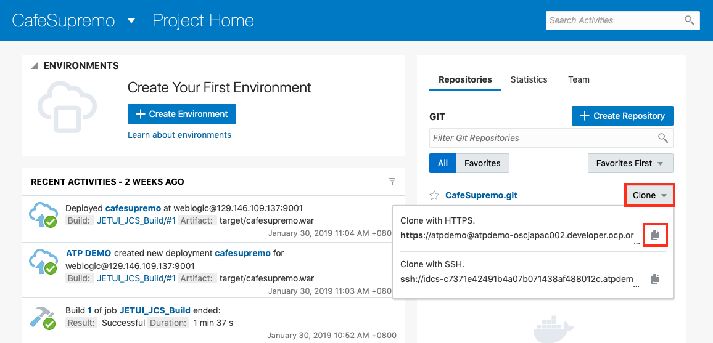
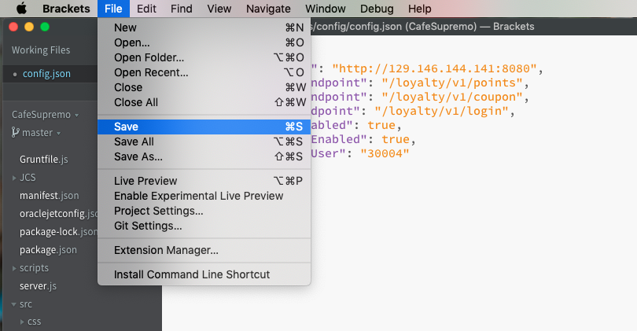
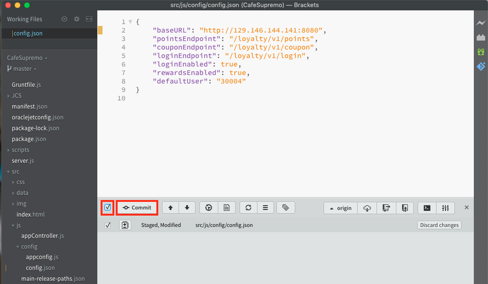
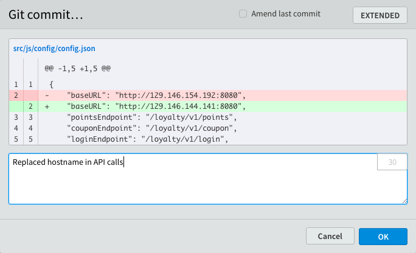
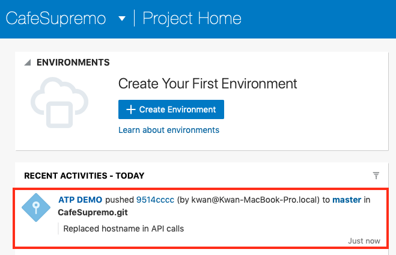
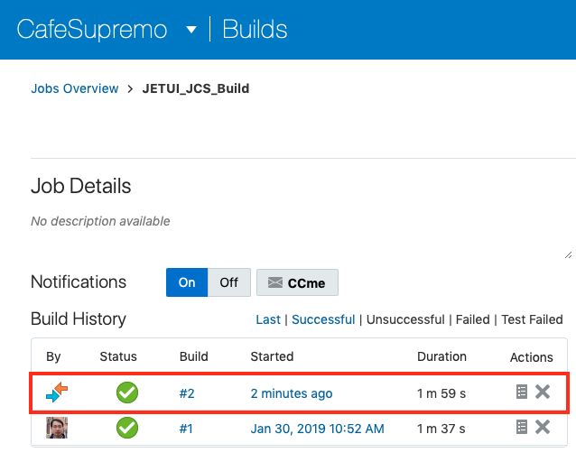
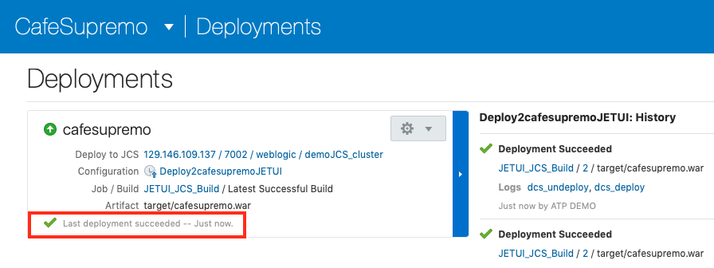

# Putting It All Together - Continuous Integration and Delivery

### **STEP 10**: Developing with Brackets

To enable a developer to develop code and commit it to the Git repository in Developer Cloud, you can use your favourite IDE or a simple text editor with Git command line interface. However, we are going to strike a balance and use something that is pretty lightweight but has built in integration with Git. Brackets is an open source editor written in HTML, CSS, and JavaScript with a primary focus on web development. You can install a Git plug-in to synchronise the commits and push process to Developer Cloud's Git repositories.

- You must have installed Brackets and Git extension as well as Git Client. If you haven't done this already please follow the guides below.

  *[Click HERE for Brackets and Git Extension installation detail](BRACKETSinstall.md)*
  *[Click HERE for Git Client installation details](GITCLIENTinstall.md)*

# Cloning the Git Repository from Developer Cloud Service

- Start the Brackets Text Editor, in the **File** pull-down menu, choose **Open Folder...**

  

- Navigate to the target destination directory to store the source code, for example: `D:\oracle`

- Click **New Folder** to create a new folder in the destination directory

- Enter `CafeSupremo` as the name of the new folder and click **Create**

- Click **Open** after it has been created

  
  
- Click on GIT icon on the right hand side of the editor to open the Git panel below the editor

  
  
- Click **Clone** in the Git panel

  

- Switch back to the Developer Cloud Service dashboard. Click the square **Copy** button by the *CafeSupremo.git* URL to copy the link

  
  
- Switch back to the Brackets editor and paste the copied URL from Developer Cloud Service into the **Enter Git URL of the repository you want to clone:**. Username should be populated automatically.

- Enter the password and select **Save credentials to remote url**

- Click **OK**

  

- Wait for Brackets to clone your remote project to local folder

  

- You now have a local copy of the Git repository

  

# Commit and Push Code Changes

- Expand the left nagivation tree and open *reward.js* file (*Under src->js->viewModels*)

  

- On the main window, locate line 27, 47, 72 and 99 in *rewards.js* source code and modify the following URLs by replacing the hostname with the ACCS instance hostname you provisioned in Step 4. These are the API calls to from the JET UI frontend to the RewardService Node.js backend. Currently, hostname of this RewardService is hard coded, hence we need to update the hostname to point to your instance.  You could in fact point to other instances.
  
  Get the current points of memeber
  
  https://`rewardservice-gse00014208.uscom-east-1.oraclecloud.com`/loyalty/v2/points/10001
  
  Get the current coupon of memeber
  
  https://`rewardservice-gse00014208.uscom-east-1.oraclecloud.com`/loyalty/v2/coupon/10001
  
  Credit memeber with one point
  
  https://`rewardservice-gse00014208.uscom-east-1.oraclecloud.com`/loyalty/v2/points/10001

  Consume one coupon
  
  https://`rewardservice-gse00014208.uscom-east-1.oraclecloud.com`/loyalty/v2/coupon/10001

  

- Save the changes **Save**

- Check the box next to **Commit** to select all modified files - this means the checkbox below (reward.js) will automatically be checked.

  
  
- Click **Commit** to commit changes to the local cloned Git repository

- In the Git commit pop up enter the comment: `Replaced hostname in API calls` and then click **OK**. This will commit the changes to your local git repository. Ignore any code inspection problems above.

  

- Click **Git Push** icon on the right side of the Git panel

  
  
- In the Push to remote pop up window, leave fields to their defaults and click **OK**. This will begin the Git push to the Developer Cloud *CafeSupremo.git* master repository.

  
  
- Once Git Push completes, click **OK**

  
  
  
  
# Verify Your Build

- Switch back to your Developer Cloud Project home page and you should see your changes has been pushed to the DevCS master repository.

  

- Click on the Build Job tab and you should see your changes has automatically trigger a build. Follow the build as it moves from the build queue to running the build.

  
  
- Wait until the build completes

  
  
- Click on the Deploy Configuration tab and wait till you see the *Last deployment succeeded* message in the *cafesupremo* configuration tile. Reload page if you don't see any dates.

  

- Let's verify your changes to see if the JET UI frontend is able to call the APIs in the RewardService backend. Enter

  http:`<JCS IP address>`/cafesupremo in your browser replacing the JCS IP address with your JCS instance
  
  Don't forget to open this in a the Developer Tools mode for a mobile device
  
  
  
- Click on the hamburger icon on at the top left hand corner to expand the menu

  
  
- Click on **Rewards**

  
  
- Click on **Credit A Star** to see the counter increments and try to redeem a coffee once you have been awarded with a coupon.

  
  

Congratulation!! You have completed the lab and have a working CI/CD pipeline for an agile application.

You have completed all the labs.

[Return to Cafe Supremo Home](README.md)
