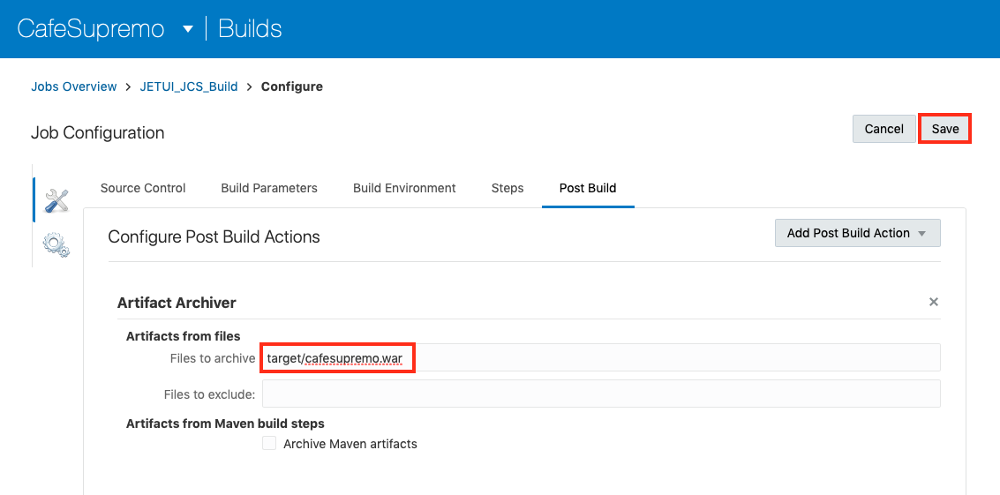
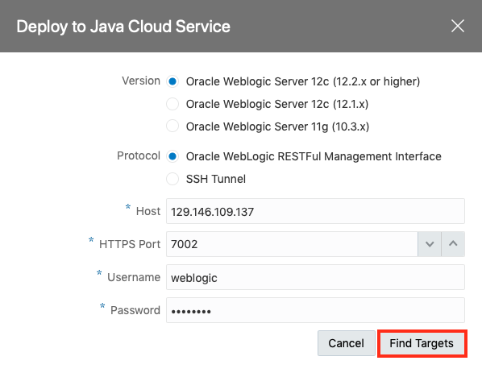
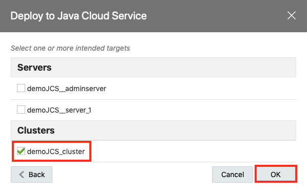
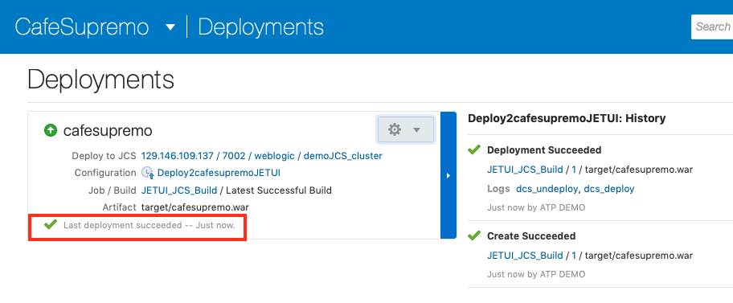

# Lab 200: Create Continuous Integration and Continuous Delivery Pipeline in Developer Cloud Service


We will create a project for the Café Supremo in Developer Cloud Service and bring all the components into this project so that we can automate the build and deploy process. We will also examine other chain tools that comes with DevCS such as branch merge request, issue tracking, Agile development, release management and team collaboration.

### About This Exercise

In this exercise, we will:

- Create and configure a Developer Cloud Service (DevCS) Project
- Import code from existing Git repository
- Create and configure build jobs and deploy configurations
- Deploy the JET UI frontend to JCS
- Deploy the Node.js Reward Service to ACCS


## Create a Developer Cloud Project and Import The Code Repositories


### **STEP 1**: Create a DevCS Project

- Go back to the Developer Cloud Service Console

- Create a new project by clicking **New Project**

- Enter `CafeSupremo` in the **Name** field

- Click **Next**

  

- Select an **Empty Project** for now and we will upload the Git repositories later from a project archive

  

- Click **Next** and followed by **Finish**

  Project creation will start upon selecting Finish.

**NOTE**: The project creation will take approximately 2 minutes to complete and it will automatically take you to the new project home page.


### **STEP 2**: Import Code Repositories

You should have an empty project after the project creation completes. We now need to populate the project with source code and build configurations. The code for the JET UI frontend and the Node.js RewardService backend has already been created so you don't need to create the application from scratch. The code is stored in two separate Git repositories to simulate two separate development teams working independently on the frontend and backend.

- On the project home page, you will see the activities displayed on the left hand pane and the on the right is your available repositories. There should be a **Maven** repository by default.

  

- Click on **New Repository** button to import the JET UI frontend repository named **CafeSupremo**

- Complete the New Repository dialog as illustrated below:
  - **Name**: CafeSupremo
  - **Intial content**: Import existing repository
  - **Import existing repository**: `https://demodevcs-gse00014208.developer.ocp.oraclecloud.com/demodevcs-gse00014208/s/demodevcs-gse00014208_cafesupremo_2682/scm/CafeSupremo.git`
  - **Username**: cloud.admin
  - **Password**: This will be provided by the instructor

    

- Click **Create**

- Repeat the above to import the RewardService backend repository named **RewardService** with the following data:
- **Name**: RewardService
- **Intial content**: Import existing repository
- **Import existing repository**: `hhttps://cloud.admin@demodevcs-gse00014208.developer.ocp.oraclecloud.com/demodevcs-gse00014208/s/demodevcs-gse00014208_cafesupremo_2682/scm/RewardService.git`
- **Username**: cloud.admin
- **Password**: This will be provided by the instructor

  

- Click **Create**

- Go back to the project home page and you should see the two new repositories you just imported.

  

**You have successfully imported the code repositories.**


## Create The Build Pipelines

Now that we have imported the code for our application, we can start creating our CI/CD pipelines for the JETUI frontend and the RewardSerivce microservice. This includes creating the build job and the deployment configurations.

At this point we could start writing our API. However, we would need to test out API with our frontend client and this client has already been built and imported in the previous step. So we want to leverage the existing client by deploying the client to a JCS runtime. To do this we could manually deploy the client to a WebLogic or JCS environment or we can complete the deployment as part of a CI/CD pipeline.

Hence, we will create the build job and deployment configuration as part of the CI/CD pipeline.


### **STEP 3**: Create The JET UI Frontend Build Job

The first task in our CI/CD pipeline is to build the JETUI frontend application. We need to create a build job for this. And we want the build to be triggered automatically whenever there is a code commit. The build process can be automated and deployed automatically to a designated JCS environment.

- Switch to Build tab on the navigation bar. There should be no build job initially.

- Click on **New Job**

  

- Complete the fields with:

  - **Job Name**: `JETUI_JCS_Build`
  - **Software Template**: `CafeSupremo` this is the Build Template you create in Lab 101

- Click **Create Job**

  

- Now you will be presented with the Job Configuration page

- Configure the build job by specifying the Git repo to build from. On the *Source Control* tab click on **Add Source Control**

  

- Select `CafeSupremo.git` from the dropdown box for **Repository** and check the **Automatically perform build on SCM commit** option to enable automated build upon a code commit.

  

- On the *Builders* tab click on **Add Builder** button and select **Unix Shell Builder** from the context option list

  

- Copy and paste the npm install script into the command field. Basically the script is building a web module from the JET UI code and then create a WAR file for deployment.

  ```
  npm install
  grunt build:release
  cd web
  mkdir WEB-INF
  cp ../JCS/web.xml WEB-INF/web.xml
  zip -r ../target/cafesupremo.war *
  ```

  

- On the *Post Build* tab click on **Add Post Build Action** button and select **Artifact Archiver** from the context option list

  

- Enter `target/cafesupremo.war` in the **Files to archive** field to define the location of the build output which it will be used for deployment

  

- Click **Save** to save the configuration

- Click **Build Now** to test the build job configuration by running it

- The build should complete without any error

  

**Congratulation! You have now completed your first build.**


### **STEP 4**: Create The Reward Service Node.js Build Job


- Switch back to the Build tab and create a new job. There should be only be one job and that is the *JETUI_JCS_Build* you just created.

- Click on **New Job**

- Complete the fields with:

  - **Job Name**: `RewardService_Build`
  - **Software Template**: `CafeSupremo` this is the Build Template you create in Lab 101

- Click **Create Job**

- Configure the build job by specifying the Git repo to build from. On the **Source Control** tab click on **Add Source Control**

- Select `RewardService.git` from the dropdown box for **Repository** and check the **Automatically perform build on SCM commit** option to enable automated build upon a code commit.

  

- On the *Builders* tab click on **Add Builder** and select **Unix Shell Builder** from the context option list

- Copy and paste the npm install script into the command field. The script also archive the build into a zip file for deployment to ACCS.

  ```
  npm install
  zip -r rewardservice.zip *
  ```

  

- On the **Post Build** tab click on **Add Post Build Action** button and select **Artifact Archiver** from the context option list

- Enter `*` in the **Files to archive** field to define the location of the build output which it will be used for deployment.

  

- Click **Save** to save the configuration

- Click **Build Now** to test the build job configuration by running it

- The build should complete without any error

  

  **You have now completed the RewardService_Build build job**


### **STEP 5**: Create The JET UI Frontend Deployment Configuration

The next part of the CI/CD pipeline is the deployment of the builds. Let's create a deployment configuration for the JET UI frontend. The deployment runtime is the JCS environment which you provisioned earlier.

- Go to the **Deploy** page

- Click on **New Configuration**

  

- Complete the New Create New Configuration as illustrated below:

  - **Configuration Name**: `Deploy2cafesupremoJETUI`
  - **Application Name**: `cafesupremo`
  - **Type**: `Automatic` and check `Deploy stable builds only`
  - **Job**: `JETUI_JCS_Build`
  - **Artifact**: `target/cafesupremo.war`

- Click **New**

- Select the **Java Cloud Service** from the context option list

  

- Complete the **Deploy to Java Cloud Service** popup configuration as illustrated below:

  - **Version**: `Oracle Weblogic Server 12c (12.2.x or higher)`
  - **Protocol**: `Oracle Weblogic RESTFul Management Interface`
  - **Host**: The IP address for your JCS environment
  - **HTTPS Port**: `7002`
  - **Username**: `weblogic`
  - **Password**: You weblogic password

- Click on **Find Targets**

  

- This will return one or more intended targets

- Check the **demoJCS_cluster**

- Click **OK**

  

- You should see the **Deployment Target** field completed with your JCS environment

- Click on **Save**

  

- You have now completed the deployment configuration for the JETUI Frontend. Let's try deploying a build to JCS cluster.

- Select the **Redeploy** option from the Settings dropdown options.

  

- Select the latest build from the **Build** dropdown list

- Click **Deploy**

  

- The deployment should complete successfully with a *Last deployment succeeded* message as below

  

  - Verify your deployment by loading the JET UI frontend URL. Open a new browser page (preferably **Chrome**), and enter the following URL:

    `http:<JCS IP address>/cafesupremo` , replacing the `<JCS IP address>` with the external IP address of your JCS instance.

   - Once the CafeSupremo home page is loaded, you will need to enable the Developer Tool and change to a mobile device format so that the menu options will be presented correctly as the UI is designed for a mobile format.

     

  - Click on the **Hamburger** icon at the top left hand corner to reveal the menu options

    

- Explore the menu options, Discover, Stores and Rewards. Please note **Rewards** makes a REST API call to the Reward Service backend to retrieve reward points and coupons.

    


**NOTE**: You should note that the Rewards menu option need to make an API call to the RewardService backend which has not been established yet. Hence you will not be able to retrieve the rewards points and coupons from the RewardService backend. We will be using this client to test our API in the next lab.


**Congratulation you have successfully deployed the Cafe Supremo JET UI frontend.**


### **STEP 6**: Create The Reward Service Deployment Configuration

Now we create a deployment configuration for the Node.js Reward Service backend. The deployment runtime is the ACCS environment which you provisioned earlier.

- Go to the **Deploy** page

- Click on **New Configuration**

- Complete the New Create New Configuration as illustrated below:

  - **Configuration Name**: `Deploy2rewardserviceNODE`
  - **Application Name**: `rewardservice`
  - **Type**: `Automatic`
  - **Job**: `RewardService_Build`
  - **Artifact**: `rewardservice.zip`


- Click **New**

- Select the **Application Container Cloud...** from the context option list

  

- Complete the **Deploy to Application Container Cloud** dialog with the following:

  - **Data Center**: `US Commercial2 - us2`
  - **Identity Domain**: Your domain ID
  - **Username**: Your Cloud username
  - **Password**: Your Cloud user password


- Click **Test Connection**

  

- This will return successfully only if all the parameters are entered correctly

  

- Check **Use Connection**

- Check **Node** in the **ACCS Properties** list

- Click **Save** to save the configuration

  


You have now completed the deployment configuration for the RewardService. Let's try deploying a build to ACCS instance.


- Select the **Redeploy** option from the Settings dropdown options.

  

- Select the latest build from the **Build** dropdown list

  

- Click **Deploy**

- The deployment will take a few minutes and you may see errors due to timeouts. Just refresh the page to see if the status has been updated.

- The deployment should complete successfully with a *Last deployment succeeded* message as below

  

- Verify your deployment to see if you can retrieve the current status for reward points and coupons. We do this by calling the API on the RewardService.

  - Enter `https://<rewardservice hostname>/loyalty/v2/points/10001` in your browser substituting the hostname of the URL with the **rewardservice** instance URL's hostname you obtained in Step 4 from the previous Lab 101

    If successful, you should see a return text of `{"points":0}` indicating zero reward points

  - Enter `https://<rewardservice hostname>/loyalty/v2/coupon/10001` in your browser substituting the hostname of the URL with the **rewardservice** instance URL's hostname you obtained in Step 4 from the previous Lab 101

    If successful, you should see a return text of `{"coupon":0}` indicating zero coupons

**NOTE**: You would normally write your API Blueprint first before coding your JET UI frontend and RewardService backend. However, as part of the demonstration for this lab exercise, the frontend and backend applications are already written for you. This is to demonstrate the end-to-end of a CI/CD pipeline. You will work with the API design in the next lab exercise which should have been the first step of your design.

**You have completed this lab section.**

[Proceed to Lab 300: API First Development](300-APIFIRSTlab.md)

or

[Back to API First Home](README.md)
