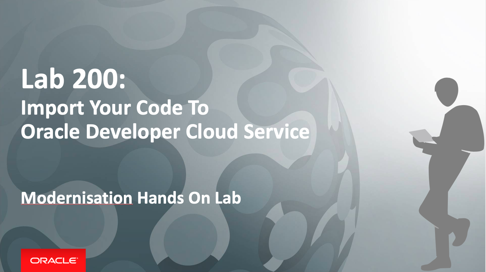

# Lab 200: Import Your Code To Developer Cloud Service

We will create a project for the Café Supremo in Developer Cloud Service and bring the application code into this project to be managed by Developer Cloud. We will also examine other chain tools that comes with DevCS such as branch merge request, issue tracking, Agile development, release management and team collaboration.

Developer Cloud Service uses Git as the Source Code Management system and is compatible with other Git systems. The Git repository created in Developer Cloud Service is a private repository and requires authentication to access it.

### About This Exercise

In this exercise, we will:

- Create and configure a Developer Cloud Service (DevCS) Project
- Import code from an existing Git repository
- Explore the chain tools that comes with Developer Cloud Service

## Create a Developer Cloud Project and Import The Code Repositories

### **STEP 1**: Create a DevCS Project

- Go back to the Developer Cloud Service Console

- Create a new project by clicking **New Project**

- Enter `CafeSupremoXX` in the **Name** field, where XX is your user number

- Click **Next**

  

- Select an **Empty Project** for now and we will upload the Git repositories later from a project archive

  

- Click **Next** and followed by **Finish**

  Project creation will start upon selecting Finish.

**NOTE**: The project creation will take approximately 2 minutes to complete and it will automatically take you to the new project home page.

### **STEP 2**: Import Code Repositories

You should have an empty project after the project creation completes. We now need to populate the project with your application source code. The code for the JET UI frontend and the Node.js RewardService backend has already been created so you don't need to create the application from scratch. The code is stored in two separate Git repositories to simulate two separate development teams working independently on the frontend and backend.

- On the project home page, you will see the activities displayed on the left hand pane and the on the right is your available repositories. There should be a **Maven** repository by default.

  

- Click on **New Repository** button to import the JET UI frontend repository named **CafeSupremo**

- Complete the New Repository dialog as illustrated below:
  - **Name**: CafeSupremo
  - **Intial content**: Import existing repository
  - **Import existing repository**: `https://demodevcs-gse00014208.developer.ocp.oraclecloud.com/demodevcs-gse00014208/s/demodevcs-gse00014208_cafesupremo_2682/scm/CafeSupremo.git`
  - **Username**: cloud.admin
  - **Password**: This will be provided by the instructor

    

- Click **Create**

- Repeat the above to import the RewardService backend repository named **RewardService** with the following data:
- **Name**: RewardService
- **Intial content**: Import existing repository
- **Import existing repository**: `hhttps://cloud.admin@demodevcs-gse00014208.developer.ocp.oraclecloud.com/demodevcs-gse00014208/s/demodevcs-gse00014208_cafesupremo_2682/scm/RewardService.git`
- **Username**: cloud.admin
- **Password**: This will be provided by the instructor

  

- Click **Create**

- Go back to the project home page and you should see the two new repositories you just imported.

  

**You have successfully imported the code repositories.**

## You have completed this lab section.##

  [Proceed to Lab 400: Putting It All Together - CICD](400-CICDlab.md)

  or

  [Back to API First Home](README.md)
