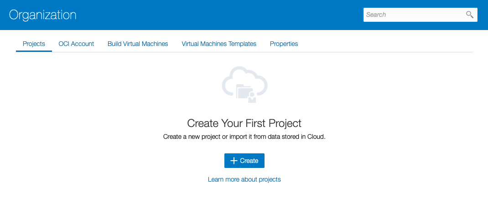
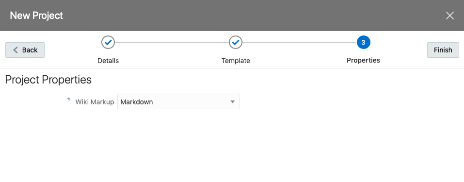
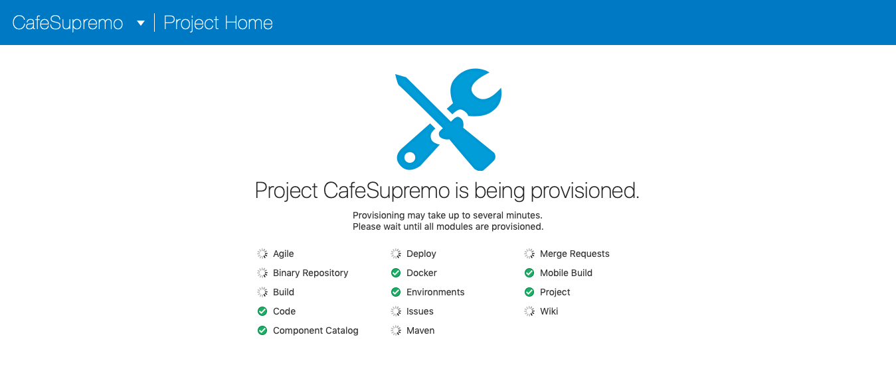
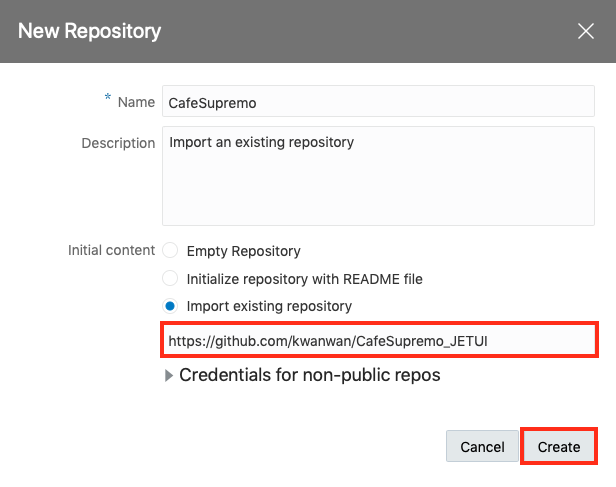
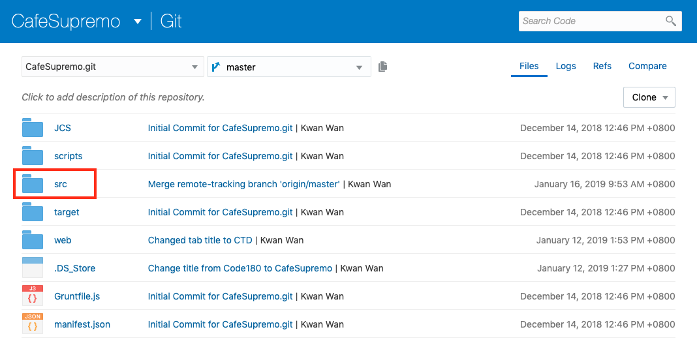
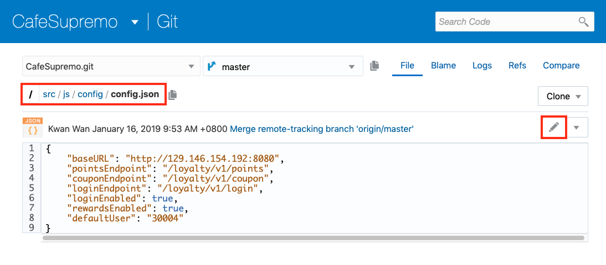
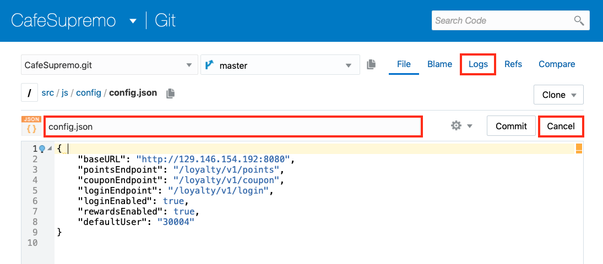
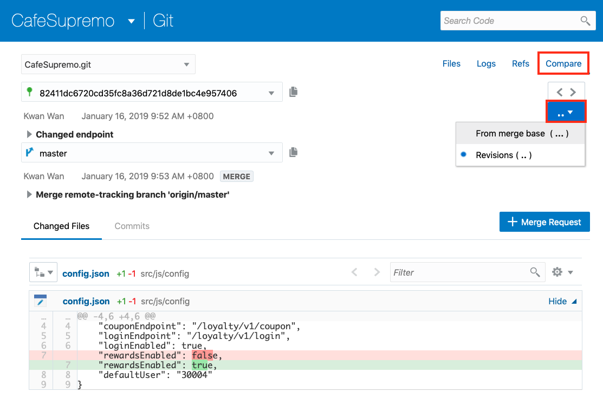
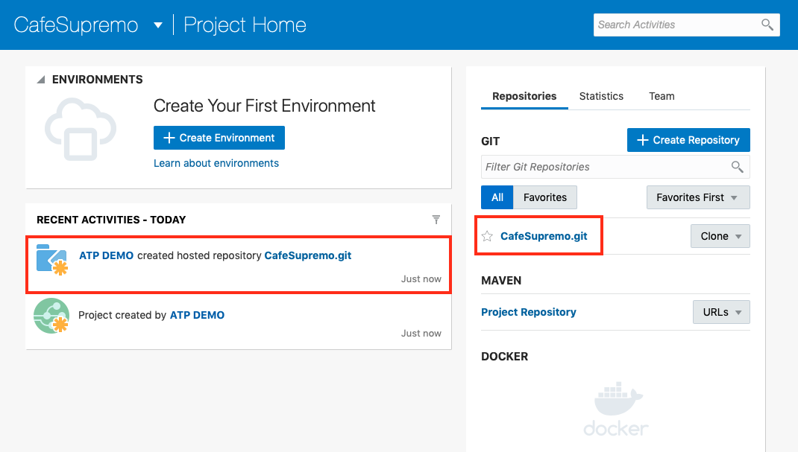

# Lab 200: Import Your Code To Developer Cloud Service

We will create a project for the Café Supremo in Developer Cloud Service and bring the application code into this project to be managed by Developer Cloud. We will also examine the chain tools that comes with DevCS such as Git repository, branch merge request, issue tracking and team collaboration.

Developer Cloud Service uses Git as the Source Code Management system and is compatible with other Git systems. The Git repository created in Developer Cloud Service is a private repository and requires authentication to access it.

### About This Exercise

In this exercise, we will:

- Create and configure a Developer Cloud Service (DevCS) Project
- Import code from an existing Git repository
- Explore the chain tools that comes with Developer Cloud Service

## Create a Developer Cloud Project and Import The Code Repositories

From the Organization page, you can create an empty project, a project with a Git repository, import a project from an OCI Object Storage, or create a project from a template.

### **STEP 1**: Create a DevCS Project

- Click the **Projects** tab in the Oragnization Page of the Developer Cloud Service Console.

  

- Create a new project by clicking **Create**

- Enter `CafeSupremo_<your name>` in the **Name** field, where `<your name>`is your own name. This is because every attendee will be creating a project in this tenancy and we need to create projects with unique names. In fact you can name it whatever you want.

- Click **Next**

  

- Select an **Empty Project** for now and we will upload the Git repositories later from an existing repository.

  

- Click **Next**

  

- Click **Finish**

  Project creation will start upon selecting Finish.

  

**NOTE**: The project creation will take approximately 2 minutes to complete and it will automatically take you to the new project home page once finished.

### **STEP 2**: Import Source Code

You should have an empty project after the project creation completes. We now need to populate the project with your application source code. The code for the JET UI frontend has already been created so you don't need to create the application from scratch. This is often the case where you want to bring an existing application into the Cloud and modernise it with CI/CD for example.

For some development teams, they may have already started their modernisation by adopting modern Open Source tools like Git for source code management. And they have already pushed their code to Git. For these developers, they can simply import their code directly from their existing Git repository. Otherwise, you will need to upload the source code manually via a local Git Client.

For this lab, we will assume your code is already hosted in GitHub and you can import it simply by providing the repository URL.

- On the project home page, you will see the tools displayed on the left hand pane and on the right is your repositories. There currently no Git repository defined.

  

- Click **Create** button to create a new Git repository to host our JET UI frontend code.

- Complete the New Repository dialog as illustrated below:
  - **Name**: CafeSupremo
  - **Intial content**: Import existing repository
  - **Import existing repository**: `https://github.com/kwanwan/CafeSupremo_JETUI`

  

- Click **Create**

- The Git repository for CafeSupremo will be displayed after the import has finished.

*Congratulation! You have successfully imported the source code.*

### **STEP 3**: Manage Code Files Using Git Repository

A project uses Git repositories hosted on Oracle Cloud to store and version control your application's source code files. Git is a distributed version control in which you clone the entire remote (or central) repository, including its history to your computer. You add and commit the files on your computer and, when you’re done, push the commits to the remote repository. The remote repository is the Git repository hosted in our DevCS project.

You can add and update files of a Git repository online from the Git page or clone the Git repository to your computer and update the files locally. You can browse, add, edit, view commit history, rename, and delete files of a Git repository. However, you can’t add or update files of a linked external Git repository.

You must also be a project member to add or updates files of a Git repository.

Let's explore the Git repository.

#### **STEP 3.1**: Navigating The Git Repository

- Click **Git** in the navigation bar if you're not already in the Git page.

- Since we only have the *CafeSupremo.git* repository, you will be taken to the **Files** page of the repository.

- You can browse and click the directory name to open it.

- Click on the *src* folder and go into the sub directories to open the file *src/js/config/config.json*

  

- This is the configuration file for CafeSupremo frontend and defines the endpoints to the Node.js RewardService. Please take note of this file as we will be coming back to this later to change our endpoints.

  

- Click on the **Edit** (Pencil icon) to edit the file's content using the online code editor.

- In the edit mode, you can rename the file, move it to another directory, by entering the new file name or path in the text box and then commit it.

  

- Click on **Cancel** to exit the edit mode.

#### **STEP 3.2**: View the History of Files

You can use the Logs view of the Git page to view the commits, branching, and merging history of a file or Git repository and its revisions.

- Click on the **Logs** link on the top right hand corner of the page. You are now in the History List view.

- To view the history of other branches, click on the **History Graph** toggle button. This enables you to view the commit history as a graph, the branches and branch merges.

  In the graph:
  - Each dot represents a commit. To see the details of the commit, click the dot.
  - A splitting line represents a branch.
  - Joining lines represent a merge.
  - Latest commits appear at the top of the graph.

  

- Click on one of the commit tags to see the changes made in the last commit.

  

#### **STEP 3.3**: Compare Revisions

You can compare any two revisions of a Git repository. The base revision indicates the starting point of the comparison and the compare revision indicates the end point of the comparison. The revision could be a branch, a tag, or a commit SHA-1 checksum hash.

- Click on the **Compare** link on the top right hand corner of the page. You are now in the History List view.

- Try changing the base revision and compare it with the merge base revision.

- The compared results are shown at the bottom of the page.

  

- Go back to the project home page and you should see the new repository you just created listed in the right hand pane. Also note the event is logged on the left hand pane under **Recent Activities**.

  

*Congratulation! You have successfully completed the import lab.*

## You have completed this lab section.##

  [Proceed to Lab 300: Create CICD Pipeline in DevCS](300-DEVCSlab.md)

  or

  [Return to Cloud Native Development Home](README.md)
