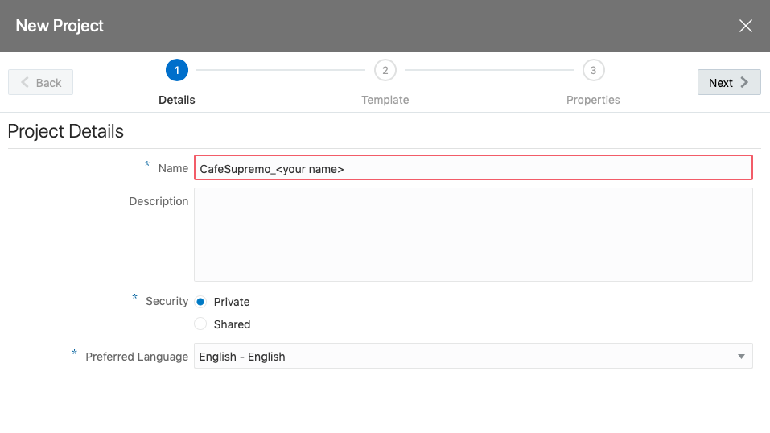

# Lab 200: Import Your Code To Developer Cloud Service

From the Organization page, you can create an empty project, a project with a Git repository, import a project from an OCI Object Storage, or create a project from a template.

We will create a project for the Café Supremo in Developer Cloud Service and bring the application code into this project to be managed by Developer Cloud. We will also examine the chain tools that comes with DevCS such as Git repository, branch merge request, issue tracking and team collaboration.

Developer Cloud Service uses Git as the Source Code Management system and is compatible with other Git systems. The Git repository created in Developer Cloud Service is a private repository and requires authentication to access it.

### About This Exercise

In this exercise, we will:

- Create and configure a Developer Cloud Service (DevCS) Project
- Import code from an existing Git repository
- Explore the chain tools that comes with Developer Cloud Service

## Create a Developer Cloud Project and Import The Code Repositories

### **STEP 1**: Create a DevCS Project

- Click the **Projects** tab in the Oragnization Page of the Developer Cloud Service Console.

  

- Create a new project by clicking **Create**

- Enter `CafeSupremo_<your name>` in the **Name** field, where `<your name>`is your own name. This is because every attendee will be creating a project in this tenancy and we need to create projects with unique names. In fact you can name it whatever you want.

- Click **Next**

  

- Select an **Empty Project** for now and we will upload the Git repositories later from an existing repository.

  

- Click **Next**

  

- Click **Finish**

  Project creation will start upon selecting Finish.

  

**NOTE**: The project creation will take approximately 2 minutes to complete and it will automatically take you to the new project home page once finished.

### **STEP 2**: Import Source Code

You should have an empty project after the project creation completes. We now need to populate the project with your application source code. The code for the JET UI frontend has already been created so you don't need to create the application from scratch. This is often the case where you want to bring an existing application into the Cloud and modernise it with CI/CD for example.

For some development teams, they may have already started their modernisation by adopting modern Open Source tools like Git for source code management. And they have already pushed their code to Git. For these developers, they can simply import their code directly from their existing Git repository. Otherwise, you will need to upload the source code manually via a local Git Client.

For this lab, we will assume your code is already hosted in GitHub and you can import it simply by providing the repository URL.

- On the project home page, you will see the tools displayed on the left hand pane and on the right is your repositories. There currently no Git repository defined.

  

- Click **Create** button to create a new Git repository to host our JET UI frontend code.

- Complete the New Repository dialog as illustrated below:
  - **Name**: CafeSupremo
  - **Intial content**: Import existing repository
  - **Import existing repository**: `https://github.com/kwanwan/CafeSupremo_JETUI`

  

- Click **Create**

- The Git repository for CafeSupremo will be displayed after the import has finished.

  

- Go back to the project home page and you should see the new repository you just created listed in the right hand pane. Also note the event is logged on the left hand pane under **Recent Activities**.

  

*Congratulation! You have successfully imported the source code.*

## You have completed this lab section.##

  [Proceed to Lab 300: Create CICD Pipeline in DevCS](300-DEVCSlab.md)

  or

  [Return to Cloud Native Development Home](README.md)
