# Lab 300: Using Apiary and Create API Blueprint


APIs make up the new language for businesses to communicate with each other. As they increase in importance, more responsibility lies on those who build and manage the APIs. Apiary solves the fundamental task of improving API development, but for many companies, meeting those increasing expectations means not only working harder but also streamlining the business process of how work gets done.

Apiary supports multiple API Description formats such as API Blueprint and Swagger. Both formats are open sourced and have great community and tooling built around them.

Both should allow you to describe a broad set of API architectures with design first approach. Swagger comes with tools to generate a description from code. API Blueprint syntax makes it easier to describe hypermedia/REST APIs.

If you are new to API Description world, we recommend to start with API Blueprint.

API Blueprint is used to encourage dialogue and collaboration between project stakeholders, developers and customers at any point in the API lifecycle. At the same time, the API Blueprint tools provide the support to achieve the goals be it API development, governance or delivery.


### About This Exercise

In this exercise, we will:
- Use API Blueprint to describe our APIs
- Use Apiary Editor to describe our Reward Service API called **loyalty**
- Use the out of the box Apiary features to provide an API Mock for client application developer to test their client against an API Mock server

For more detail information of Apiary, please visit https://apiary.io

## Login to apiary.io

### Step 1: Navigate to apiary.io

- Open a browser window and navigate to https://apiary.io

  

### Step 2: Sign up a Free Account

- If you already have an Apiary account, you can just login. If you haven't, you can sign-up for a free account with either Github OR with email. **In this example, we will sign-up with email**.

- Click [ **Sign up free with email!** ]

- Fill in your name, your email address and desired password and click [ ** Sign up for Apiary** ] - *please remember to review Apiary's Terms of Service and Privacy Policy*.

  

- You will receive email verification for your Apiary account. Just follow the instructions in that email to activate your free account.

### Step 3: Login to Apiary and Create Our First API

- If you don't have an Apiary account, follow Step 2 to create one now. You can login to Apiary once you have created your own account and activated it.

- Login to Apiary if you haven't already.

  

- **IF THIS IS YOUR FIRST API, YOU WILL SEE A SCREEN LIKE THIS**. Provide a name for your API, e.g. **apifirstlab**.

  


- Leave the default setting for format to *Start your API in* **API Blueprint**

- Click [**SAVE AND START USING APIARY**]

- You will be taken to the Apiary Editor as shown below

  

- The Apiary Editor shows a preview of your documentation while providing instant feedback to ensure correct syntax in your API document.

 Your API document will be parsed with warnings and errors as you type. These errors will be displayed both in the editor header and on the lines where the warnings and errors exist.

- Your screen will be split in two halves. The left hand side is the API Editor and the right hand side is the preview of your API.

- By default a sample API is populated in the API Editor with the preview shown on the right hand side after you create your API.


## Using Apiary Editor

### Step 4: Edit our API Blueprint

- We will now create the API Blueprint **loyalty** for our backend Reward Service. If you recall the Reward Service allows the client to query and update the reward points and coupons. These will be called through the **loyalty** API.

- In the API Editor, replace **EVERYTHING** (sample) with the following API documentation for **loyalty**.

- Take care when copying and pasting the text as the API Blueprint syntax is sensitive to spaces/tabs and line breaks. Please refer to the API Blueprint documentation and [tutorial](https://help.apiary.io/api_101/api_blueprint_tutorial/) for more details about how to write API Blueprint.


```
FORMAT: 1A
HOST: https://REPLACE-WITH-YOUR-ACCS-INSTANCE.oraclecloud.com

# loyalty

Loyalty is a sample coupon system

## Points [/loyalty/v2/points/{id}]

### Get the current points of member [GET]

+ Parameters
    + id: `10001` (string, required) ... member ID

+ Response 200
    + Headers

            Content-Type: application/json; charset=utf-8
    + Body

            {
                "points": 1
            }

### credit member 1 point [POST]

For every 3 points, member will get 1 coupon and point will be reset to zero. Response will be current points.

+ Parameters

    + id: `10001` (string, required) ... member ID

+ Request (application/json)

        {

        }

+ Response 200
    + Headers

            Content-Type: application/json; charset=utf-8
    + Body

            {
                "points": 2
            }

## Coupon [/loyalty/v2/coupon/{id}]

### Get the current coupon of member [GET]

+ Parameters
    + id: `10001` (string, required) ... member ID

+ Response 200
    + Headers

            Content-Type: application/json; charset=utf-8
    + Body

            {
                "coupon": 2
            }

### consume 1 coupon [POST]

+ Parameters
    + id: `10001` (string, required) ... member ID

+ Request (application/json)

        {

        }

+ Response 200
    + Headers

            Content-Type: application/json; charset=utf-8
    + Body

            {
                "coupon": 1
            }

```

- The final blueprint for **loyalty** will look similar to the following.

  

- Click [**Save**] to to save your API Blueprint.


## Using Apiary Interactive Documentation and Console

Apiary interactive documentation is an interactive representation of your API Description for you to not only read and write, but to be a place where you can interact with your API even before you’ve built it.

Once the API Blueprint is ready, we can use the Mock Server to test our API. We can also use the Mock Server for client application development & testing. The following steps show how a Client Application Developer use Apiary to develop their client.


### Step 5: Exploring API Documentation

The interactive documentation contains two main columns: the human and machine columns. These two columns provide the separation that is important for reading the documentation and actually using tooling to interact with it.

The columns appears as two separate halves of the page. The left hand side is the human column that provides visibility into the long form description of your API that is meant to be read by humans.

The right hand side is the machine column that displays the information  clients and servers will be interested in when interacting with you API or Apiary's Mock Server, which is meant to be read by machines.


- Click the [**Documentation**] tab to navigate to the API documentation. This is the view which *Client Application Developers* will work in when they need to learn / check / test your APIs.

  


- Imagine you are the client application developer, when you navigate to this page, you can see this **loyalty** API contains:

  - Points
    - Get current points of member
    - Credit member 1 point
  - Coupon
    - Get current number of coupons of member
    - Consume 1 coupon


- Click [**Get the current points of member**] and examin the machine column on the right. It shows you an example of using this API and the endpoint (URL) of the Mock Server.

  


### Step 6: Testing Your API with Apiary Mock Server

The Mock Server is automatically created each time you publish your API Description. This means the only thing you have to do to get started is to write your API Description, include specific requests and responses for your resources, and publish.

There are several ways in which you may interact with the Mock Server, both using your own tools and environments and using Apiary’s Console.

- Let's test the API with the Mock Server using the Apiary's Console. Select [**Mock Server**] from the dropdown option list under the [**Request**] section of the machine column on the right hand pane.

  

- After switching to the Mock Server, you will receive your own private URL for the Mock Server. This is to ensure that other users do not see the traffic you’re sending to the server.

- This URL may be used to interact directly with the server. You can make requests with applications like **curl** or **Paw** to that URL and will get responses defined in the API Description. Take note of the URL.

  

- Click [**Try**] button to switch to the Console.

- The Console is where you can send requests to the Mock Server directly from the documentation. Think of this as the test console.

- In this test console, you can set the desired URI parameters, headers, as well as entering your payload in the request body. Just keep the default values (*we are going to get the current reward points for member id 10001*).

  

- Verify that we have selected the [**Mock Server**]

- Click [**Call Resource**] button

- Scroll down and you will see the API response *(from Mock Server)*. Feel free to explore the test console.

  

**NOTE**: You have just tested the **loyalty** API without writing a single line of code.


## Code Example for Client Application(s)

Apiary encourage a contract first approach to designing your API. Write your API Description first before writing any server or client code.

To make this process possible, Apiary provides tools that allow you to try out your API as you design it, as shown in Step 6.

Apiary provides code examples that you may use to interact with the Mock Server. Code examples are one tool provided that can be dropped into your existing code or used for prototyping. Apiary generates code samples in a variety of languages.


### Step 7: Get Example Code for Different Programming Language(s)

- Go back to the example console by clicking the [**Switch to Example**] *(you might have to scroll to the top of the console pane)*.

  

- In the right hand pane, under the [Request] section, select your desired programming language from the dropdown option list. Select [**JavaScript**]

  

- After you selected a language, the sample code for that language will be displayed below. As you can see, if you want to develop a HTML5 application, you can just copy and paste this sample code segment to your JavaScripts source code and extend it. Feel free to try different languages.

  

- For example if you need to develop a Node.JS client, you can use the *request* npm module and have source code similar to the following segment to interact with the API service. Of course, these are just code examples. You can always use other framework (e.g. JQuery, request-promise, etc.) to integrate with the API service.

  

- You can also switch to other APIs by selecting an API choose from the *left hand pane*.


### Step 8: Testing Your Client Code with Apiary Mock Server

Once you have developed your client code, you can test your client against the Apiary Mock Server. We will use the prebuilt JET UI frontend client we imported into Developer Cloud Service and change the endpoint for API call to the Apiary Mock Server.

- Write down the URL of your Apiary Mock Server, we will need to use this URL in our JET UI frontend.

  

- Switch to the Developer Cloud Service home page and select [**Code**] from the naviagtion menu on the left

- Select **CafeSupremo.git** from the repository dropdown list

- Click on the **src** folder to enter the directory

  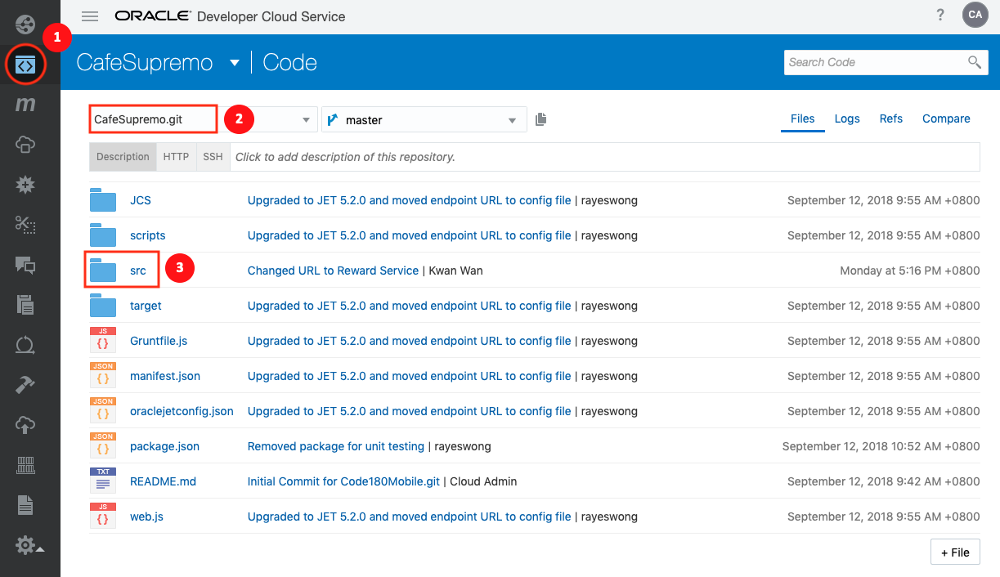

- Click into `src/js/config` directory

- Click on `config.json` to open the file

  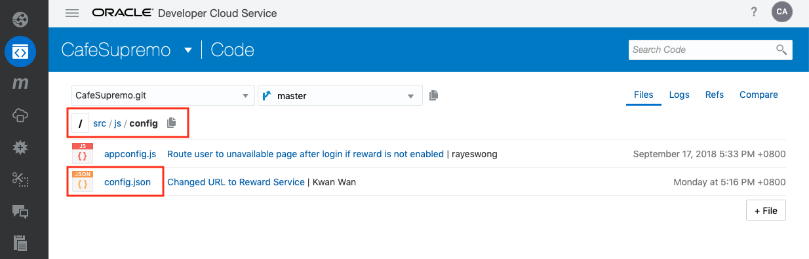

- The is the configuration file for our **loyalty** API. It enables you to change the location of your Reward Service simply by changing the `baseURL`. The parameters definition are:
    - **baseURL**: the location of our Reward Service
    - **pointsEndpoint**: endpoint for points
    - **couponEndpoint**: endpoint for coupons
    - **defaultUser**: port number for endpoint
    - **rewardsEnabled**: to enable or disable Reward Service


  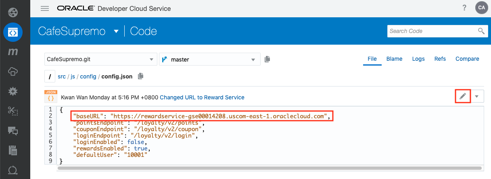

- In order to test with our Apiary Mock Server, we need to change the `baseURL` to point to your Mock Server.

- Click on the [**Pencil**] icon on the right to go into the edit mode. We are directly editing the `config.json` file in the repository.

- Replace the `baseURL` with the Apiary Mock Server URL you obtained earlier.

  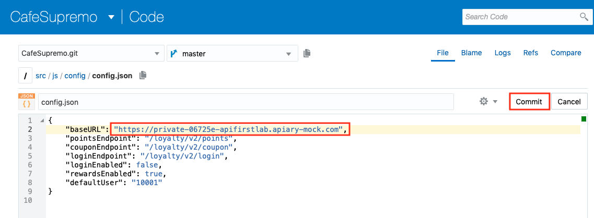

- Click [**Commit**]

- On the popup Commit changes dialog box, enter a commit summary such as `Changed the baseURL to point to Apiary Mock Server`

  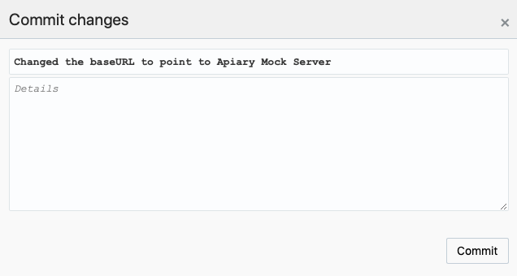

- Click [**Commit**] to save the changes.

- Upon committing the change, this will automatically trigger off a build and deployment of the CafeSupremo JET UI frontend which you configured in Lab 200.


- You can follow the build progress under the Build Job page.

   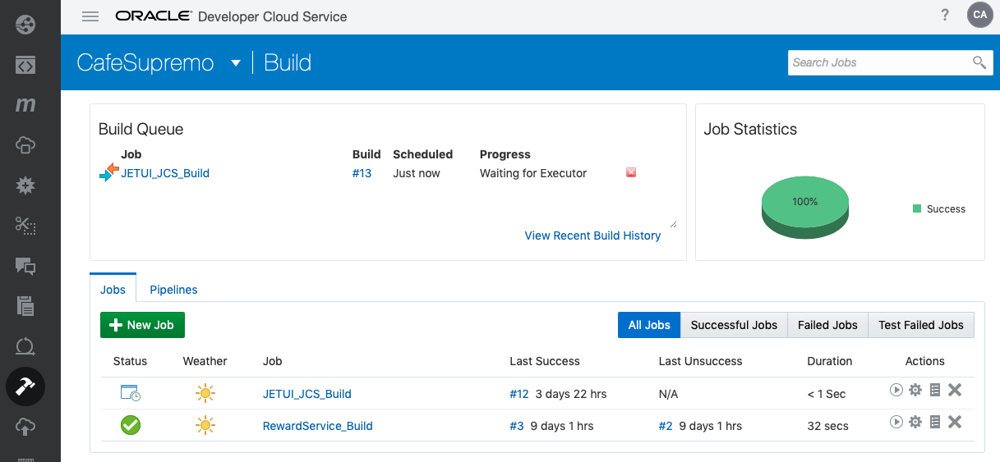

- Once built, it should deploy automatically. Similarly, you can follow the deployment progress under the Deployment page.

- Alternatievely, you should see the commit followed by the build and deploy notifications under the **RECENT ACTIVITIES -TODAY** on the project home page.

     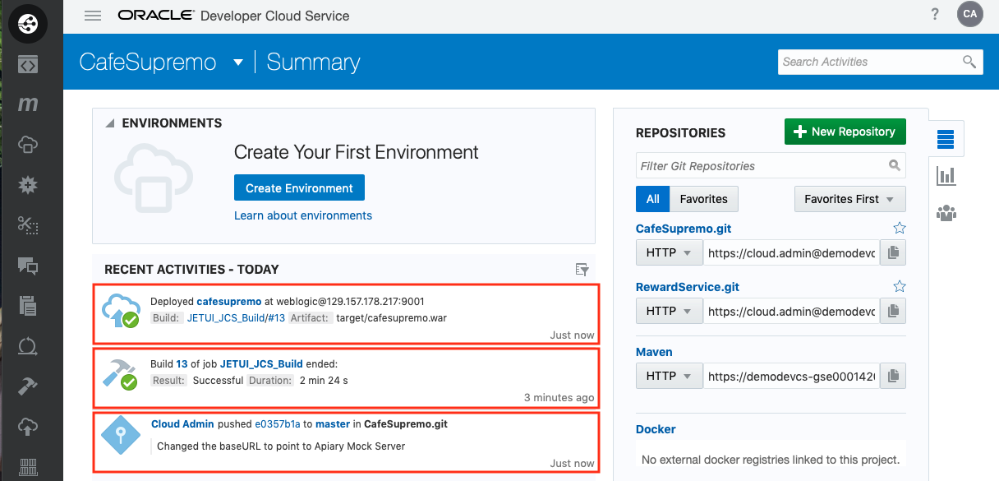

- We now have a JET UI frontend client pointing to the Apiary Mock Server. So try this out.

- Open a new browser page (preferably **Chrome**), and enter the following URL:

  `http:<JCS IP address>/cafesupremo` , replacing the `<JCS IP address>` with the external IP address of your JCS instance as in **Step 5** of **Lab 200**.

 - Once the CafeSupremo home page is loaded, you will need to enable the Developer Tool and change to a mobile device format so that the menu options will be presented correctly as the UI is designed for a mobile format.

   

- We are now ready to test our API. Click on the **Hamburger** icon at the top left hand corner to reveal the menu options

   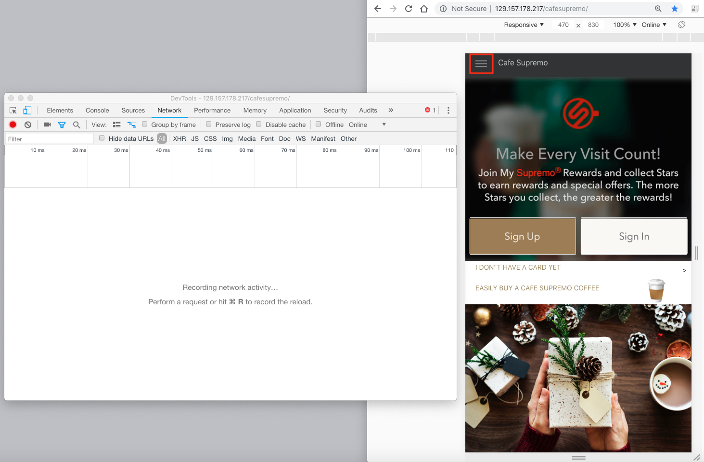

- Click on **Rewards** option. This will make a REST API call to our **loyalty** API to retrieve the reward points and coupons for the customer.

   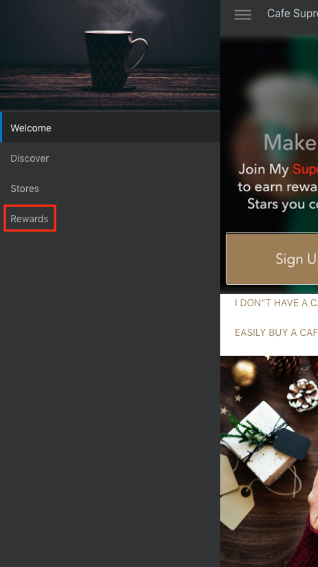

- You will be able to trace the API calls in the Developer Tools console. These will appear as **10001**.

   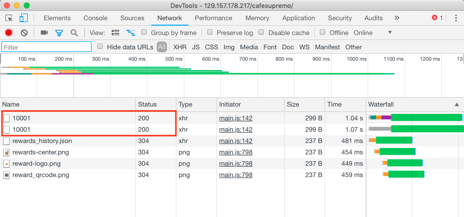

- Click into each of these calls to see more detail. This confirms the API call is made to our Mock Server to retrieve the reward points.

   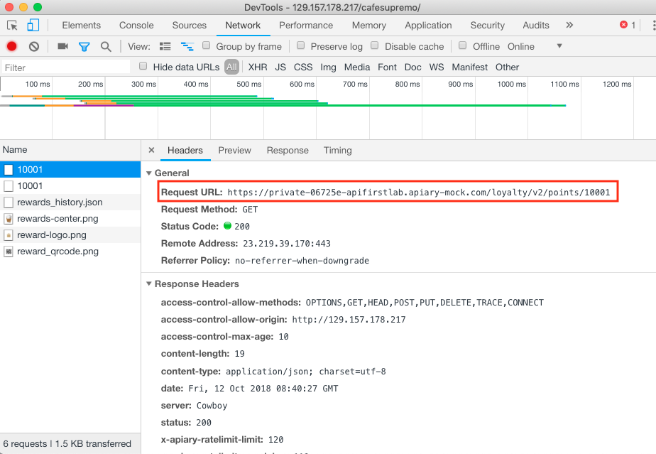

- And the following makes a call to our Mock Server to retrieve the coupons.

   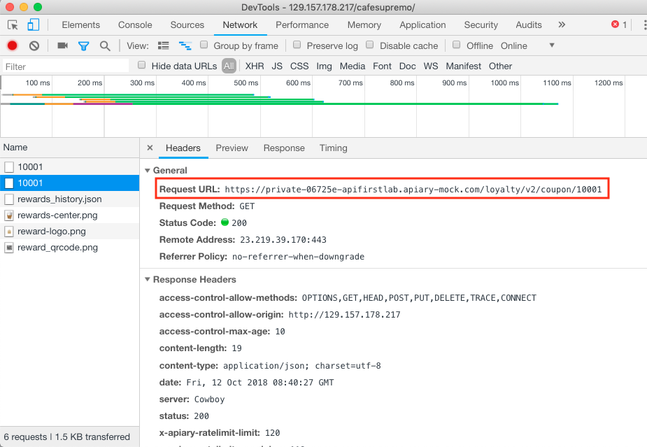

- And you can see the response for either API calls by selecting the **Preview** tab on the Developer Tool console. This following is for points.

   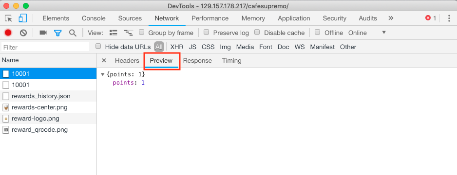

- And the following is the response for coupon.

   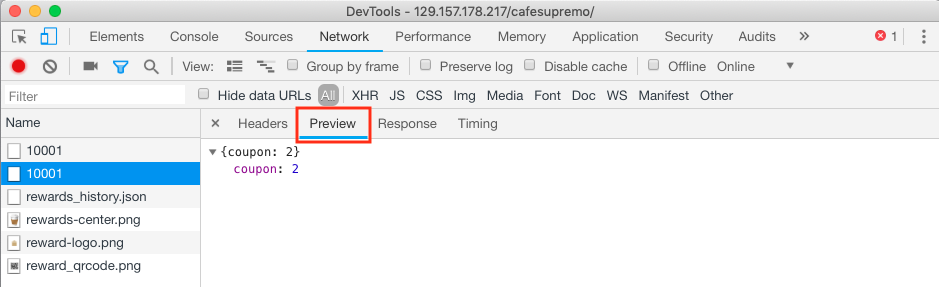


## You have completed this lab section.##

  [Proceed to Lab 400: Putting It All Together - CICD](400-CICDlab.md)

  or

  [Back to API First Home](README.md)
