# Lab 300: Automating Your Build and Deployment in Developer Cloud Service

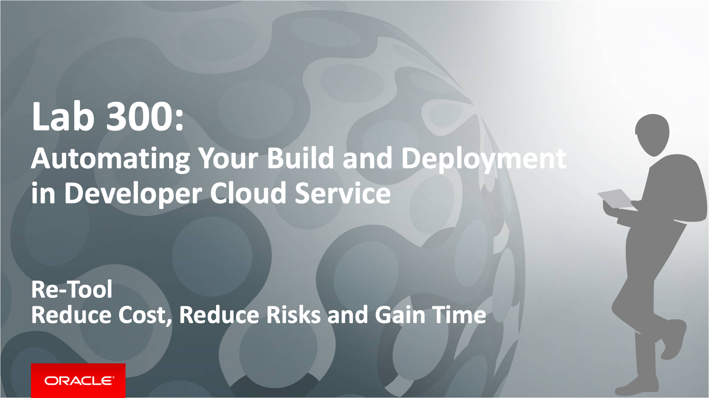

Having created a project for the Café Supremo in Developer Cloud Service and imported the source code, we can now automate the build and deploy process. We will also examine other chain tools that comes with DevCS such as branch merge request, issue tracking, Agile development, release management and team collaboration.

### About This Exercise

In this exercise, we will:

- Create and configure build jobs and deploy configurations
- Deploy the JET UI frontend to JCS


## Create The Build Pipelines

Now that we have imported the code for our application, we can start creating our CI/CD pipelines for the JETUI frontend. This includes creating the build job and the deployment configuration.


### **STEP 1**: Create The JET UI Frontend Build Job

The first task in our CI/CD pipeline is to build the JETUI frontend application. We will create a build job that will be triggered automatically whenever there is a code commit. The build process can be automated and deployed automatically to a designated JCS environment.

- Switch to Build tab on the navigation bar. There should be no build job initially.

  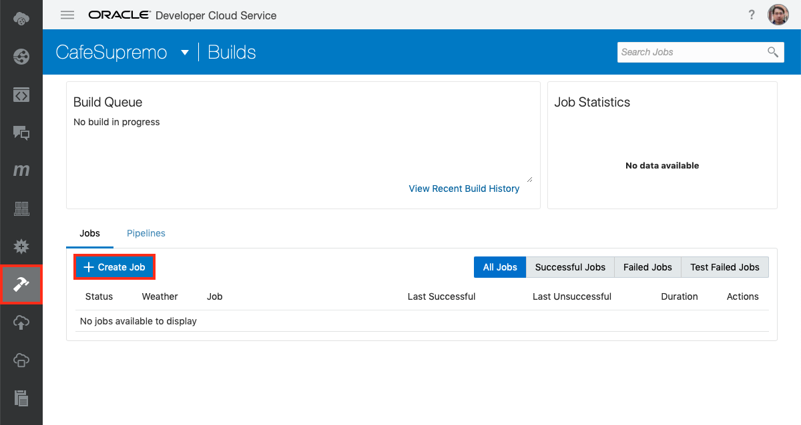

- Click on **Create Job**

- Complete the fields with:

  - **Job Name**: `JETUI_JCS_Build`
  - **Software Template**: `CafeSupremo` this is the Build Template you create in Lab 101

    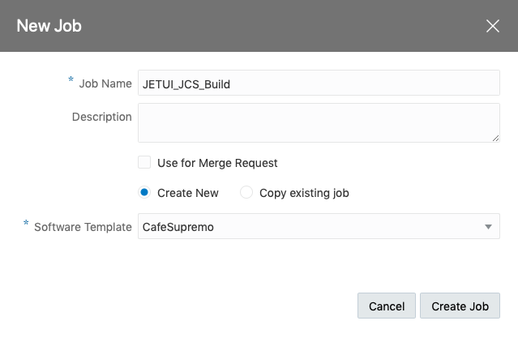

- Click **Create Job**    

- Now you will be presented with the Job Configuration page

- Configure the build job by specifying the Git repo to build from. On the *Source Control* tab click on **Add Source Control**

  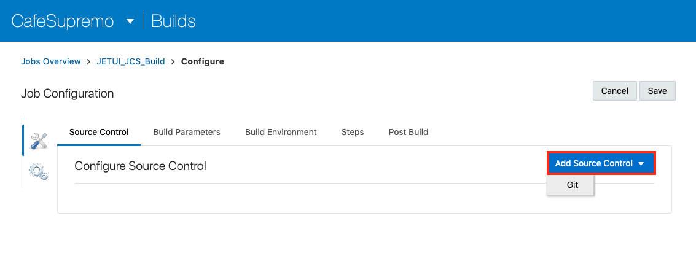

- Select `CafeSupremo.git` from the dropdown box for **Repository** and check the **Automatically perform build on SCM commit** option to enable automated build upon a code commit.

  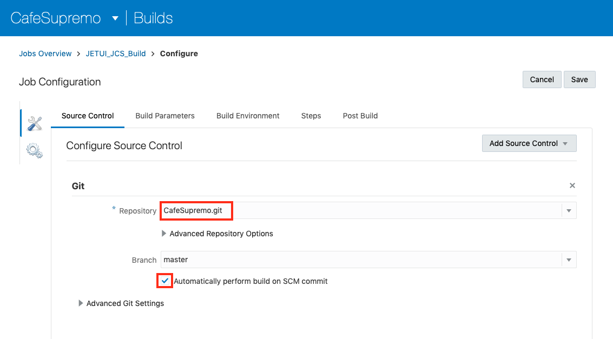

- On the *Steps* tab click on **Add Step** button and select **Unix Shell** from the context option list

  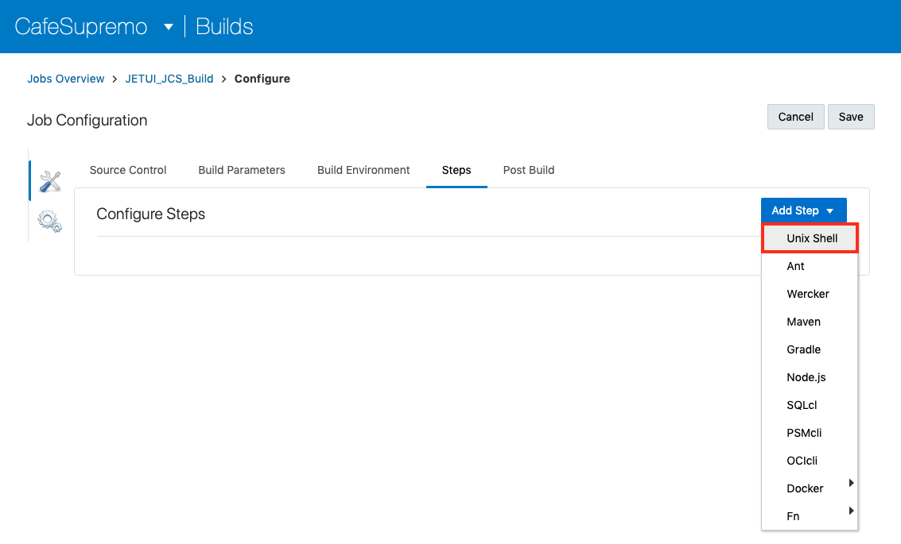

- Copy and paste the npm install script into the command field. Basically the script builds a web module from the JET UI code and then create a WAR file for deployment.

  ```
  npm install
  grunt build:release
  cd web
  mkdir WEB-INF
  cp ../JCS/web.xml WEB-INF/web.xml
  zip -r ../target/cafesupremo.war *
  ```

  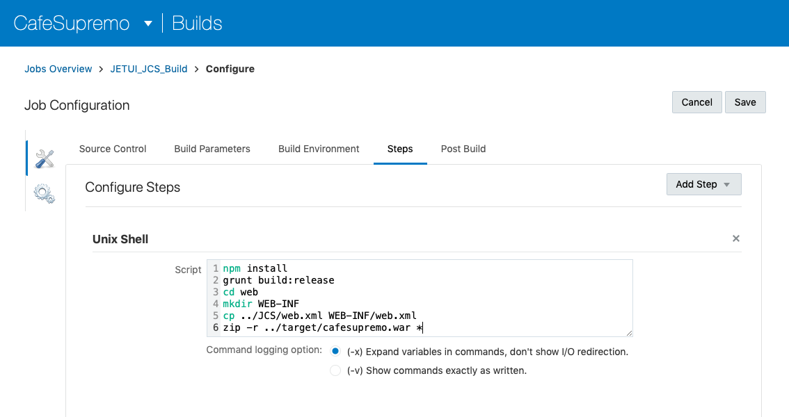

- On the *Post Build* tab click on **Add Post Build Action** button and select **Artifact Archiver** from the context option list

  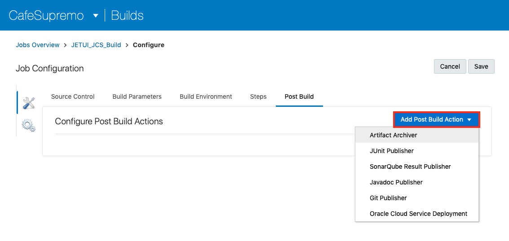

- Enter `target/cafesupremo.war` in the **Files to archive** field to define the location of the build output which it will be used for deployment

  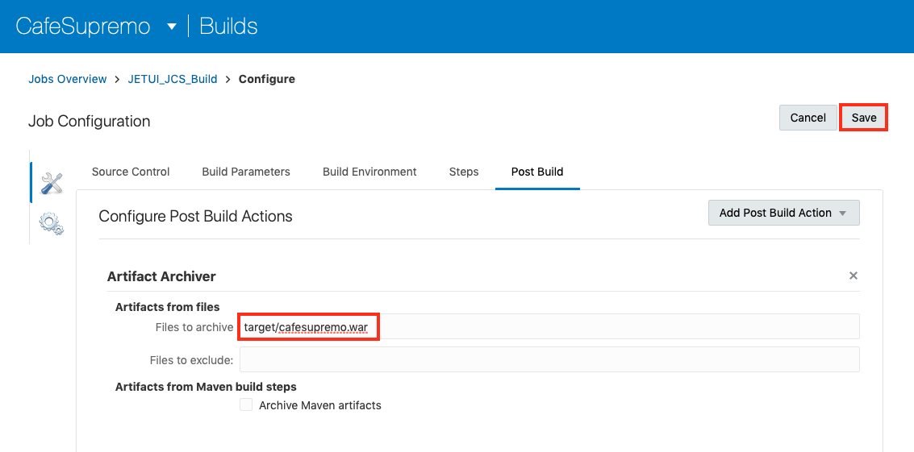

- Click **Save** to save the configuration

- Click **Build Now** to test the build job configuration by running it

  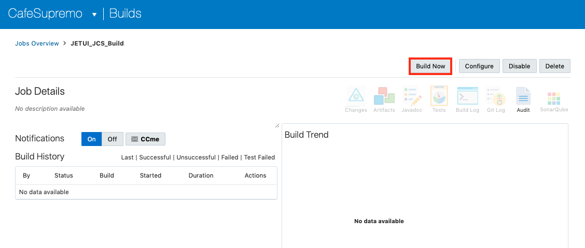

- The build is placed on the executor queue and will be served by the first available Build VM. If a Build VM is already started, then the build will complete in a few minutes. However, if a Build VM is stopped and need to be started, then it take will take a bit longer as starting the Build VM will take a few more minutes.

  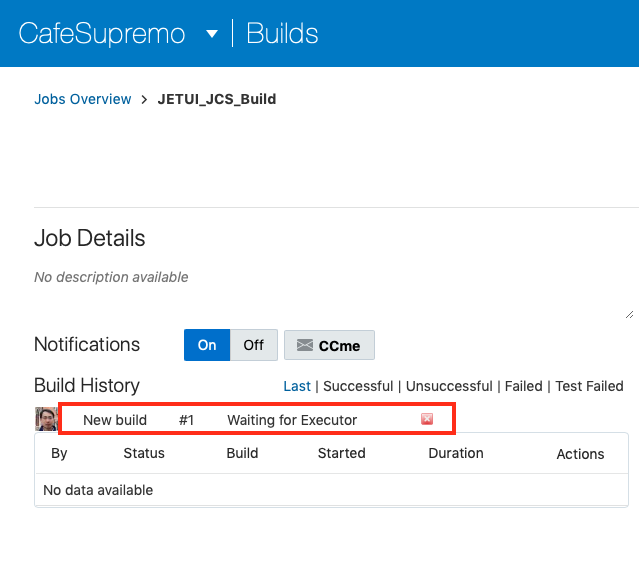

- The build should complete without any error. A build generates various types of reports and logs such as SCM Changes, test results, and action history. You can open these reports from the Job Details page or the Build Details page.

  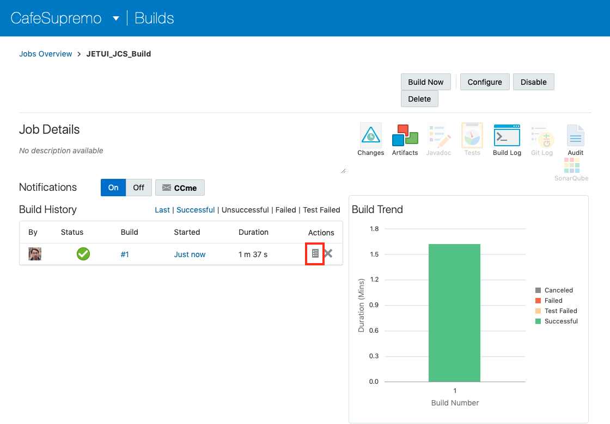

- You can review the build log in the *Build Log* page. If the log is displayed partially, click the **Download Log** link to view the entire log. To download the log as a text file, click the Download Console Output link.

  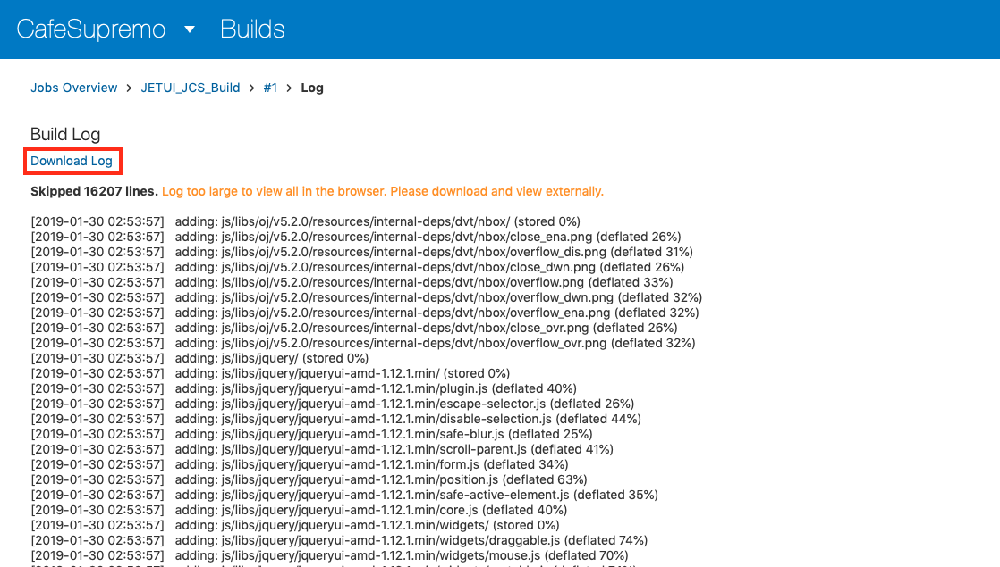


*Congratulation! You have now completed your first build.*


### **STEP 2**: Create The JET UI Frontend Deployment Configuration

The next part of the CI/CD pipeline is the deployment of the build. Let's create a deployment configuration for the JET UI frontend. The deployment runtime is the JCS environment which you provisioned earlier.

- Go to the **Deploy** page

- Click on **Create Configuration**

  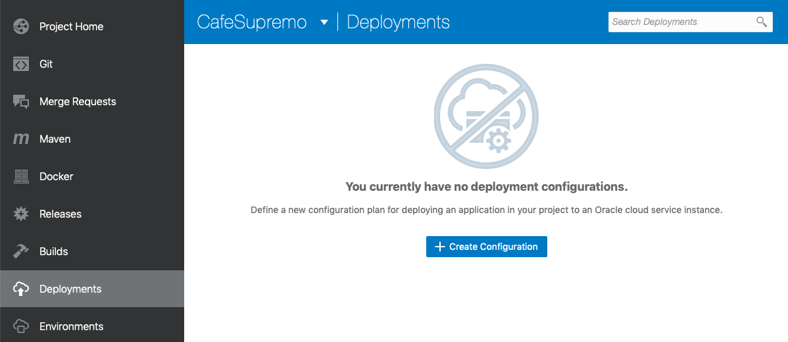

- Complete the New Create New Configuration as illustrated below:

  - **Configuration Name**: `Deploy2cafesupremoJETUI`
  - **Application Name**: `cafesupremo`
  - **Type**: `Automatic` and check `Deploy stable builds only`
  - **Job**: `JETUI_JCS_Build`
  - **Artifact**: `target/cafesupremo.war`

- Click **New**

- Select the **Java Cloud Service** from the context option list

  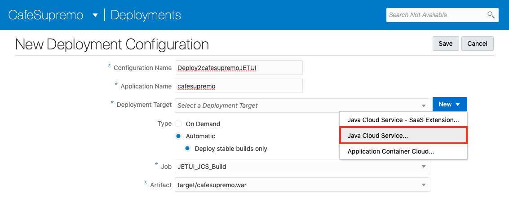

- Complete the **Deploy to Java Cloud Service** popup configuration as illustrated below:

  - **Version**: `Oracle Weblogic Server 12c (12.2.x or higher)`
  - **Protocol**: `Oracle Weblogic RESTFul Management Interface`
  - **Host**: The IP address for your JCS environment
  - **HTTPS Port**: `7002`
  - **Username**: `weblogic`
  - **Password**: You weblogic password

- Click on **Find Targets**

  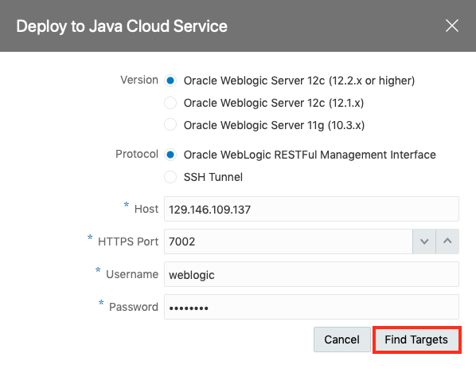

- This will return one or more intended targets

  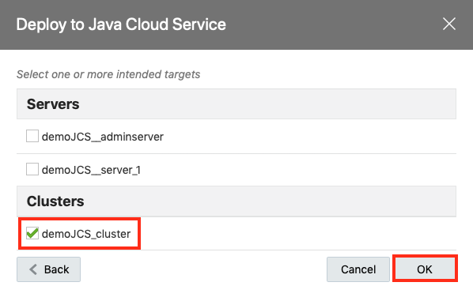

- Check the **demoJCS_cluster**

- Click **OK**


- You should see the **Deployment Target** field completed with your JCS environment

- Click on **Save**

  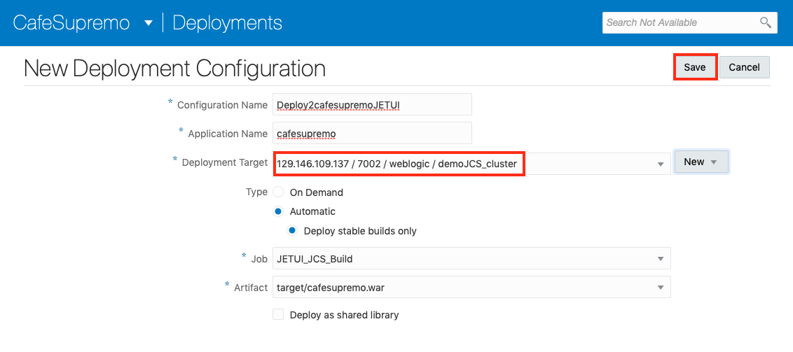

- You have now completed the deployment configuration for the JETUI Frontend. Let's try deploying a build to JCS cluster.

- Select the **Redeploy** option from the Settings dropdown options.

  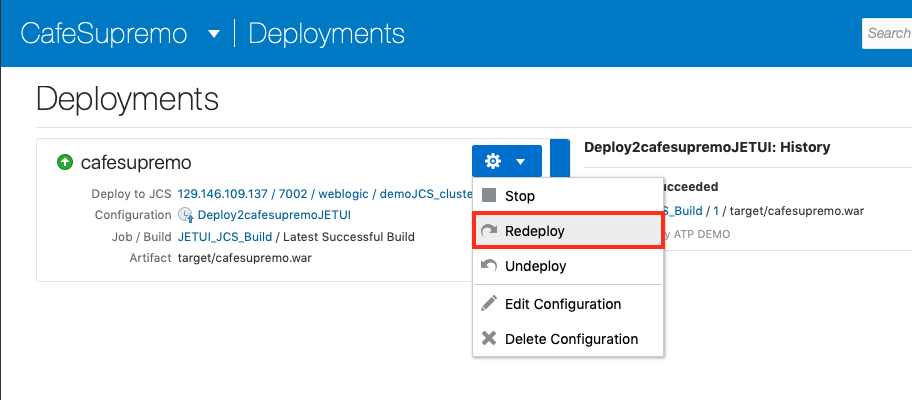

- Select the latest build from the **Build** dropdown list

- Click **Deploy**

  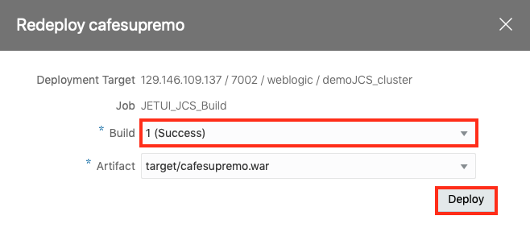

- The deployment should complete successfully with a *Last deployment succeeded* message as below

  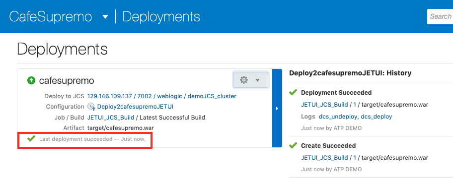

- Verify your deployment by loading the JET UI frontend URL. Open a new browser page (preferably **Chrome**), and enter the following URL:

    `http:<JCS IP address>/cafesupremo` , replacing the `<JCS IP address>` with the external IP address of your JCS instance.

- Once the CafeSupremo home page is loaded, you will need to enable the Developer Tool and change to a mobile device format so that the menu options will be presented correctly as the UI is designed for a mobile format. Below is how you would do it in **Chrome**.

 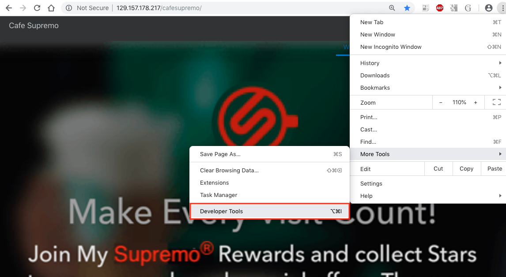

- Click on the **Hamburger** icon at the top left hand corner to reveal the menu options

  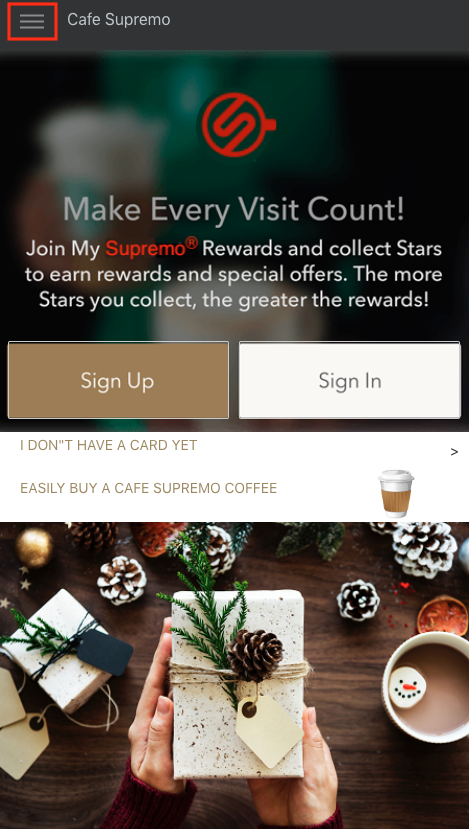

- Explore the menu options, **Discover**, **Stores** and **Rewards**.

  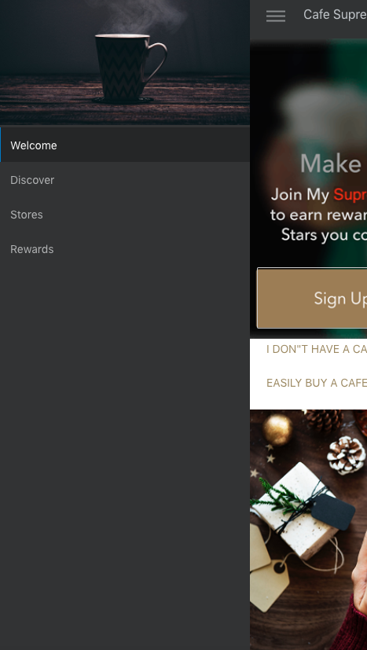


**NOTE**: The **Rewards** menu option need to make an REST API call to the RewardService backend which has not been established yet. Hence you will not be able to retrieve the rewards points and coupons from the RewardService backend. We will enable the client to call our REST API in the next lab.


*Congratulation! You have successfully deployed the Cafe Supremo JET UI frontend.*


### **STEP 3**: Verify the Reward Service Backend

The Reward Service Backend has already been provisioned for you by your instructor. There is only one instance of this Reward Service running in a Kubernetes cluster hosted on OCI.

You need to verify your access to this Rewards Service by making a REST API call to the RewardService.

  - Enter `http://<rewardservice hostname>:8080/loyalty/v2/points/10001` in your browser, substituting the hostname with one provided by your instructor.

    If successful, you should see a return text of `{"points":0}` indicating zero reward points

  - Enter `http://<rewardservice hostname>:8080/loyalty/v2/coupon/10001` in your browser, substituting the hostname with one provided by your instructor.

    If successful, you should see a return text of `{"coupon":0}` indicating zero coupons


*Congratulation! You have successfully completed this lab section.*


[Proceed to Lab 400: Putting it All Together](400-CICDlab.md)

or

[Return to Cloud Native Development Home](README.md)
