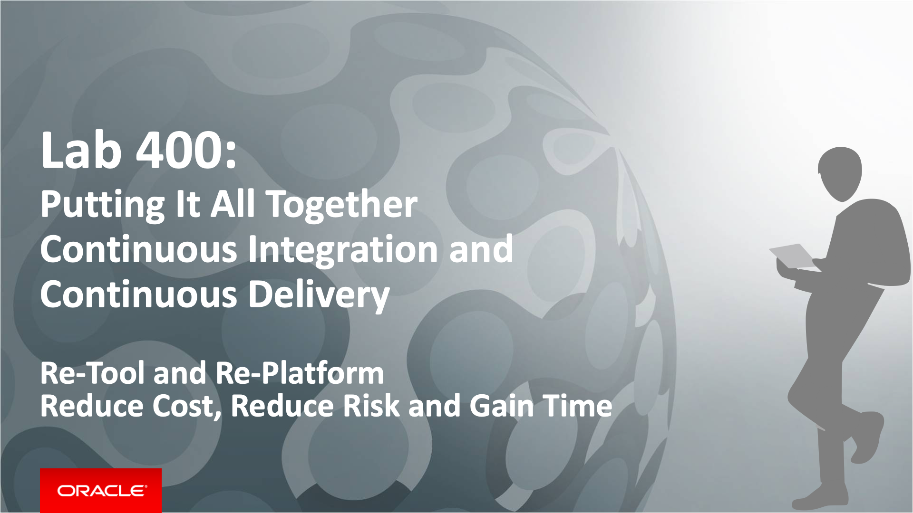
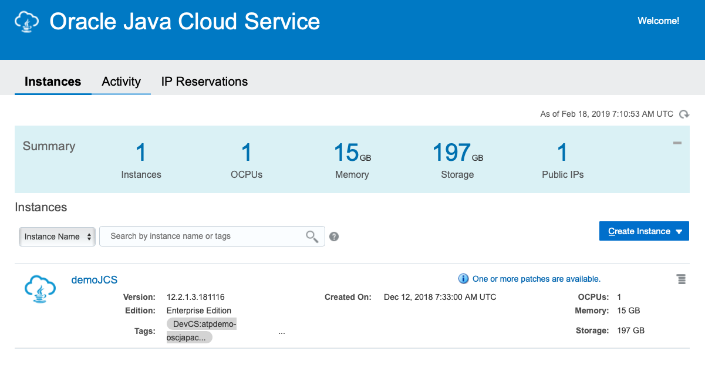
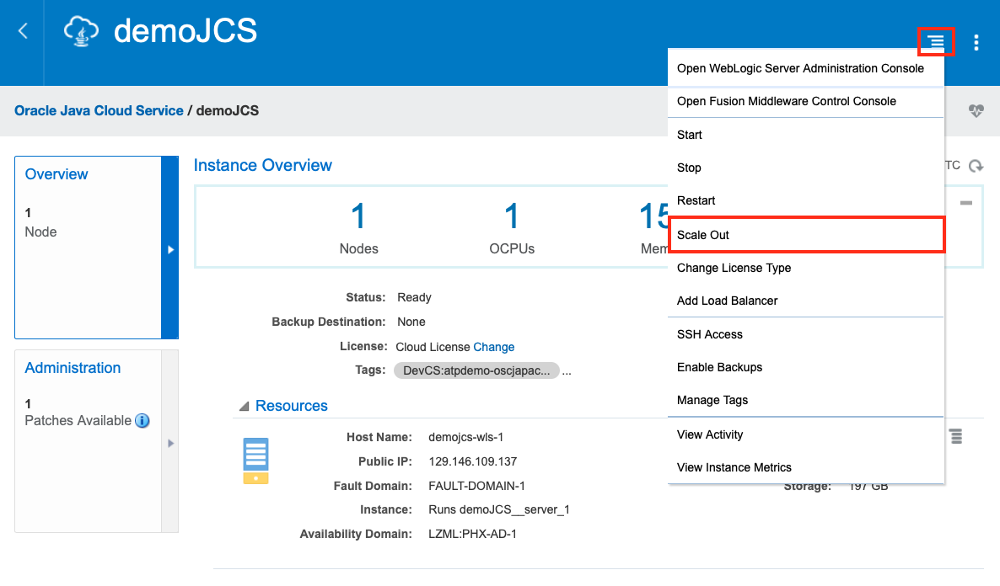

# Lab 400: Putting It All Together - Continuous Integration and Delivery



On the completion of the previous lab - Lab 300, you should be able to build and deploy the Cafe Supremo JET UI frontend to JCS, as well as loading the Cafe Supremo app on your browser. However, you are not able retrieve your rewards points and coupons with the **Rewards** menu option. That's because the REST API in the JET UI frontend has not been configured to point to the Reward Service endpoint.

In this lab we will demonstrate the complete end-to-end of our CI/CD lifecycle by updating the REST API call in the JET UI frontend code to point to our newly provisioned Reward Service. By doing so, it will trigger an automated build and deployment of the JET UI frontend.

### About This Exercise

In this exercise, we will:

- Configure Brackets as your code editor
- Clone the DevCS Git repository to your local laptop
- Make changes to your code and trigger a build
- Observe the CI/CD process in action
- Validate your Cafe Supremo application
- Scaling a JCS instance
- Scaling an ATP instance


## Developing with Brackets

To enable a developer to develop code and commit it to the Git repository in Developer Cloud, you can use your favourite IDE or a simple text editor with Git command line interface. However, we are going to strike a balance and use something that is pretty lightweight but has built in integration with Git. Brackets is a modern open source editor that is supported by an active community.

- You must have installed Brackets and Git extension as well as Git Client. If you haven't done this already please follow the guides below.

  *[Click HERE for Brackets and Git Extension installation detail](BRACKETSinstall.md)*
  *[Click HERE for Git Client installation details](GITCLIENTinstall.md)*


### STEP 1: Cloning the Git Repository from Developer Cloud Service

- Start the Brackets Text Editor, in the **File** pull-down menu, choose **Open Folder...**

  

- Navigate to the target destination directory to store the source code, for example: `D:\oracle`

- Click **New Folder** to create a new folder in the destination directory

- Enter `CafeSupremo` as the name of the new folder and click **Create**

- Click **Open** after it has been created

  

- Click on GIT icon on the right hand side of the editor to open the Git panel below the editor

  

- Click **Clone** in the Git panel

  

- Switch back to the Developer Cloud Service dashboard. Click on the **Clone** dropdown list next to the **CafeSupremo.git** repository to open the list of clone options.

- Click the square **Copy** icon by the *HTTPS* URL to copy the link.

  

- Switch back to the Brackets editor and paste the copied URL from Developer Cloud Service into the **Enter Git URL of the repository you want to clone:** field. The username should be populated automatically.

- Enter your password

- Check the **Save credentials to remote url** checkbox

- Click **OK**

  

- Wait for Brackets to clone your remote project to local folder

  

- You now have a local copy of the Git repository

  


### STEP 2: Commit and Push Code Changes

Let's try out the CI/CD pipeline by making code changes and pushing the committed changes to the DevCS master Git repository. We will work with the cloned Git repository, replace the REST API calls to a running Reward Service provided by your instructor.

- Expand the left navigation tree and open *config.json* file (*Under src->js->config*)

  

- On the main window, locate the **baseURL** entry in *config.json* source code and modify the URL by replacing the host IP with the IP address provided by your instructor.

  ```
  "baseURL": "https://<RewardService IP address>",
  ```

- Below the `baseURL` are the endpoints for getting the points and coupons.

- Select **Save** to save the code changes

  


- Check the box next to **Commit** to select all modified files - this means the checkbox below for `config.json` will automatically be checked

  

- Click **Commit** to commit changes to the local cloned Git repository

- In the Git commit pop up enter the comment: `Replaced hostname in API calls` and then click **OK**. This will commit the changes to your local git repository. Ignore any code inspection problems above.

  

- Click **Git Push** icon on the right side of the Git panel

  

- In the *Push to remote* pop up window, leave fields to their defaults and click **OK**. This will begin the Git push to the Developer Cloud *CafeSupremo.git* master repository.

  

- Once Git Push completes, click **OK**

  


### STEP 3: Observe Your CI/CD Pipeline

- Switch back to your Developer Cloud Project home page and you should see your changes has been pushed to the DevCS master repository

  

- Click on the Build Job tab and you should see your changes has automatically triggered a build

- Follow the build as it moves from the build queue to running the build

  

- Wait until the build completes

  

- Click on the Deploy Configuration tab and wait till you see the *Last deployment succeeded* message in the **cafesupremo** configuration tile. Reload page if you don't see any dates.

  


  ### STEP 4: Verify Your Deployment

- Let's verify your changes to see if the JET UI frontend is able to call the APIs in the Reward Service backend. Enter

  `http://<JCS IP address>/cafesupremo` in your browser replacing the `<JCS IP address>` with the IP address of your newly provisioned JCS instance.

  

- Click **Sign In**

- Enter the username and password assigned to you by your instructor.

   

- Click **Submit**

- After logging in, click on the **Hamburger** icon at the top left hand corner to reveal the menu options

  

- Click on **Rewards** and you will be presented with your account balance.

  

- Click **Credit A Star** to add points to your account and see the counter increments

- Once you have accumulated 3 or more stars, you will be credited with a **Free Coffee** coupon

  

- Click on **Free Coffee** to reveal the QR code and a **Redeem** button

- Click **Redeem** to redeem coffee. This will reset the coupon counter.

  

- If you can increment the points, accumulated coupons and redeem coupons, then you have successfully connected to your Autonomous Transaction Database.


*Congratulation!! You have completed a working CI/CD pipeline for an agile application.*


## Scaling a Java Cloud Service Instance

**This section is optional**

Scaling lets you add or remove resources for a Java Cloud Service instance on demand in response to changes in load on the service instance. You can scale Java Cloud Service instance by scaling a cluster or a node.

You can scale out a cluster by adding a node to the cluster and you can scale in a cluster by removing removing a selected node from the cluster. By default, the service scales in a cluster gracefully by shutting down any Oracle software running on the node.


### STEP 4: Scaling Java Cloud Service Cluster

To increase resources in response to larger workloads, you can scale out an Oracle Java Cloud Service instance by adding a node.

- Go to your Java Cloud Console.

  

- Click on **demoJCS**, the service instance to which you want to add a node.

- Select **Scale Out** from the **Manage this instance** list by clicking on the hamburger icon at the top right hand corner.

  

- Click on **Scale Out** to confirm the action.

  

- After a while you will be to see the second node being added to the cluster.

  

  **NOTE**: This may take 15 to 20 minutes to complete.

- To scale in, you simply remove the node from the cluster by clicking on the hamburger icon at the top right hand corner of the node you want to remove.

  

- Select **Remove Node** from the menu list

  

- Check **Force scale in VMs** checkbox and click **Remove Node** to confirm.

  **NOTE**: This may take 15 to 20 minutes to complete.

*Congratulation!! You have completed the scaling of a JCS cluster.*


## Scaling an Autonomous Transaction Processing Instance

Autonomous Transaction Processing provides all of the performance of the Oracle Database in an environment that is tuned and optimised for transaction processing workloads. ATP database provisions in a few minutes and requires very little manual ongoing administration.

Scaling in the context of an ATP database means increasing or decreasing the amount of CPU or storage resources allocated to the service. Scaling an ATP instance is easy, flexible and can be done without any downtime so your application can continue to run unaffected while the scaling operation is in progress.


### STEP 5: Log into Your Cloud Account and Navigate to ATP Console

- Log into your cloud account and navigate to ATP console.

- Click **ATP_Demo_DB** database instance to see details of it.

  

- On the instance details page, select **Scale Up/Down** button at the top

  

- You can scale up or down by changing the CPU count or storage size.

  

- Click **Update** to commit the changes.


**Congratulation!! You have completed all the labs.**


[Return to Cloud Native Development Home](README.md)
