# Cafe Supremo CI/CD Hands On Lab

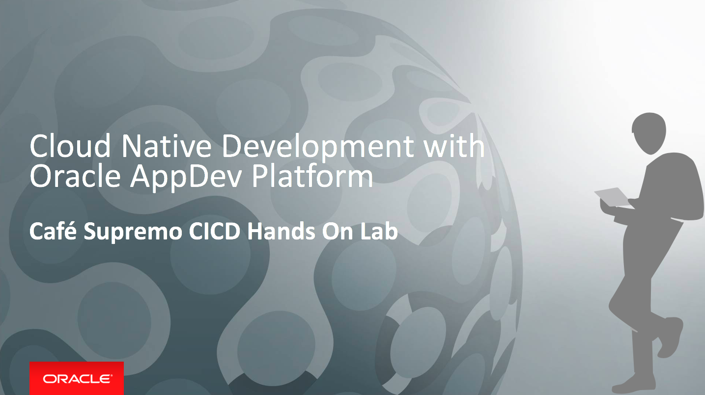


## Introduction

This workshop will walk you through the process of moving an existing application into a CI/CD pipeline and deploying it to a WebLogic cluster and a ACCS Node.js instance in the Oracle Public Cloud.

You will take on 2 personas during the workshop. The **Lead Developer Persona** will be responsible for configuring the parts of the automated build and deploy process that involve details about the application itself. The **DevOps Engineer Persona** will configure the parts of the automation involving the JCS and ACCS infrastructure. To automate the building and deploying of this application you will make use of Developer Cloud Service for CI/CD, JCS for hosting JET UI frontend, and ACCS for hosting the Rewards Service.

## Preparing Database Cloud Service, Java Cloud Service, Application Container Cloud Service and Developer Cloud Service

During this part of the lab, you will take on the **DevOps Engineer Persona**. You will provision the required cloud services for Developer Cloud Service to build and deploy to a WebLogic Server cluster in Java Cloud Service and Application Container Cloud Service instance. You must have access to a:

- GitHub account
- Oracle Public Cloud Service account including Java, Application Container, Developer, Database and Storage Cloud Service

The current release of the application no longer requires a database for storing customer data. Customer data is now stored in a ACCS cache and is automatically populated upon the start up of the RewardService ACCS instance. This is to keep the lab duration short and to avoid the laborious effort in uploading the data to a database. However, a datbase would be required as a persistent storage in real case scenario.

However, an Oracle Database Cloud Service is still required by Java Cloud Service to host the Oracle Fusion Middleware component schemas used by Oracle Java Required Files (JRF).


## Provision a DBCS Instance

### **STEP 1**: Sign Into The Oracle Cloud Service Account

- Sign into your Oracle Cloud Service account.


### **STEP 2**: Create a DBCS Instance

- On the dashboard click the hamburger icon on the **Database** tile. Select **Open Service Console**.

  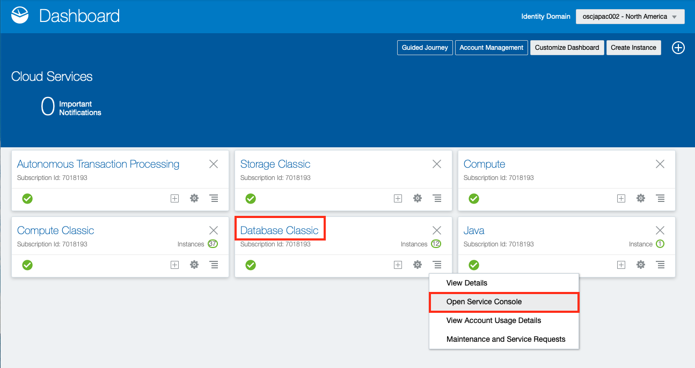

- Once in the Database Cloud Service Console page, create a new instance by clicking **Create Service** button.


### **STEP 2.1**: Basic Instance Configuration

- Complete the Create Instance Page as illustrated below:

  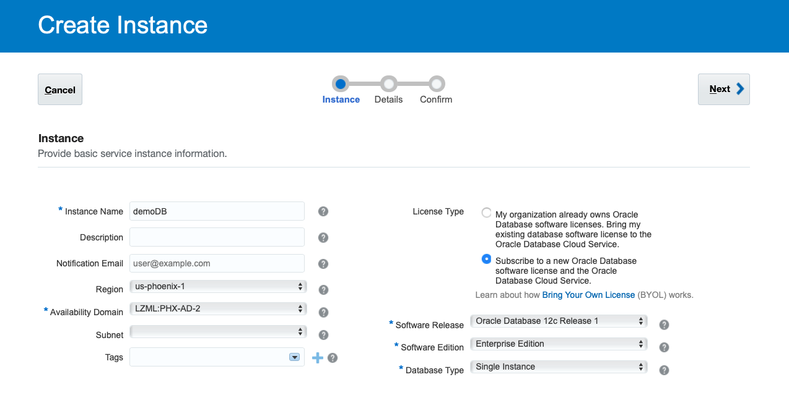

- Enter the following parameters:
  
  - **Instance Name**: `demoDB`
  - **Software Release**: `12c Release 1 Software`
  - **Software Edition**: `Enterprise Edition software edition`
  - **Database Type**: `Single Instance`
  - Leave the rest to default

- Click **Next**


### **STEP 2.2**: Detailed Instance Configuration

The last input page is the Service Details page.

  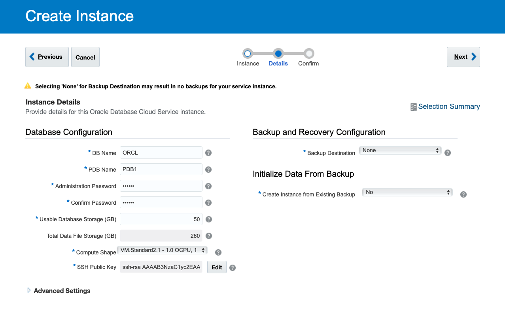
  
  
The following parameters have to be provided:

  - **Administration Password**: DB's password. Don't forget to note the provided password
  - **Compute Shape**: `OC3 - 1.0 OCPU, 7.5 GB RAM` This is the smallest  (default)
  - **SSH Public Key**: public key which will be uploaded to the VM during the creation. It allows to connect to the VM through ssh connection using the private key.
    - If you don't have or want to  to create different keypair select **Create a New Key** option and download the newly generated keypair for later usage
  - **Storage Username**: Your Oracle Cloud username e.g. `cloud.admin`
  - **Storage Password**: Cloud Account password
  - **Create Cloud Storage Container**: Leave to default of `Checked`
  - **Create Instance from Existing Backup**: Leave to default of `No`

- Click **Next**

- Confirms the details on the next page and then click **Create**


**NOTE**:  Your DBCS instance will take about 30 minutes to complete. Please wait until the DBCS instance has been completed before creating a JCS instance. Whilst we are for the DBCS instance to be provisioned, we can work on other infrastructure components such as ACCS.

*You have now completed the provisioning of a DBCS instance for use with JCS.*


## Provision a ACCS Cache Instance


### **STEP 3**: Create a ACCS Cache Instance

- On the dashboard click the hamburger icon on the **Application Container** tile. Select **Open Service Console**.

  
  

- Once in the Application Container Cloud Service Console page, click the hamburger icon by the **Welcome!** text at the top right corner and then select **Application Cache** by scrolling down the the list as shown below.

  


- On the Application Caches page, create a new instance by clicking **Create Instance** button.


### **STEP 3.1**: Instance Configuration

- Complete the new Create New Instance Page as illustrated below:

  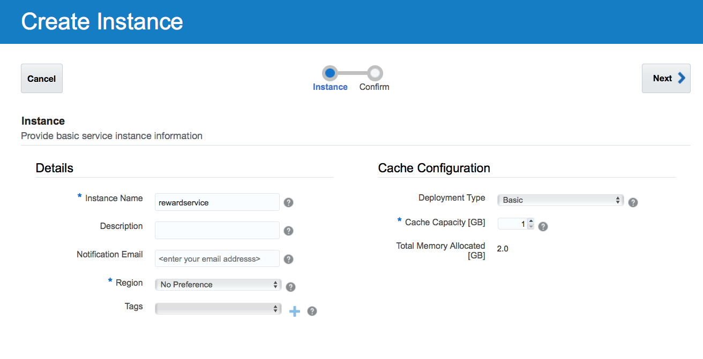


- Enter the following parameters:

  - **Instance Name** `rewardservice`
  
  - Leave evertyhing else to their defaults
  
- Click **Next**
  
- Click **Create** on the Confirm Page


**NOTE**: Your ACCS Cache instance will be ready in about 10 minutes.

Once completed, you will find the **rewardservice** cache instance available to use as illustrated below.

  


*You have now completed the provisioning of an ACCS Cache instance for use with an ACCS application instance.*


## Provision a ACCS Application Instance


### **STEP 4**: Create a ACCS Application Instance

- Go back to the Application Container Service Console

- Click **Create Application**

- Click on the **Node** icon to select your application platform in the **Create Application** popup box

  
  
  
- You are now presented with the **Application** configuration popup box
  
  

- Enter the following parameters:

  - **Name:** `rewardservice`
  - **Application:** Click on Choose File to Upload Archive
    - Select `pointsystem.zip` from your folder
    - The `pointsystem.zip` can be downloaded it here. You must be an Oracle employee to download this.

  - **Instances**: `1`
  - **Memory (GB)**: `1`

  - Click on **More Options** to expand the configuration page

  - **Application Cache**: Select `rewardpoints` from the dropdown box. This is Application Cache you created in the previous step

- Click **Create**


**NOTE**: Your ACCS Application instance will be ready in about 10 minutes.

Once ready, you will find your rewardservice available in the Application Container Service Console.

- Take note of the instance URL.

  


*You have now completed the provisioning of the Reward Service Node.js ACCS application instance.*


## Provision a JCS Instance

For this part of the lab, you would need a DBCS instance to complete the JCS configuration.

- Please verify the provisioning of a DBCS instance in **Step 2** has completed and is up and running

- If this is running, then proceed to the following steps, otherwise, please wait until it is ready.


### **STEP 5**: Create a JCS Instance

- On the dashboard click the hamburger icon on the **Java** tile. Select **Open Service Console**.

  
  

- Once in the Java Cloud Service Console page, create a new instance by clicking **Create Service** button.


### **STEP 5.1**: Basic Instance Configuration

- Complete the new Create New Instance Page as illustrated below:

  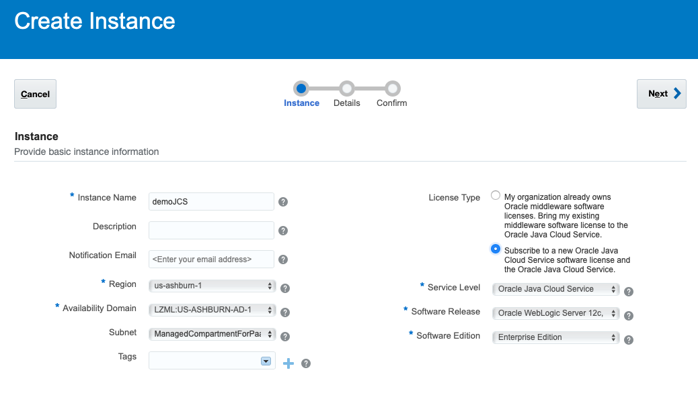
  
- Enter the following parameters:

  - **Instance Name**: `demoJCS`
  - **Service Level**: `Java Cloud Service`
  - **Software Release**: `12c Software Release (12.2.1.2)`
  - **Software Edition**: `Enterprise Edition software edition`
  - Leave the rest to default

- Click **Next**


### **STEP 5.2**: Detailed Instance Configuration

On the Service Details page.

- Click **Advanced** to show additional configuration options

  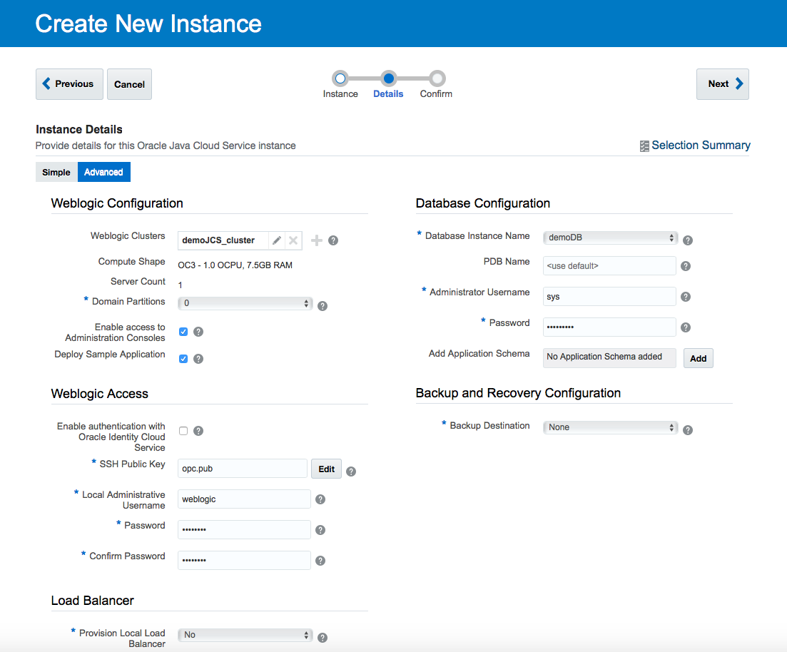

The following parameters have to be provided:
	
  - **Shape**: `OC3 - 1.0 OCPU, 7.5 GB RAM` this is the smallest one (default)
  - **Server Count**: `1` which means one managed server
  - **Domain Partitions**: `zero` for no partitions (default)
  - **Enable access to Administration Console**: `Checked` to get access to the Admin console
  - **Deploy Sample Application**: `Unchecked`
  - **Enable authentication with Oracle Identity Cloud Service**: `Unchecked`
  - **SSH Public Key**: public key which will be uploaded to the VM during the creation
    - It allows to connect to the VM through ssh connection using the private key.
    - Click on **Edit** button and select the same publicKey what was generated for Database Cloud Service instance    
  - **Username**: `weblogic` username of WebLogic administrator
  - **Password**: WebLogic administrator's password. Don't forget to note the provided password.
  - **Database Instance Name**: `demoDB` Database Cloud Service name to store WebLogic repository data. Your provisioned DBCS instance will appear in the dropdown list.
  - **PDB Name**: `<use default>` If you have choosen default (PDB1) during Database Cloud Service creation then leave the default here too
  - **Administrator User Name**: Enter: **sys**. DBA admin to create repository schema for Java Cloud Service instance.
  - **Password**: DBA admin password you provided during Database Cloud Service creation
  + **Add Application Schema**: `No Application Schema added`
  + **Provision Load Balancer**: `No` to save resources, we will not create a Load Balancer instance
  + **Backup Destination**: `None`

- Click **Next**

The final page is the summary page about the configuration before submitting the instance creation request.

- Click **Create** to start the provisioning of the new service instance.


When the request has been accepted, the Java Cloud Service Console page appears and shows the new instance. The instance now is in Maintenance (Progress) mode. Click **In Progress** link to get more information about the status.

**NOTE**: Your JCS instance will be ready in about 30 minutes. Whilst we are for the JCS instance to be provisioned, we can work on other components such as Developer Cloud Service.

*You have now completed the provisioning of the JET UI frontend JCS instance.*


## Provision a Developer Cloud Service

You have two choices for Developer Cloud Service:

  - Traditional Developer Cloud Service
  - Autonomous Developer Cloud Service
  
It is recommeneded to use the Autonomous Developer Cloud Service as it offers a dedicated Buid VM for your build jobs. This has significant performance improvement over the Traditional Developer Cloud Service and would result in much faster build time. The use of the Autonomous Developer Cloud Service is particularly important as one would see the full potential of our service and would bring out the key benefits in Continuous Integration and Continuous Delivery.

Oracle Developer Cloud Build VMs run on Oracle Linux 6 and Oracle Linux 7, and support a variety of software such as Node.js, Docker, and Oracle SOA Suite. The platform and the software in Build VMs are defined by Build VM templates.


### **STEP 6**: Open the Automonous Developer Cloud Console

- Ensure you are opening the Autonomous DevCS and NOT the Traditional DevCS

- On the dashboard click the hamburger icon on the **Developer** tile. Select **Open Service Console**

  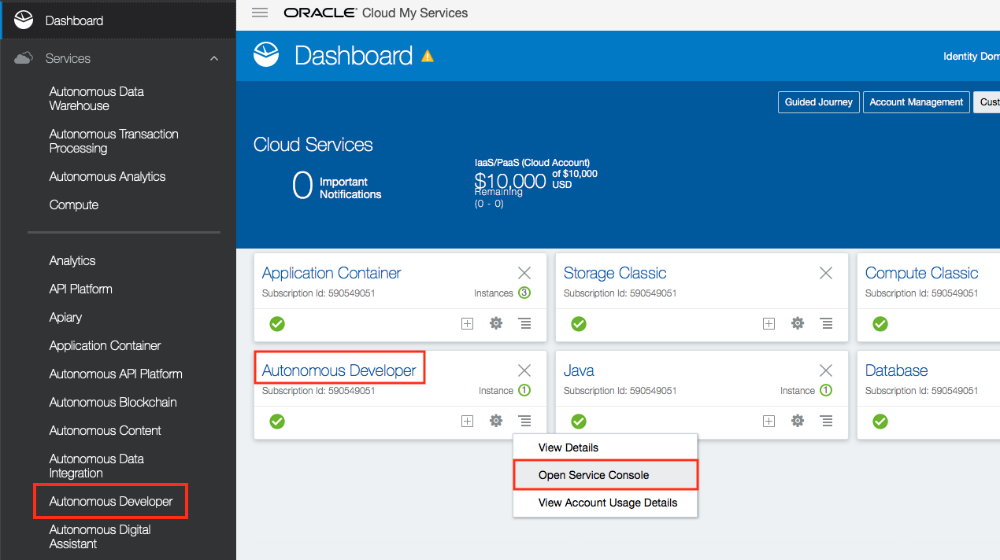


### **STEP 6.1**: Create a VM Template

In this section, you learn how to create a basic Build VM template that includes the minimum required software.

- Select **Organization** from the user name dropdown options

  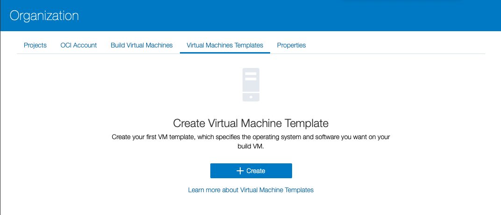

- Click **VM TEMPLATES** on the Organization Administration page

  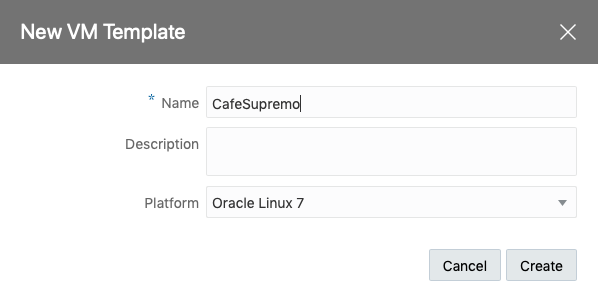
  
- Click **New Template** in the Build VM Templates page

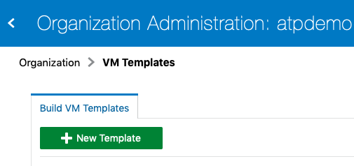

- In the New VM Template dialog box, enter the following details:

  - **Name**: `CafeSupremo`
  - **Description**: `A Build VM template with minimum required software`
  - **Platform**: `Oracle Linux 7`

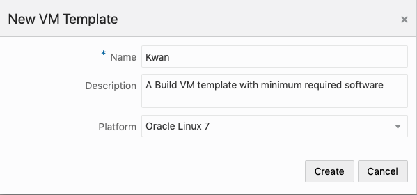

- Click **Create**

A Build VM template named **CafeSupremo** is created. It includes just the required Build VM components. The right side of the page displays the details for this Build VM.


### **STEP 6.2**: Configure the Software of a Build VM Template

The CafeSupremo template contains the minimum software required to run basic builds. We need to add additional software to the template in order to build our JET UI frontend and Node.js RewardService microservice.

  - In the **Build VM Templates** tab, select the template named **CafeSupremo**
  
  - On the right side of the page, click **Configue Software**

  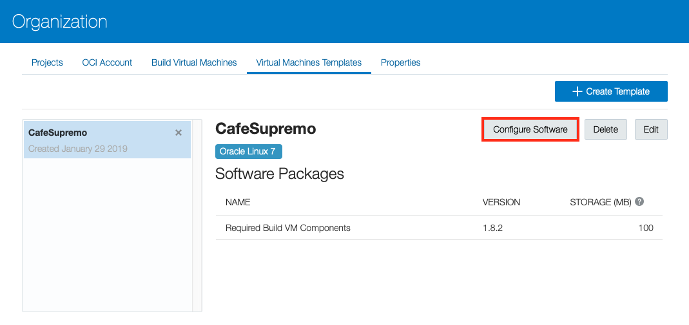
  
  - Select **Gradle 4** and **Node.js 6** from the list of software by clicking the **Add** `+` icon on that tile.
  
  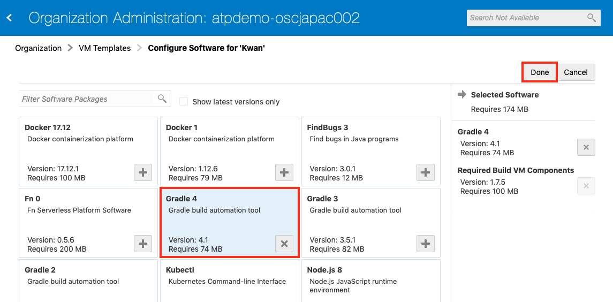
  
  - Click on **Done** to save the selections
  
    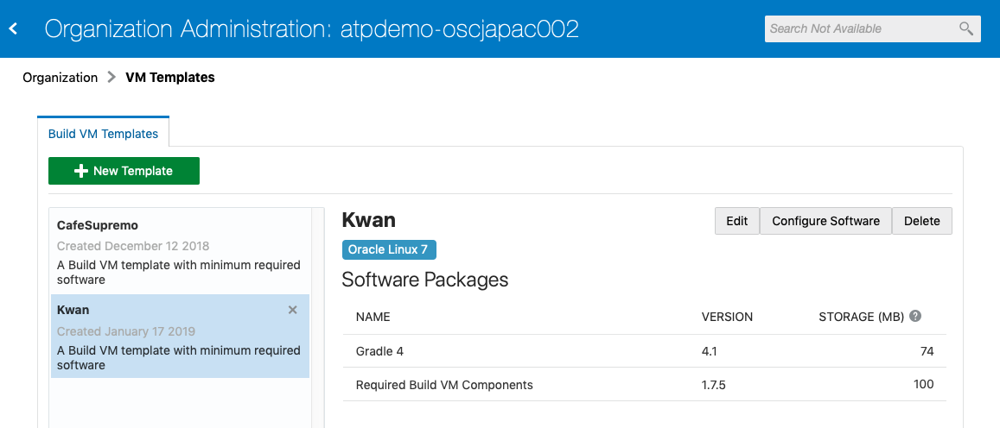
  
  
  
### **STEP 6.3**: Create a Virtual Machine for Build and Develop

Oracle Developer Cloud Service projects use Oracle Cloud Infrastructure Compute Classic virtual machines (VMs) to run builds. To use the VM we need to connect the VM with Oracle Developer Cloud Service and we need to capture some service detail about the VM for configuration.

- In another browser tab or window, open Oracle Cloud Dashboard

- In the Compute Classic tile, click the hamburger icon, and select **View Details*

  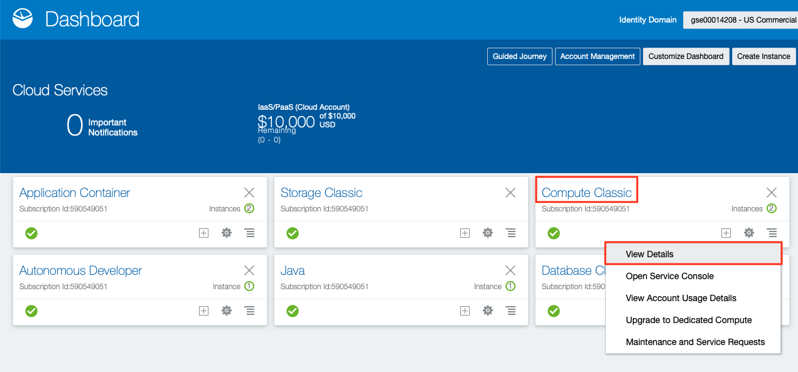

- On the Service Details page, in the Additional Information section of the Overview tab, note the values of **Service Instance ID** and **REST Endpoint**.

  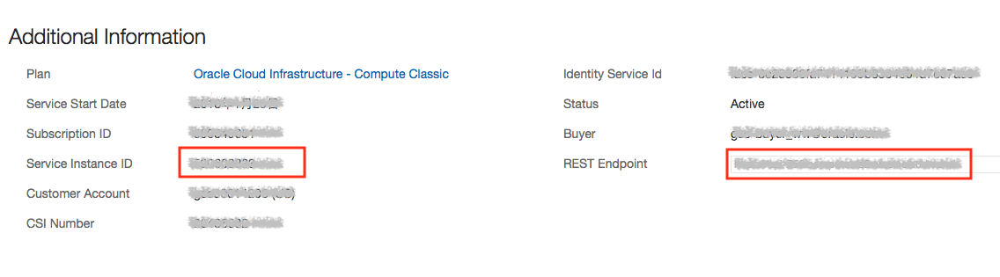

- Go back to the Developer Cloud Service Organization Administration Page

- Select **VIRTUAL MACHINES**

  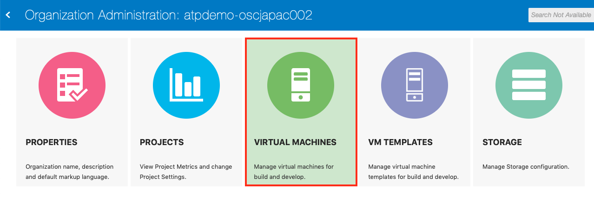
  
- On the Virtual Machine page, click **Configure Compute Account**

  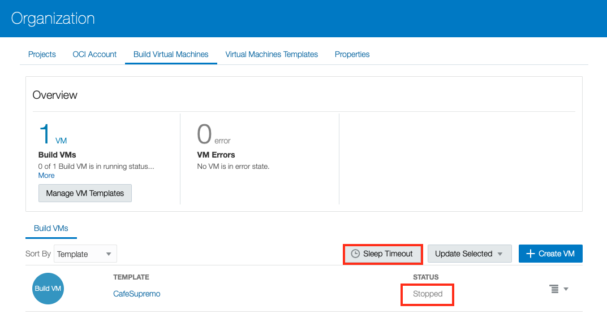

- In the Configure Compute Account dialog box, enter the following values:

  - **Username**: `Cloud Username`
  - **Password**: `Password`
  - **Service Instance ID**: *ID assigned to the Oracle Cloud Infrastructure Compute Classic instance* (The value must match the Service Instance ID field that appears on the Oracle Cloud Infrastructure Compute Classic Service Details page.)
  - **REST Endpoint**: *REST API endpoint URL for the Oracle Cloud Infrastructure Compute Classic instance* (The value must match the REST Endpoint field that appears on the Oracle Cloud Infrastructure Compute Classic Service Details page.)

  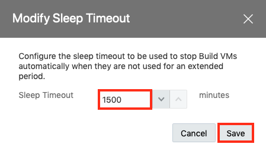
  
- Click on **Save**

You have now created a Build VM for for your build jobs.

  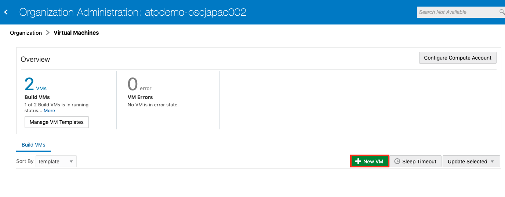


  
### **STEP 7**: Create a Developer Cloud Project

We will create a project for the Café Supremo and bring all the components into this project so that we can automate the build and deploy process.


### **STEP 7.1**: Create a DevCS Project

- Go back to the Developer Cloud Service Console

- Create a new project by clicking the **New Project** button

- Click **Next**

  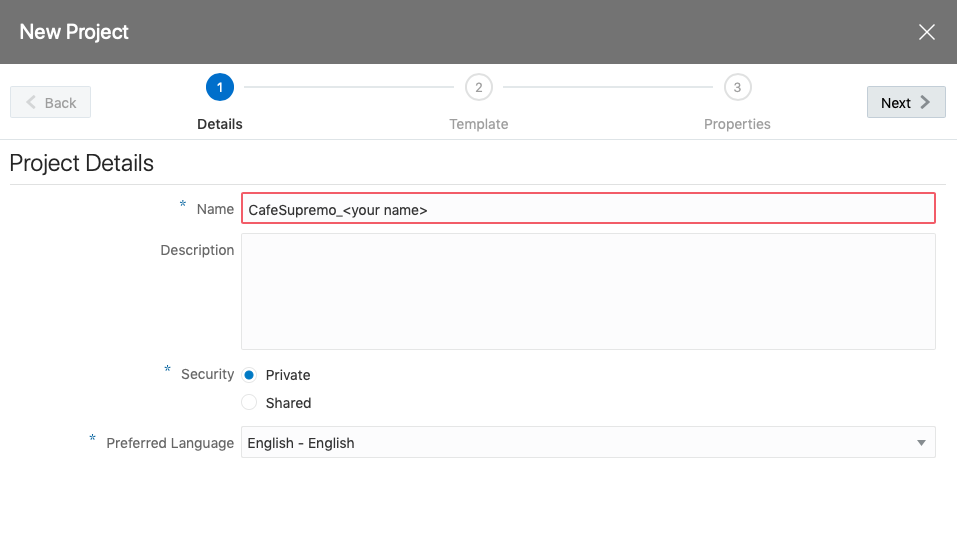

- Select an **Empty Project**

  We will upload the Git repositories later from an archive project

  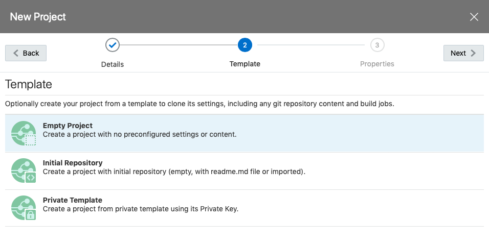

- Click **Next**

- Click **Finnish**

Project creation will start upon selecting Finish.


### **STEP 7.2**: Setup The Storage For Importing a Project Archive

A previously configured CafeSupremo project was exported as an archive. This contains the Git repositories, mock issues and agile boards to give a sense of a realistic project.

**NOTE :** You can download the project archive from here.


- You must first configure storage to upload the project archive to

- Go back to the Organization Page

- Select **STORAGE**

  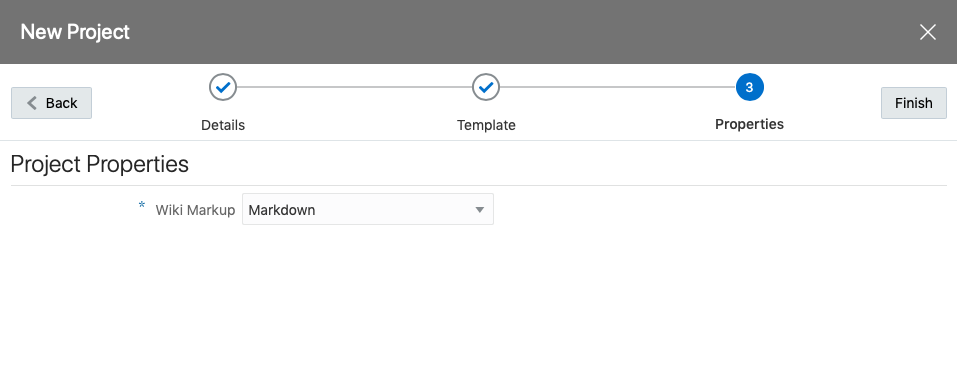
  
- Click on **Create**

- Enter the **Service ID** for your storage

  The Service ID is made up of **Storage-domain ID**

- Enter your Cloud **Username** and **Password**

- Enter the **Authorization URL**

  You can locate the Authorization URL on the Storage Classic View Details Page

  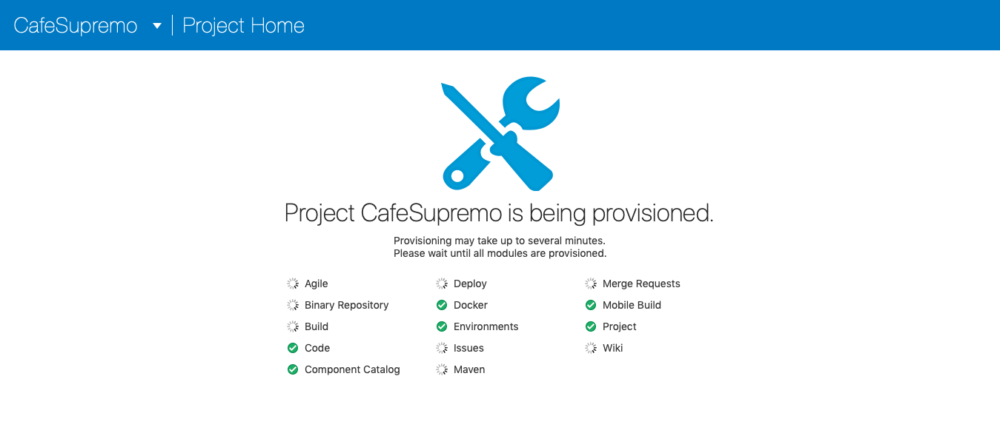
  
  
- Click on **Save** to save the configuration
  
- Click on **Test Connection** to validate connectivity to your storage and you should get a **Connection successful** in response

  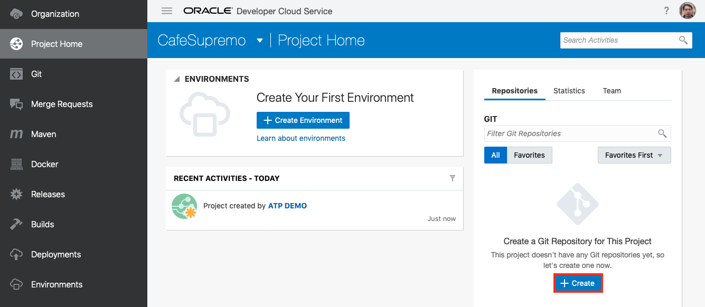
  

- Click **Close** on the top right hand corner of the Organization page


### **STEP 7.3**: Uploading The Project Archive To The Storage

- On the dashboard click the hamburger icon on the **Storage Classic** tile. Select **Open Service Console**.

  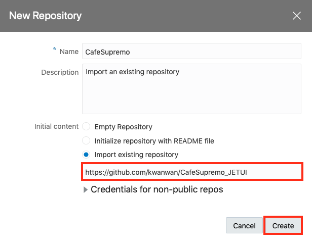

- Click **Create Container** to create a storage area for uploading your project archive to

  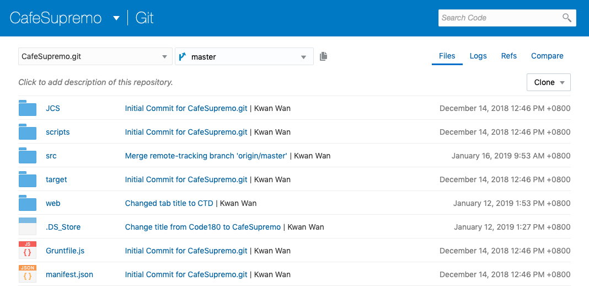
  
- Enter a name for your container e.g. *tmp*

- Click on **Create**

  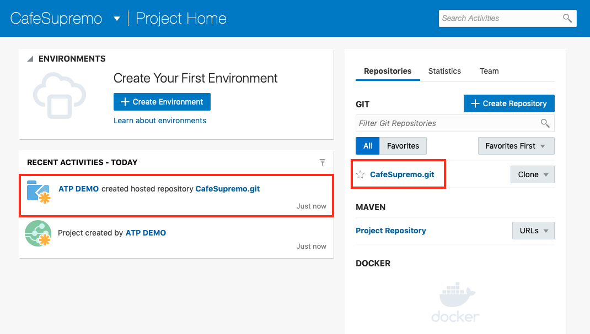
  
- Click on the container you just created e.g. *tmp*

- Click **Upload Objects**

  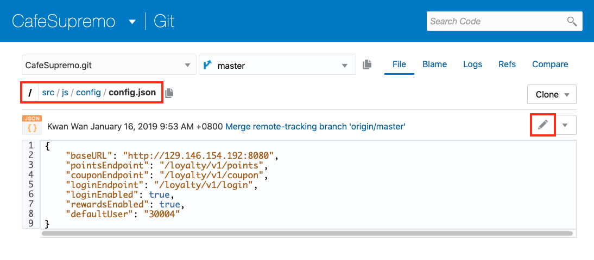
  
- Select your archive file and upload  

The project archive is now ready to be imported into the CafeSupremo project.


### **STEP 7.4**: Importing a Project Archive

- Click on the **Administration** option on the left hand side of the page

- Select **Data Export/Import** from the popup context option list or from the Administration page

  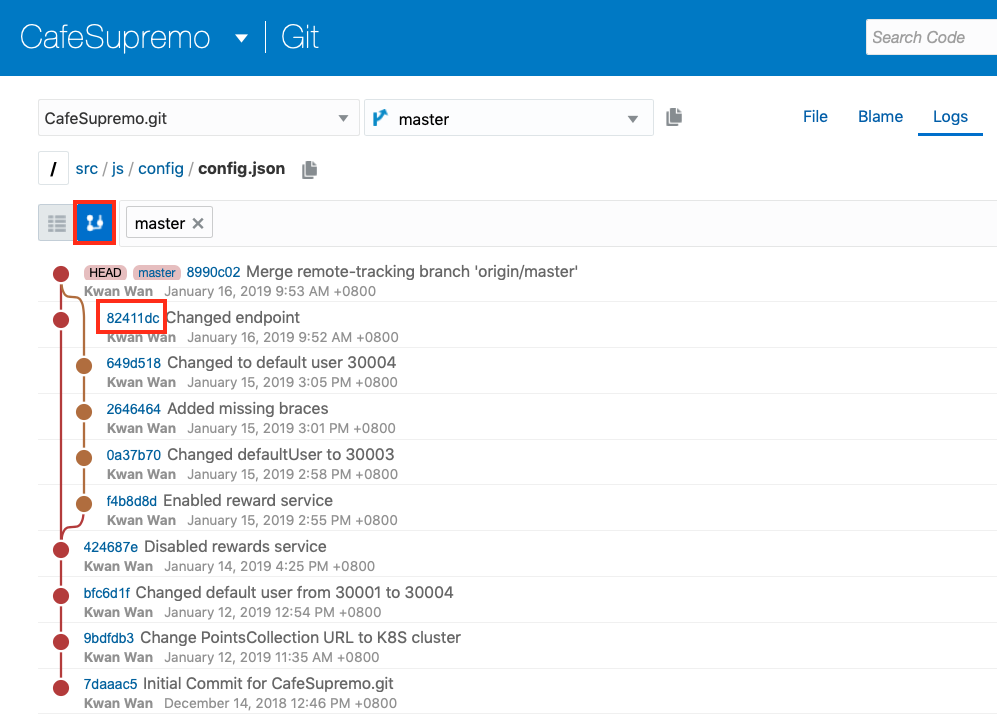
 
- Complete the Data Export/Import Page as illustrated below:

  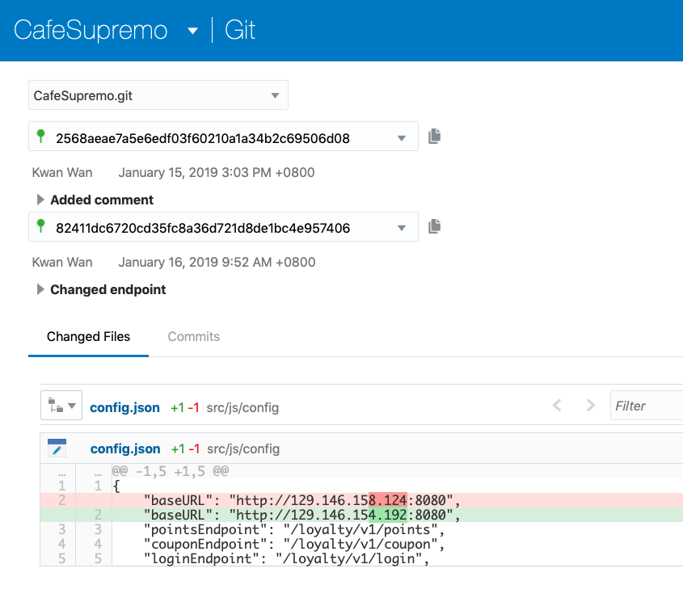

  
  - Enter the **Storage Service URL**
  
    You can locate the Storage Service URL on the Storage Classic View Details Page
  
  - Enter **Storage** as the **Storage Service Name** 

  - Enter the **Identity Domain**

  - Enter the **Storage Account Username** and **Storage Account Password**
  
  - Click on **Connect**

- Once connected, the page will expand with the **Create Job** configuration.

  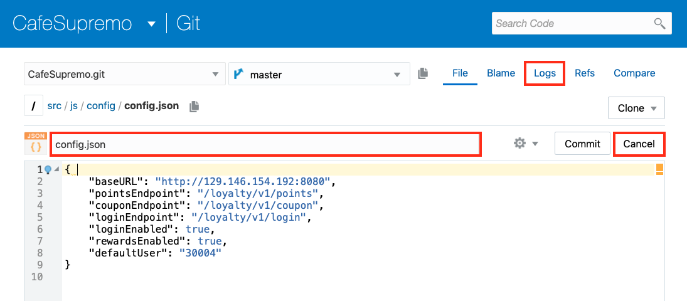

  - Select *Import* from the dropdown **Type**

  - Enter *tmp* as the **Storage Container**
  
  - Select the zip file from the **Storage Object** dropdown box
  
  - Click on **Import**
  
  - Check the *Import project data into 'CafeSupremo'* and Click **Yes**
  
    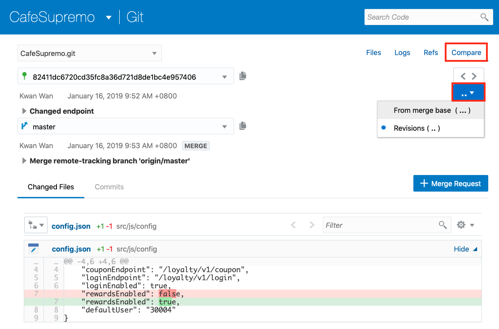
  
**NOTE:** The project archive import will begin and will take about 10 minutes to complete

Once completed, you will be presented with two Git repositories:

  - **CafeSupremo.git** that holds the JETUI frontend code
  - **RewardService.git** that holds the Node.js microservice code
  
  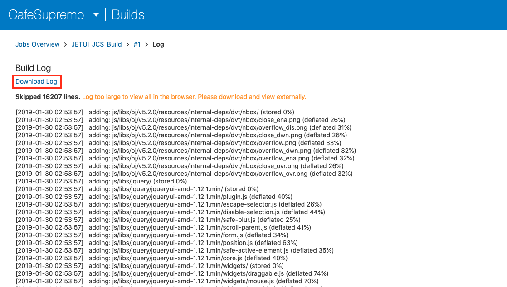
  
- Verify the rest of the project has been imported properly. There should be issues, agile boards, and code. However, there are no project members, build jobs or deployment configuration as these cannot be exported with the original project. Therefore we would need to rebuild these configurations in the following steps.


### **STEP 8**: Add New Members To The Project

Project members are not exported with the orignal project, therefore we will need to a add users back into the project. These users are referenced in the issues tracking and agile board. Hence we will need to add the users back into the project.

- Go to the project home page

- Click on the **Team** icon to see the project members

  There should just be the owner of the project e.g. *cloud.admin*

  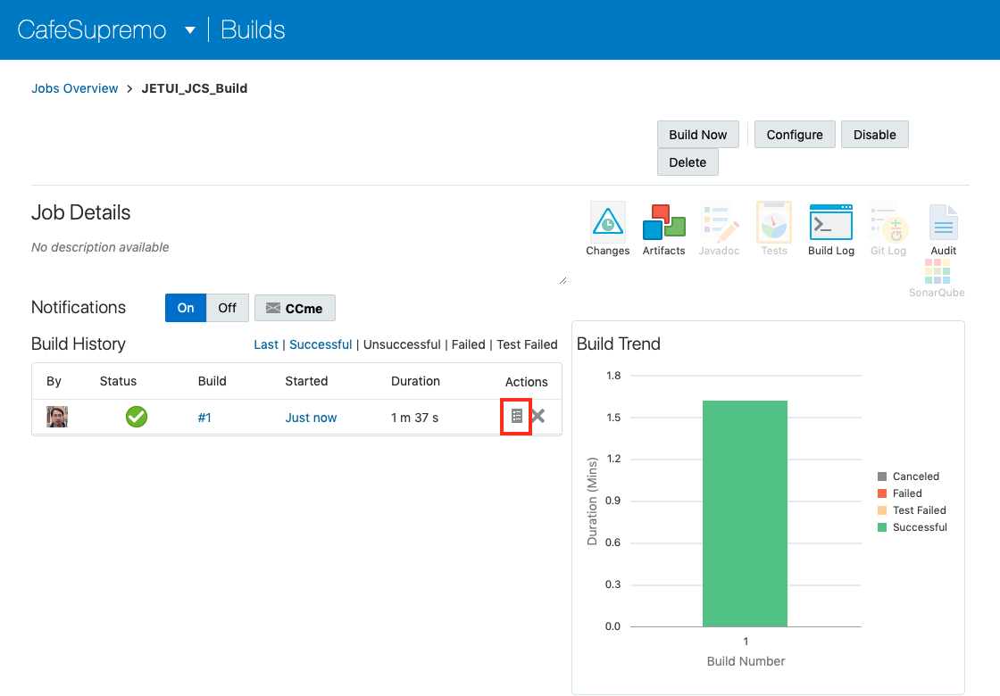
  
- Click on **New Member**

- Select all the users from the available user list and click **Add**

  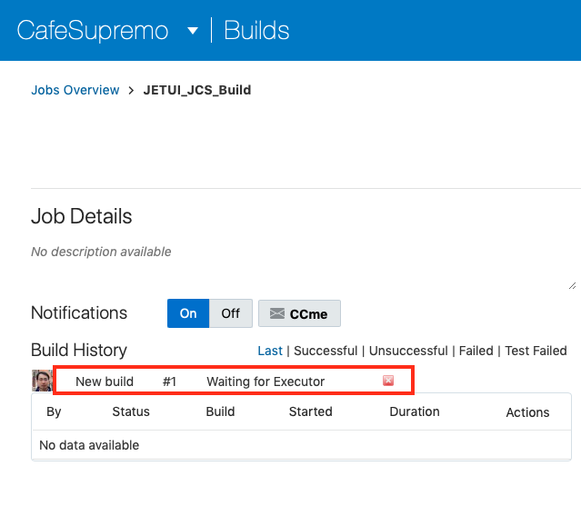
  
- Your now have all the users required for the demo

  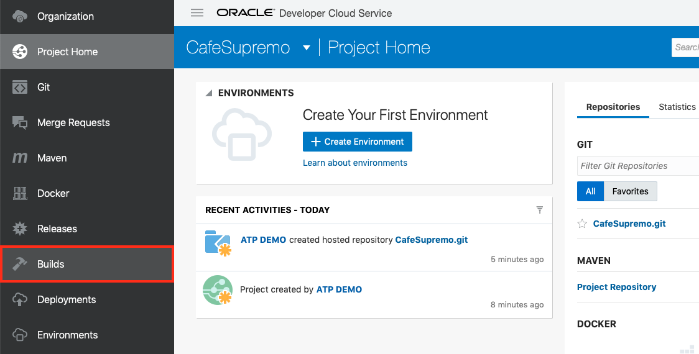


### **STEP 9**: Create The Build Pipelines

Now that we have imported the project archive for our demo, we can start creating our CICD pipelines for the JETUI frontend and the RewardSerivce microservice. This includes creating the build job configurations and the deployment configurations.


### **STEP 9.1**: Create The JETUI Frontend Build Job

The first task in our CICD pipeline is to build the JETUI frontend application. We need to create a build job for this. And we want the build to be triggered automatically whenever there is a code change. The build process can be automated and deployed automatically to a designated JCS environment.

- Switch to Build tab and create a new job. There should be no build job initially.

- Click on **New Job**

  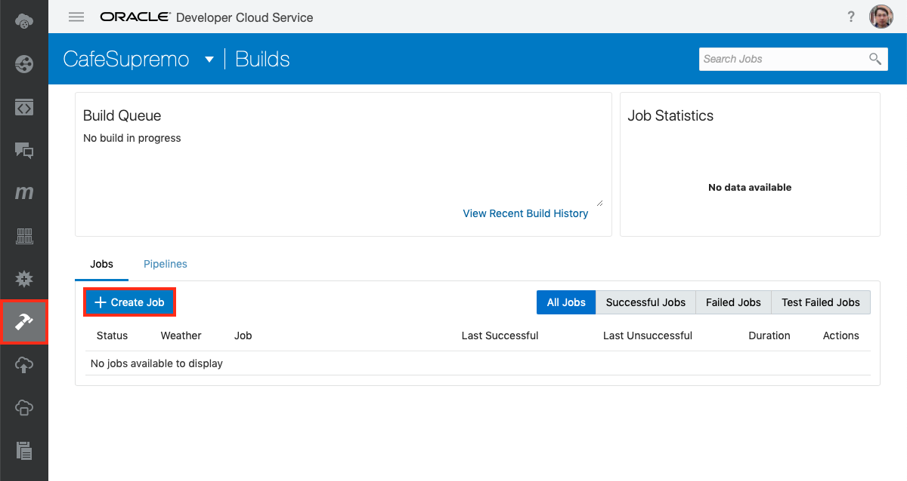
  
- Enter *JETUI_JCS_Build* as the **Job Name**

- Select *CafeSupremo* from the dropdown list for **Software Template**

- Click **Create Job**

  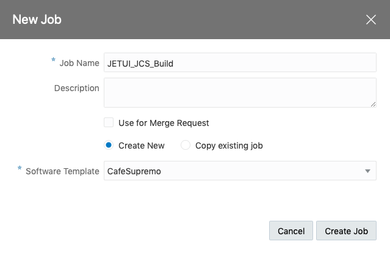

- Configure the build job by specifying the Git repo to build from. On the **Source Control** tab click on **Add Source Control**

  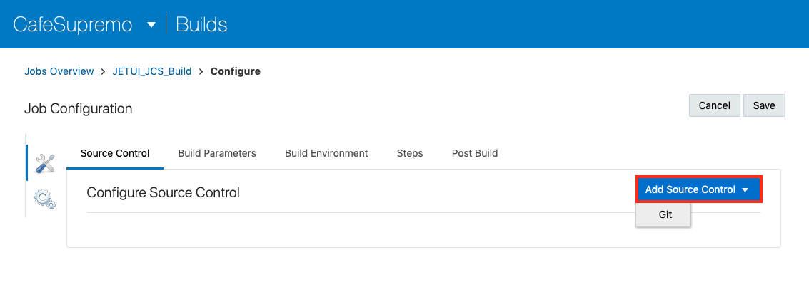

- Select *CafeSupremo.git* from the dropdown box for **Repository**

  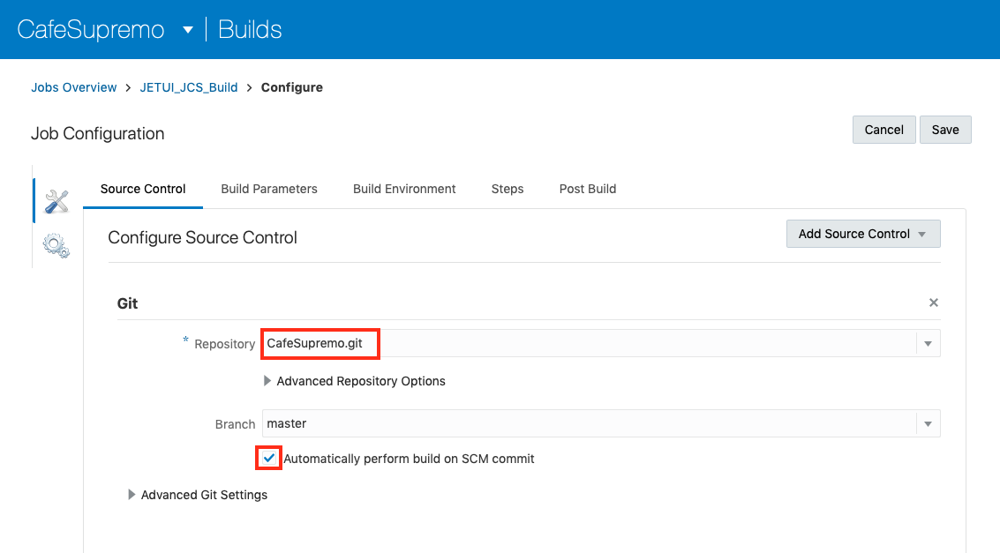
  
- On the **Builders** tab click on **Add Builder** button and select **Unix Shell Builder** from the context option list

  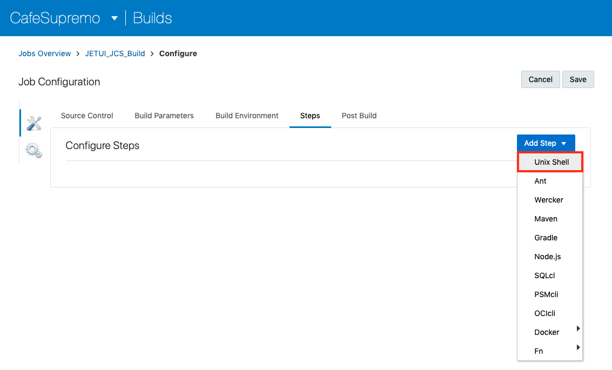
  
- Copy and paste the npm install script into the command field

  ```
  npm install
  grunt build:release
  cd web
  mkdir WEB-INF
  cp ../JCS/web.xml WEB-INF/web.xml
  zip -r ../target/cafesupremo.war *
  ```

  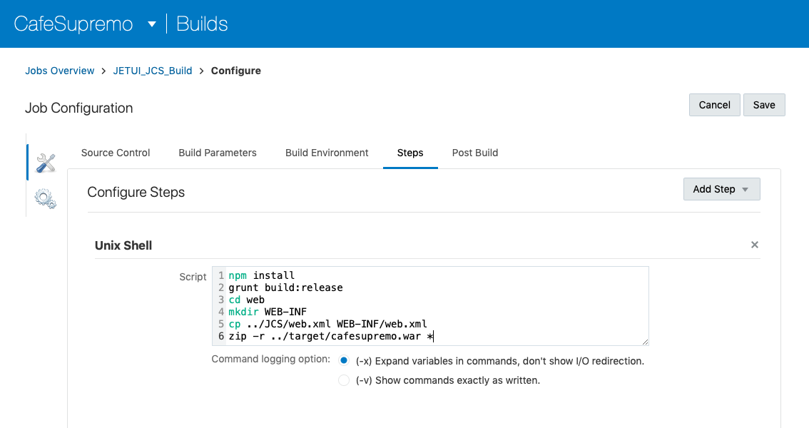

- On the **Post Build** tab click on **Add Post Build Action** button and select **Artifact Archiver** from the context option list

  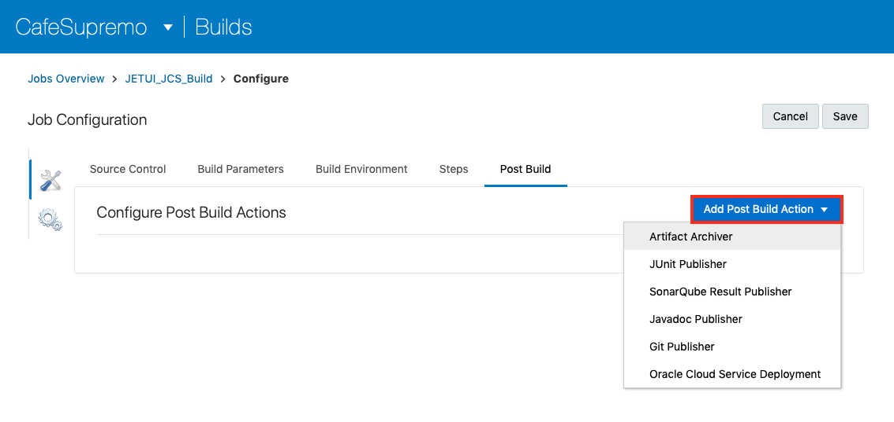
  
- Enter `target/cafesupremo.war` in the *Files to archive* field to define the location of the build output which it will be used for deployment.

  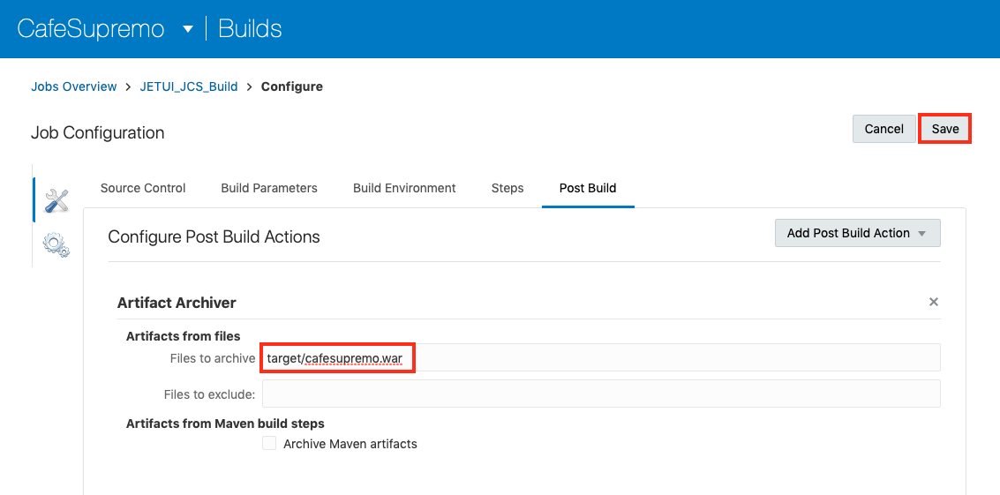
  
- To enable automated build we need to set the trigger to be based on code commit in the Git repo. Select **SCM Polliing Trigger** from the **Add Trigger** context dropdown list

  
  
- Change the SCM Polling Trigger from the default 30 minutes to 1 minutes in the **Cron Pattern in UTC** field

  

- Click **Save** to save the configuration

- Let’s test the build job configuration by running a build now. Click **Build Now** to build

- The build should complete without any error

  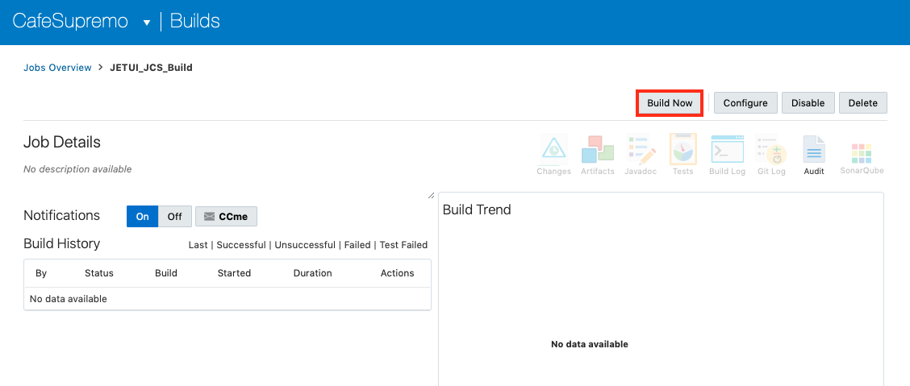
  
  You have now completed the **JETUI_JCS_Build** build job
  
  
  
  
### **STEP 9.2**: Create The Reward Service Node.js Build Job
  
  
- Switch to Build tab and create a new job. There should be no build job initially.

- Click on **New Job**
  
- Enter *RewardService_Build* as the **Job Name**

- Select *CafeSupremo* from the dropdown list for **Software Template**

- Click **Create Job**


- Configure the build job by specifying the Git repo to build from. On the **Source Control** tab click on **Add Source Control**

- Select *RewardService.git* from the dropdown box for **Repository**

  
  
- On the **Builders** tab click on **Add Builder** button and select **Unix Shell Builder** from the context option list

  
- Copy and paste the npm install script into the command field

  ```
  npm install
  zip -r rewardservice.zip *
  ```

  

- On the **Post Build** tab click on **Add Post Build Action** button and select **Artifact Archiver** from the context option list
  
- Enter `*` in the *Files to archive* field to define the location of the build output which it will be used for deployment.

  
  
- To enable automated build we need to set the trigger to be based on code commit in the Git repo. Select **SCM Polliing Trigger** from the **Add Trigger** context dropdown list
  
- Change the SCM Polling Trigger from the default 30 minutes to 1 minutes in the **Cron Pattern in UTC** field

  

- Click **Save** to save the configuration

- Let’s test the build job configuration by running a build now. Click **Build Now** to build

- The build should complete without any error

  
  
  You have now completed the **RewardService_Build** build job


### **STEP 9.3**: Create The JETUI Frontend Deployment Configuration

Let's create a deployment configuration for the JET UI Frontent. The deployment runtime is the JCS environment which you previsioned earlier.

- Go to the **Deploy** page

- Click on **New Configuration**

  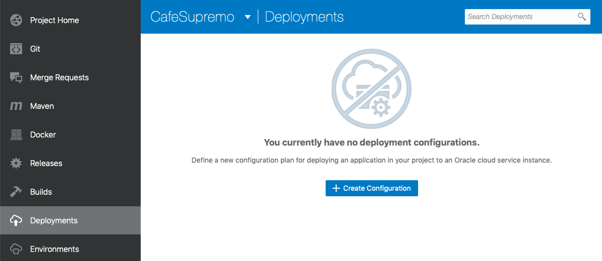

- Complete the New Create New Configuration as illustrated below:

  - Enter `Deploy2cafesupremoJETUI` as the **Configuration Name**

  - Enter `cafesupremo` as the **Application Name**
  
  - Check *Automatic*

  - Select *JETUI_JCS_Build* from the **Job** option list

  - Select *target/cafesupremo.war* from the **Artifact** option list

  - Click the **New** button
  
- Select the **Java Cloud Service** from the context option list
  
  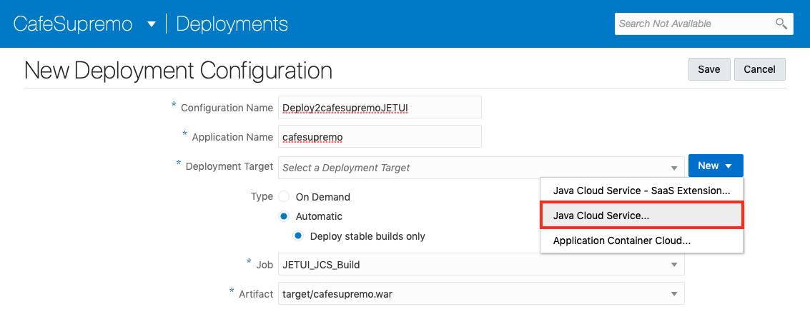
  
- Complete the **Deploy to Java Cloud Service** popup configuration as illustrated below:

  - Use the default *Oracle Weblogic Server 12c (12.2.x or higher)
  
  - Use the default *Oracle Weblogic RESTFul Management Interface*
  
  - Enter the IP address for your JCS environment as the **Host**
  
  - Use the default *HTTPS Port**

  - Enter your Weblogic **Username** and **Password**
  
  - Click on **Find Targets**
  
  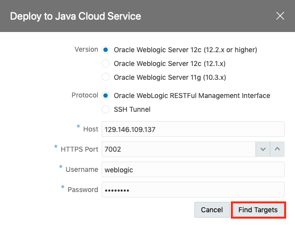
  
- This will return one or more intended targets

- Check the **demoJCS_cluster**

- Click on **OK**

  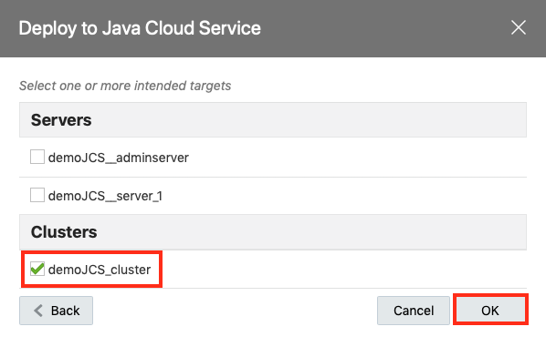
  
- You should see the **Deployment Target** completed

- Click on **Save**

  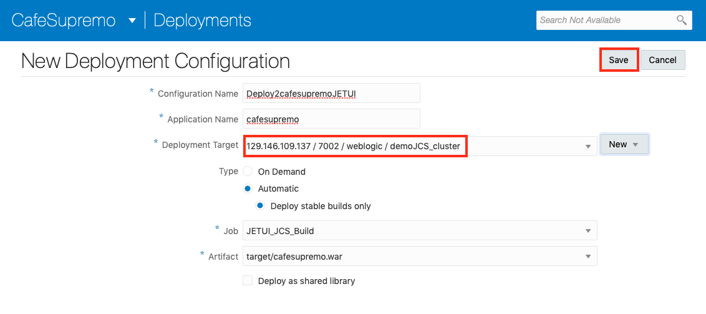
  
- You have now completed the deployment configuration for the JETUI Frontend. Let's try deploying a build to JCS cluster.

- Select the **Redeploy** option from the Settings dropdown options.

  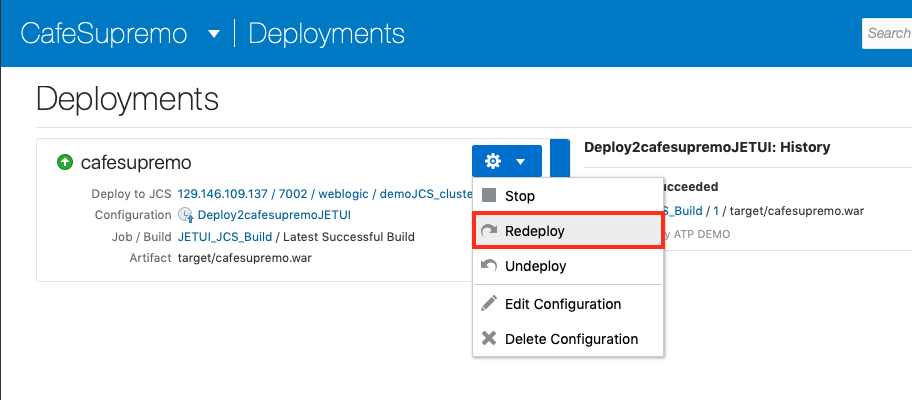
  
- Select the latest build from the ** Build** dropdown list

- Click on **Deploy**

  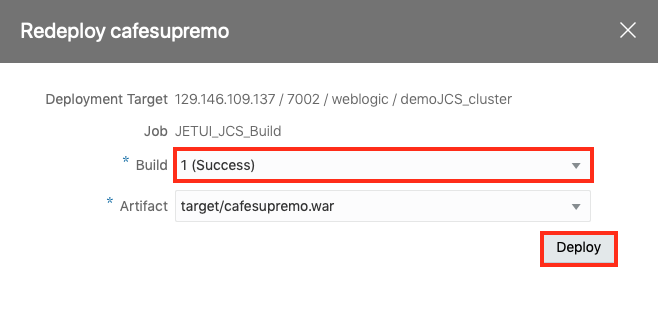

- The deployment should complete successfull with a deployment succeeded message as below

  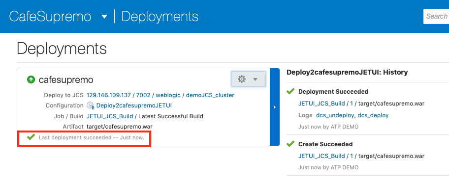
  
- Verify your deployment by going to the JETUI Frontend URL

- Enter *http:ip address/cafesupremo* in your browser

  
  
  
  
  ### **STEP 9.4**: Create The Reward Service Deployment Configuration

Now we create a deployment configuration for the Reward Service. The deployment runtime is the ACCS environment which you previsioned earlier.

- Go to the **Deploy** page

- Click on **New Configuration**

- Complete the New Create New Configuration as illustrated below:

  - Enter `Deploy2rewardserviceNODE` as the **Configuration Name**

  - Enter `rewardservice` as the **Application Name**
  
  - Check *Automatic*

  - Select *RewardService_Build* from the **Job** option list

  - Select *rewardservice.zip* from the **Artifact** option list

  - Click the **New** button
  
- Select the **Application Container Cloud...** from the context option list
  
  
  
  - Complete the **Deploy to Application Container Cloud** popup configuration as illustrated below:

  - Select your **Data Center** from the dropdown list
  
  - Enter your **Identity Domain**
  
  - Enter your Cloud **Username** and **Password**
  
  - Click on **Test Connection**
  
  
  
- This will return successfully only if all the parameters are entered correctly.

  

- Check the **Use Connection**

- Check on **Node** in the **ACCS Properties** list

- Click on **Save** to save the configuration

  

- You have now completed the deployment configuration for the RewardService. Let's try deploying a build to ACCS instance.

- Select the **Redeploy** option from the Settings dropdown options.

  
  
- Select the latest build from the ** Build** dropdown list

- Click on **Deploy**

  

- The deployment should complete successfull with a deployment succeeded message as below

  
  
- Verify your deployment by going to the JETUI Frontend URL

- Enter *http:ip address/cafesupremo* in your browser

- Click on the hamberger icon at the top left hand corner

- Click on **Rewards**

  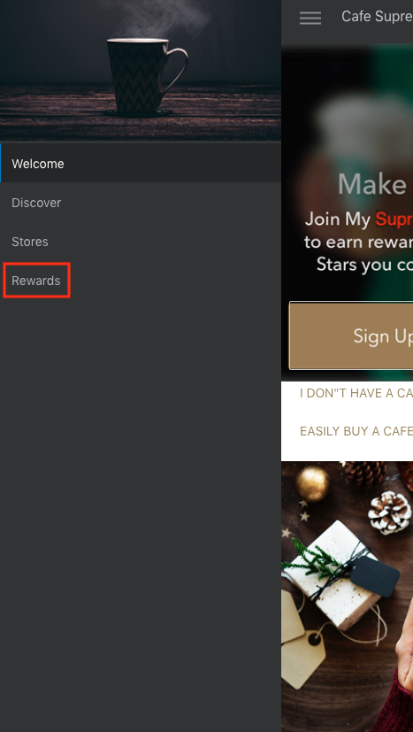
  
- Verify you can Credit a Star and Redeem Coffee

  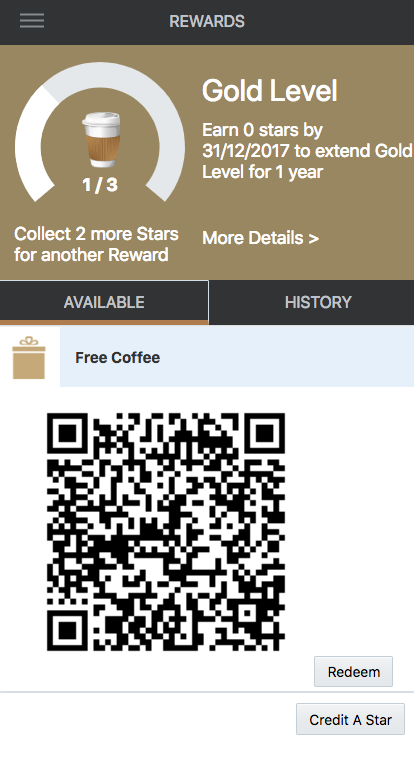
  

Congratulation!! You have completed the setup and have a working demo.

Click here to go back to the home page.
