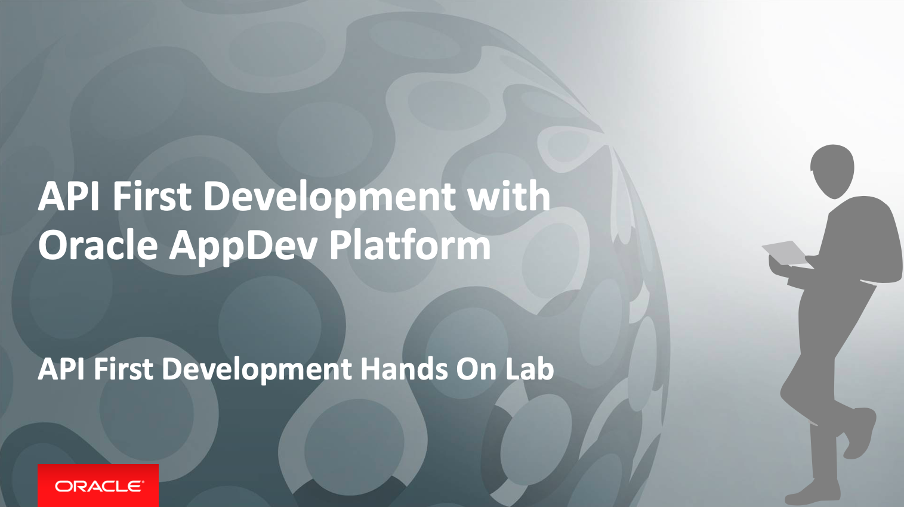
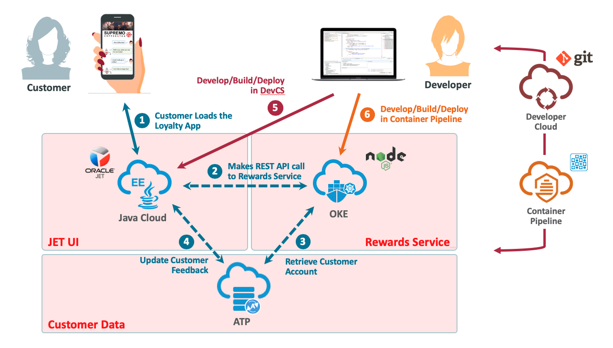

# API First Development with Oracle AppDev Platform - API First Development Hands On Lab

## Introduction

APIs make up the new language for businesses to communicate with each other. As they increase in importance, more responsibility lies on those who build and manage the APIs. Apiary solves the fundamental task of improving API development, but for many companies, meeting those increasing expectations means not only working harder but also streamlining the business process of how work gets done.

This Oracle Cloud workshop contains the hands on lab material to demonstrate an API First development workflow of a cloud native application using Oracle AppDev Platform. Participants will be able appreciate and experience how to use Oracle Cloud Services to implement cloud native applications using a real use case scenario based on a loyalty rewards system for a coffee shop. This includes services such as Oracle Apiary, Developer Cloud Service, Java Cloud Service, Application Container Cloud Service and Database Cloud Service.

The lab will also show how to work with Open Source tools in Oracle Developer Cloud Service for managing your software lifecycle as well as how to build, deploy and promote to different environments. With Continuous Integration and Delivery as core principles, it will illustrate how issues are tracked, managed and released.

## API First Development Hands On Lab

The API First Development lab is a good deep dive workshops for architects, project leads and developers. This requires about 3 hours to complete.

The [API First Hands On Lab](CICDlab.md) provide a hands on experience in setting up the complete end-to-end CI/CD pipeline on Oracle Cloud Platform.

On the development side, this will show you how to develop with API First without writing any code:
* Create an API Blueprint to describe our APIs
* Test your API against the Apiary Mock Server
* Generate code examples from Apiary for different languages

On the CI/CD side, this will show you how to automate your workflow with Developer Cloud Service:

*	Project creation, configuration, and user management
*	Agile development
*	Integrated issue tracking for tasks, bugs, and enhancements
*	Source code repository through Git to store your application source
*	Code Review enabled with Team Collaboration
*	Continuous software build integration
*	Deployment to an Oracle Java Cloud Service and Application Container Cloud Service

## Scenario

You are an application developer who will be developing a brand new cloud native loyalty application for Café Supremo, which will be deployed to the Oracle Cloud. The reason why you want to adopt a cloud native approach has partially been driven by the need to go to market quicker, by delivering new features more frequently, but also more reliably. And you are able to do this by developing Microservices that has less dependency on other services, as well as the footprint being smaller and easier to deploy. What’s also attractive with Microservices is that you can use the best programming language for the job. So, you could end up with a polyglot application. To be able to deliver this new style of cloud native application approach, you will need to adopt the Agile development practice to continuously integrate and deliver these services and features. The application basically consists of two parts:

1. The user interface that is built using Oracle JET framework, packaged as a WAR file and deployed to a Java Cloud Service instance.
2. The Reward Service backend service, which is a Microservice written in Node.js, packaged as a ZIP file and deployed to an Application Container Cloud Service instance.
3. The customer data is stored in the Database Cloud Service and the data is cached in Application Container Cache.

You will use Apiary to write your API for the Reward Service backend and generate the API Blueprint. This API will be called by the client JET UI frontend. Once the API Blueprint is ready, you will use the Mock Server to test your API. We can also use the Mock Server for client application development & testing.

You will use DevCS as the core CI/CD software lifecycle management tool for your Agile development and DevOps pipeline. A developer could use their favourite IDE or editor to write their code. In this scenario a developer will be using an open source editor called Brackets which can synchronise the code changes with the Git repository in Developer Cloud Service.

Different developers or teams can work independently on the JET UI frontend and the Node.js Rewards Service backend from the API Blueprint. The two parts can be integrated and delivered continuously through Oracle Developer Cloud Service.

A project manager will be logging into Developer Cloud Service and manage the Café Supremo project from issue tracking to tracking the build, deploy and release progress.

## Prerequisites ##

- The demo and lab requires an Oracle Public Cloud account
- You will also need to install a lightweight IDE - [Brackets](http://brackets.io/). Brackets installer will be provided by instructor or you can download it from [GitHub HERE](https://github.com/adobe/brackets/releases).  
- You need to have a Git Client. If you are already using Github Desktop, Eclipse or other IDE, you probably have Git already. Git installer will be provided by the instructor or you can download it from [here](https://git-scm.com/downloads).
- *[Click HERE for Brackets installation detail](BRACKETSinstall.md)*
- *[Click HERE for Git installation details](GITCLIENTinstall.md)*

[Go to CI/CD Hands On Lab](CICDlab.md)
