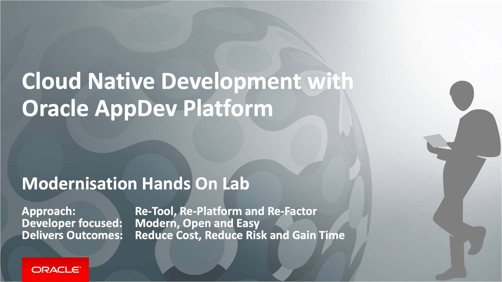

# Cloud Native Development with Oracle AppDev Platform - Modernisation Hands On Lab

## Introduction

This Oracle Cloud workshop contains the hands on lab material to demonstrate a typical DevOps workflow of a cloud native application using Oracle AppDev Platform. Participants will be able to appreciate and experience how to use Oracle Cloud Services to implement cloud native applications using a real use case scenario based on a loyalty rewards system for a coffee shop. This includes services such as Oracle Developer Cloud Service, Java Cloud Service and Database Cloud Service.

The lab will also show how to work with Open Source tools in Oracle Developer Cloud Service for managing your software lifecycle as well as how to build, deploy and promote to different environments. With Continuous Integration and Delivery as core principles, it will illustrate how issues are tracked, managed and released.

## Continuous Integration and Continuous Delivery Hands On Lab

The CI/CD lab is a good deep dive workshops for architects, project leads and developers. This requires about 3 hours to complete. This lab provide a hands on experience in setting up the complete end-to-end CI/CD pipeline on Oracle Cloud Platform and demonstrates how you can modernise existing application by bringing your code into Oracle's Cloud Platform.

This lab will show you how to automate your workflow with Developer Cloud Service:

*	Provisioning of your environment
* Project creation, configuration, and user management
* Importing your code
*	Agile development
*	Integrated issue tracking for tasks, bugs, and enhancements
*	Source code management through Git to store your application code
*	Code Review enabled with Team Collaboration
*	Continuous software build integration
*	Deployment to an Oracle Java Cloud Service

## Scenario

You are an application developer who will be developing a cloud native loyalty application for Café Supremo, which will be deployed to the Oracle Cloud. The reason why you want to adopt a cloud native approach has partially been driven by the need to go to market quicker, by delivering new features more frequently, but also more reliably. You may be developing a brand new application or you simply want to modernise an existing application by taking advangate of a cloud platform and a modern development approach.

You can for example do this by developing Microservices that has less dependency on other services, as well as the footprint being smaller and easier to deploy. What’s also attractive with Microservices is that you can use the best programming language for the job. So, you could end up with a polyglot application. To be able to deliver this new style of cloud native application approach, you will need to adopt the Agile development practice to continuously integrate and deliver these services and features. The application basically consists of two parts:

1. The user interface is built using Oracle JET framework, packaged as a WAR file and deployed to a Java Cloud Service instance
2. The Reward Service backend service, which is a Microservice written in Node.js running in a Docker container and hosted in a Kubernetes cluster
3. The customer data is stored in the Database Cloud Service or Autonomous Transaction Processing database

You will use Developer Cloud Service (DevCS) as the core CI/CD software lifecycle management tool for your Agile development and DevOps pipeline. A developer could use their favourite IDE or editor to write their code. In this scenario a developer will be using an open source editor called Brackets which can synchronise the code changes with the Git repository in Developer Cloud Service.

Different developers or teams can work independently on the JET UI frontend and the Node.js Rewards Service backend. The two parts can be integrated and delivered continuously through Oracle Developer Cloud Service.

A project manager can log into Developer Cloud Service and manage the Café Supremo project from issue tracking to tracking the build, deploy and release progress.

## Prerequisites ##

- The demo and lab requires an Oracle Public Cloud account
- You will also need to install a lightweight IDE - [Brackets](http://brackets.io/). Brackets installer will be provided by instructor or you can download it from [GitHub HERE](https://github.com/adobe/brackets/releases).  
- You need to have a Git Client. If you are already using Github Desktop, Eclipse or other IDE, you probably have Git already. Git installer will be provided by the instructor or you can download it from [here](https://git-scm.com/downloads).

- *[Click HERE for Brackets installation detail](BRACKETSinstall.md)*
- *[Click HERE for Git installation details](GITCLIENTinstall.md)*

# Lab Exercises

There are four parts to the lab with each focusing on different aspect of Cloud Native Application development, from provisioning of a cloud environment to importing your code and creating you CI/CD pipeline. Please begin your exercise in the following order:

## 100: Prepare Your Oracle Cloud Environments

[Click Here to Lab 100: Prepare Your Oracle Cloud Environments](100-PREPARElab.md)

## 200: Import Your Code

[Click Here to Lab 200: Import Your Code](200-IMPORTlab.md)

## 300: Create Continuous Integration and Continuous Delivery Pipeline in Oracle Developer Cloud Service

[Click Here to Lab 300: Create CI/CD Pipeline in DevCS](300-DEVCSlab.md)

## 400: Putting It All Together - Continuous Integration and Delivery

[Click Here to Lab 400: Putting It All Together - CICD](400-CICDlab.md)
